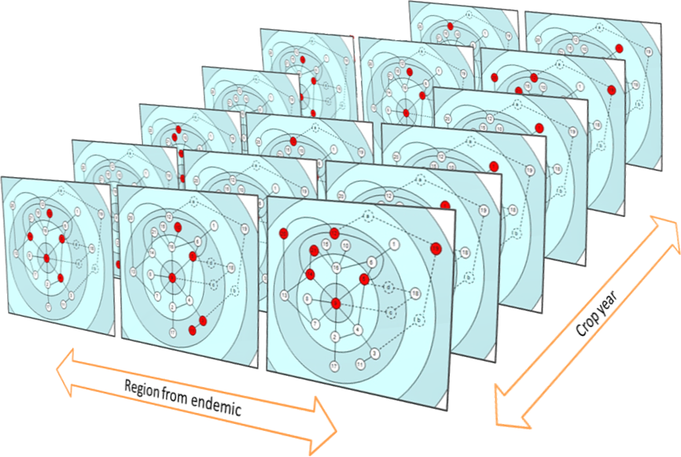
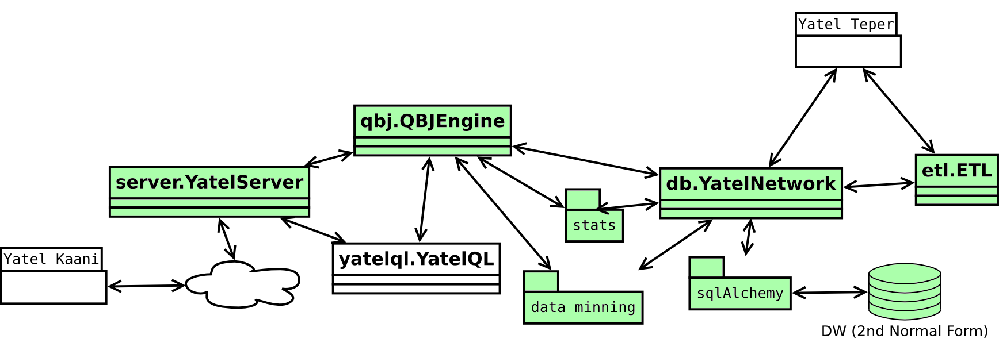
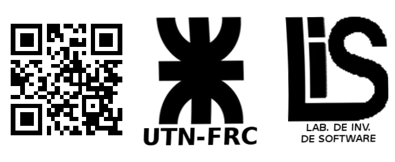

.. =============================================================================
.. HEADER
.. =============================================================================

.. header::

    .. image:: img/head.png
        :align: center
        :scale: 90 %

    Mario Alejandro García[1],
    Juan Bautista Cabral[1],
    María de la Paz Giménez Pecci[2],
    Rodrigo Liberal[1],
    Irma Graciela Laguna[2][3],

.. =============================================================================
.. CONTENT
.. =============================================================================

Contexto
--------

Este trabajo se realiza en el marco del proyecto UTN1685, “Análisis de datos
de enfermedades infecciosas transmitidas por *Hemiptera Auchenorrhyncha*”,
el tercero de una serie de proyectos de cooperación UTN FRC - INTA IPAVE en
los que se analizan fitopatologías mediante técnicas de Minería de Datos.

Introducción
------------

Para estudiar la variabilidad genética del virus causante del Mal de Río
Cuarto del Maíz (MRCV) se desarrolló una técnica método que ahora se
propone como método general de análisis de datos mediante redes.

El método propuesto consiste en representar entidades de la base de datos
como nodos de una red cuyos arcos dependen de la diferencia que hay entre
las entidades/nodos según el criterio elegido para medir distancias en el
espacio multidimensional de los atributos de la base de datos.

Después de crear la red, se analizan sus propiedades y, lo más importante, se
la explora dinámicamente de la misma forma que se hace con un cubo OLAP.
Esta exploración permite al investigador tener rápidamente un modelo mental
del comportamiento de los datos representados en la red.

El método
'''''''''

Se compone de siete etapas, que al igual que las etapas del proceso de KDD
(*Knowledge Discovery in Database*), se ejecutan cíclicamente. Estas son:

.. figure:: img/kdd.png
    :align: center
    :scale: 50 %

    Fig.1 - Proceso de KDD

#. **Identificación y representación de perfiles**. Los perfiles son las
   entidades que serán los nodos en la red. El nombre “perfiles” se debe a que
   los datos analizados originalmente fueron perfiles electroforéticos, también
   llamados en las publicaciones haplotipos (genotipos haploides).
   Se mantiene el nombre porque se puede usar de forma general al analizar,
   por ejemplo, perfiles de redes sociales. Los perfiles pueden estar formados
   por una entidad única representada en la base de datos o por entidades
   creadas como combinaciones únicas de algunos atributos, como es el caso de
   los haplotipos del MRCV.
#. **Definición de medidas de la distancia.** Los arcos pueden ser
   conexiones naturales entre los nodos, como amistad en una red social o
   rutas entre ciudades, pero también pueden ser diferencias entre los
   perfiles,  una medida de qué tan distintos son. En otras palabras, la
   distancia entre el perfil x y el perfil y, puede ser la cantidad de cambios
   o mutaciones se deberían realizar sobre x para convertirlo en y. En este
   último caso, pueden existir múltiples criterios y es necesario que un
   experto en el dominio del problema participe de la definición.
#. **Cálculo de la distancia.** En esta etapa se realiza el cálculo de las
   distancias según el criterio elegido en el paso anterior. Es importante
   definir correctamente, tanto la forma de ejecución del cálculo, como los
   detalles de almacenamiento de los resultados, porque la cantidad de valores
   calculados puede ser extremadamente grande.
#. **Creación de la red.** Cuando se crea la red de perfiles se debe decidir
   si todas las distancias calculadas generarán un arco o sí sólo lo harán
   aquellas que cumplan con determinado criterio, como por ejemplo, ser menor
   que algún valor. Como parte de esta etapa, se genera un gráfico de la red
   donde todas las entidades están presentes.
#. **Visualización y análisis topológico.** En analista junto con el experto
   en el dominio hacen un análisis visual del gráfico generado, calculan las
   propiedades topológicas (por ejemplo diámetro y *cluster coefficient*)
   y su interpretación en el problema estudiado.
#. **Exploración.** Esta etapa se analiza dinámicamente, en el sentido OLAP,
   la existencia de cada perfil de acuerdo a combinaciones de valores de varias
   dimensiones. Cada ciclo de exploración tiene las siguientes sub-etapas:

  - Selección de dimensiones y niveles de detalles. La combinación de las
    dimensiones elegidas entre sí según el nivel de agregación de cada una
    define ambientes que contienen los hechos de la base de datos.
  - Visualización de existencia de perfiles por ambiente. El analista navega a
    través de los ambientes creados (Figura 2). Para cada ambiente se muestra
    la red completa que se generó en la etapa 4 y se resaltan los nodos de los
    perfiles que existen para ese ambiente. Además, se muestra para cada ambiente
    el resultado de un set de cálculos, como cantidad de muestras, cantidad de
    perfiles distintos, distancia promedio entre los perfiles existentes, o
    cualquier cálculo de complejidad arbitraria que el analista definiera.

    Fig.2 - Ambientes generados para dos dimensiones. En todos los ambientes se
    puede ver la misma red y los perfiles existentes en el ambiente.

#. Generación de hipótesis y conclusiones. Las observaciones y cálculos
   realizados en las etapas 5 y 6 pueden dar lugar a hipótesis o conclusiones
   que se deben formalizar en esta etapa.

Yatel
'''''

Para dar soporte al método de análisis propuesto se desarrolló Yatel,
una base de datos que brinda la infraestructura al proceso antes descrito de
una manera genérica, robusta y escalable. Yatel representa la información en
una estructura de datos que se decidió llamar NWOLAP
(del inglés “*Network OnLine Analytical Processing*”), claramente inspirando
en las infraestructuras de la Inteligencia de Negocios.

Desde el punto de vista técnico se siguió una implementación similar a la
proporcionada por cualquier herramienta ROLAP (del inglés:
“*Relational OnLine Analytical Processing*”) la cual se brinda una capa de
abstracción sobre una base de datos relacional para representar la información
como nodos, arcos y hechos. Toda la implementación fue realizada en el
lenguaje de programación Python.

La arquitectura de Yatel está dividida  en los siguientes módulos (Figura 3):

- ``db.YatelNetwork`` es el componente de más bajo nivel de toda la
  infraestructura, genera la abstracción sobre el almacén de datos para
  representar red de perfiles.
- ``etl.ETL`` Es un *micro-framework* incorporado para la realización de
  herramientas de extracción transformación y carga de datos en el almacén de
  redes de perfiles.
- El paquete de ``data mining``, contiene algoritmos que operan sobre las
  instancias de las redes de perfiles para descubrir relaciones existentes entre
  los datos almacenados.

- ``stats`` contiene un conjunto de funciones estadísticas para medir la
  variabilidad en las redes.

    Fig.3 - Módulos de Yatel, marcando con verde los módulos ya implementados
    en la version actual.

- Los objetos ``qbj.QBJEngine`` son envoltorios sobre la red que permiten r
  ealizar búsquedas sobre los datos utilizando un lenguaje agnóstico que se
  decidió llamar “QBJ” (del inglés: *Query By Json*). Este lenguaje es
  considerado de bajo nivel, con lo cual es verboso y difícil de escribir por
  una persona; pero permite acceder a toda la funcionalidad de Yatel de manera
  declarativa.
- El objeto ``yql.YatelQueryLanguage`` (YatelQL) es el lenguaje de alto nivel
  implementado sobre QBJ que aún esta en etapas tempranas de diseño, pero
  persigue el objetivo de ser sencillo para realizar las consultas sobre las
  redes de perfiles.
- ``server.YatelServer`` es en objeto encargado de servir la red utilizando el
  protocolo HTTP. Integra en su diseño la posibilidad de realizar consultas en
  QBJ y YatelQL sobre la red servida. En el  futuro contará con las
  funcionalidades de los, todavía en diseño, módulos de seguridad y cache.

**Yatel BI**: Es un proyecto en implementaciones tempranas separado de
Yatel que se encargará de brindar al analista una interfaz amigable para
operar los datos de la red en busca de conocimiento.

**Yatel Teper** Por su lado será una interfaz gráfica para la contrucción de
ETL

Si bien quedan fuera de esta descripción existen otros módulos, como los
encargados de la utilización de Yatel por línea de comandos y la exportación
e importación de datos de manera agnóstica de la base subyacente en formatos
basados en JSON y XML.

Líneas de Investigación, Desarrollo e Innovación
------------------------------------------------
Las principales líneas de I/D/I de este trabajo son:

- Aplicaciones del análisis de redes
- Visualización de datos
- Almacenamiento de datos orientado a redes
- Optimización de consultas orientadas a redes

Resultados y Objetivos
----------------------

Los resultados obtenidos son positivos.

Utilizando este método se logró evidenciar que la variabilidad del Mal de
Río Cuarto virus ha disminuido después de la gran epidemia de 1996/97.
Para este caso se definieron perfiles (haplotipos) con las bandas
electroforéticas del virus, se crearon medidas de distancia basadas en la
distancia de Hamming más modificaciones fundadas en el conocimiento
biológico del virus, se exploraron las redes generadas, donde se pudo ver
que en las primeras campañas muestreadas los perfiles existentes eran más
y con mayores distancias entre ellos, para luego confirmar la observación
mediante la creación de una prueba basada en el indicador SDH (Suma de
distancia entre haplotipos) y su valor esperado E(SDH) [9].

Nuestra conclusión es que, en un proceso centrado en la persona
(human-centered), donde la creatividad y experiencia del analista juega un rol
fundamental, la herramienta propuesta es capaz de ofrecer una perspectiva
novedosa y complementaria con las demás técnicas de KDD.

Entre los objetivos del proyecto se encuentran:

- Con respecto al método planteado, su difusión y aplicación a distintos
  dominios.
- Con respecto a Yatel, su difusión como proyecto open source1 y la
  extensión/optimización de las funcionalidades.

Formación de Recursos Humanos
-----------------------------

La estructura del grupo según la afiliación de los integrantes es la siguiente:

- UTN FRC
    (1) Director
    (1) Investigador graduado
    (2) Investigador alumno
- INTA IPAVE
    (3) Investigador
- CONICET
    (1) Investigador

.. =============================================================================
.. FOOTER
.. =============================================================================

.. footer::

    .. class:: footer

        Yatel (http://getyatel.org)

        Universidad Tecnológica Nacional, Facultad Regional Córdoba
        (http://www.frc.utn.edu.ar/)

        Laboratorio de Investigación de Software
        (http://www.investigacion.frc.utn.edu.ar/mslabs/)

        Financiación UTN1685

.. [1] Departamento de Sistemas, Universidad Tecnológica Nacional Facultad
       Regional Córdoba (UTN FRC) Maestro M. Lopez esq. Cruz Roja Argentina,
       Córdoba, Argentina
.. [2] Instituto de Patología Vegetal (IPAVE), Instituto Nacional de Tecnología
       Agropecuaria (INTA) Camino 60 cuadras Km. 5 y ½, Córdoba, Argentina 3
.. [3] Consejo Nacional de Investigaciones Científicas y Técnicas (CONICET)
