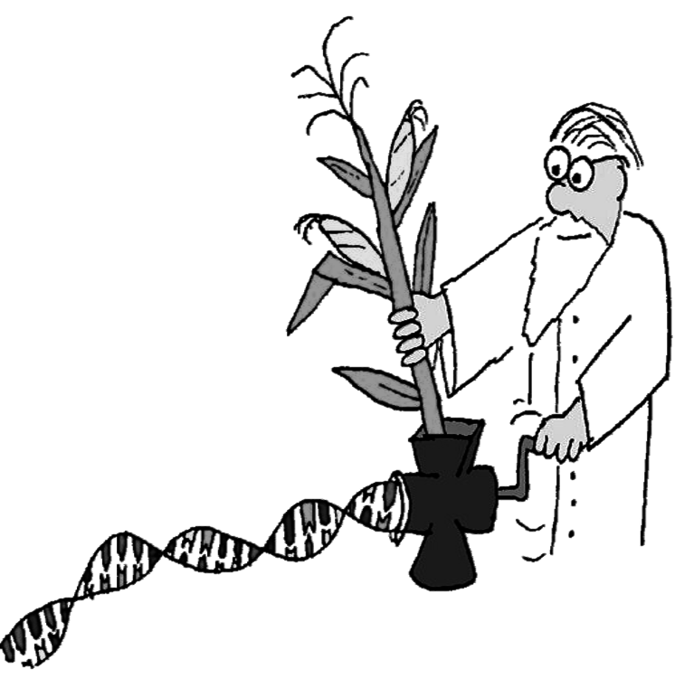
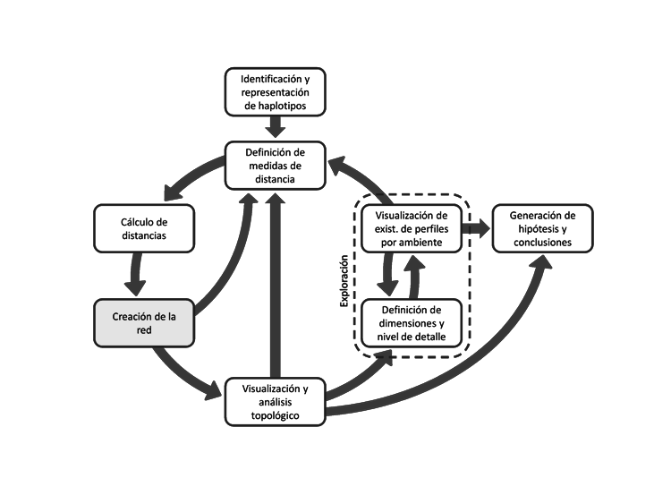
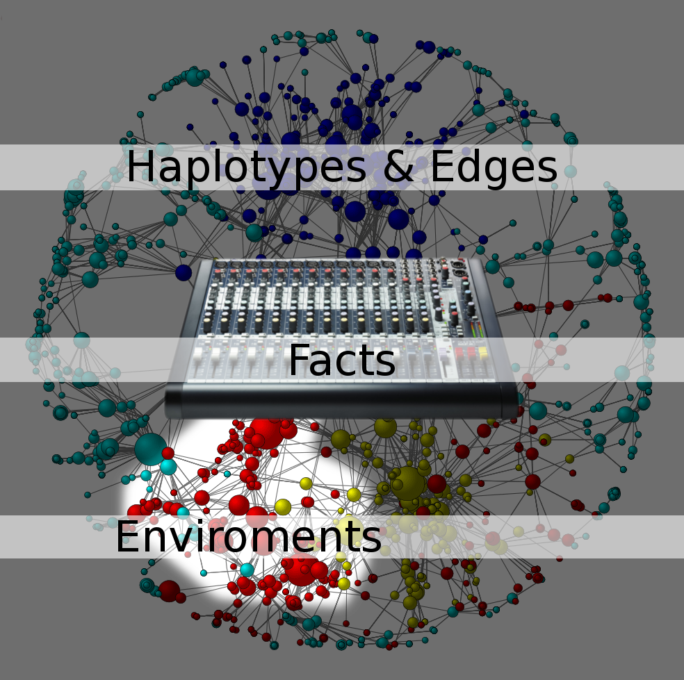

.. =============================================================================
.. ICONS
.. =============================================================================

.. |utnico| image:: img/utnico.png
.. |intaico| image:: img/intaico.png
.. |conicetico| image:: img/conicetico.png

.. =============================================================================
.. CONTENT
.. =============================================================================

Análisis de datos a través de grafos
------------------------------------

.. class:: center

    Cabral, Juan B.

    18/06/2014 - Posadas, Misiones

Integrantes
-----------

- |utnico|  - García, Mario Alejandro
- |utnico|  - Cabral, Juan Bautista
- |utnico|  - Ramirez, Emilio
- |utnico|  - Arnaud, Máximo "El Topo"
- |utnico|  - Castro, Jésica

- |intaico|  - Gimenez Pecci, María de la Paz
- |conicetico| |intaico|  - Laguna, Irma Graciela
- |intaico|  - Raspanti Monteoliva, Jorge G
- |intaico|  - Maurino, Fernanda

About Me
--------

- Egrese del Liceo Storni
- Soy ingeniero en sistemas de la UTN-FRC
- Estoy preparando mi doctorado en::

    Análisis y diseño de procesos de minería de datos astrofísicos sobre
    catálogos fotométricos múltiple época.

    Directores:
        Dr. Pablo Granitto (CIFASIS-CONICET)
        Dr. Sebastián Gurovich (IATE-UNC - CONICET)

- Otros intereses:
    - Recolección de datos.
    - Optimizaciones.
    - API e Infraestructura.

Paper
-----

- **Título:** “Interactive network exploration in the KDD process, Contributions
  in the study of population variability of a Corn Fijivirus”
- **Autores:** M. A. García, M. P. Giménez Pecci, J. B. Cabral, A. Nieto, I. G. Laguna.
- **Publicación:** Journal of Data Mining in Genomics & Proteomics 2012 3:3
- **Editorial:** OMICS Publishing Group
- **ISSN:** 2153-0602. Año: 2012
- **URL:** http://goo.gl/pcjdG

.. image:: img/qr.png
    :align: right
    :scale: 30 %

Agenda
------

- Un poco de historia y motivaciones.
- Un poco de KDD.
- Un poco de Network Science.
- Proceso de Analisis.
- DW - OLAP - BI.
- El proyecto en sí
- Mini Demo

.. image:: img/to_do_list.jpg
    :align: right
    :scale: 30 %

Historia: Mal de Río Cuarto virus
---------------------------------

- Base de datos formada por

    - Perfiles electroforéticos.
    - Atributos que definen el ambiente de la planta

        .. image:: img/electroforesis.png
            :align: center
            :scale: 20 %

- Variabilidad (redes vs árboles).

Knowledge Discovery in Database (KDD)
-------------------------------------

- Es un proceso no trivial de identificación de información útil y desconocida
  que permanece oculta en una base de datos [Fayyad, 1996]

- Es un proceso centrado en la persona (human-centered) [Brachman, 1996]

.. image:: img/mining.png
    :align: center
    :scale: 20 %

Network Science
---------------

- Es el estudio de las redes que representan fenómenos físicos, biológicos y
  sociales conduciendo a modelos predictivos de estos fenómenos.
- Topologías.
- Características comunes.

    Topologías en redes de comunicación

Networks 1
----------

    Interacción proteína-proteína

Networks 2
----------

    Redes sociales/económicas

Networks 3
----------

.. figure:: img/energy.png
    :align: center
    :scale: 100 %

    Red de distribución de energía

Networks 4
----------

.. figure:: img/motor.png
    :align: center
    :scale: 100 %

    Relación entre automotrices

Networks 5
----------

.. figure:: img/bbt.png
    :align: center
    :scale: 35 %

    Red semántica TBBT (Season 3)

Proceso de análisis
-------------------

Los ejemplos van con nuestra investigación (osea: resumen del paper)

Proceso de análisis: Identificación y representación de haplotipos
------------------------------------------------------------------

Proceso de análisis: Identificación y representación de haplotipos
------------------------------------------------------------------

Proceso de análisis: Identificación y representación de haplotipos
------------------------------------------------------------------

.. image:: img/tablaperfiles.png
    :align: center
    :scale: 200 %

Proceso de análisis: Definición de medidas de distancia
-------------------------------------------------------

Proceso de análisis: Definición de medidas de distancia
-------------------------------------------------------

Proceso de análisis: Cálculo de distancias
------------------------------------------

Proceso de análisis: Cálculo de distancias
------------------------------------------

Proceso de análisis: Creación de la red
---------------------------------------

Proceso de análisis: Creación de la red
---------------------------------------

Proceso de análisis: Visualización y análisis topológico
--------------------------------------------------------

Proceso de análisis: Visualización y análisis topológico
--------------------------------------------------------

Proceso de análisis: Exploración
--------------------------------

.. image:: img/kdd6.png
    :align: center
    :scale: 200 %

Proceso de análisis: Exploración
--------------------------------

Proceso de análisis: Generación de hipótesis y conclusiones
-----------------------------------------------------------

Proceso de análisis: Generación de hipótesis y conclusiones
-----------------------------------------------------------

.. image:: img/conc.png
    :align: center
    :scale: 60 %

Proceso de análisis: Generación de hipótesis y conclusiones
-----------------------------------------------------------

.. image:: img/conc2.png
    :align: center
    :scale: 75 %

Proceso de análisis: Conclusiones del proyecto
----------------------------------------------

- Según el índice calculado, la variabilidad del Mal de Río Cuarto virus,
  ha disminuido con el tiempo, habiendo una clara división del
  indicador en la campaña posterior a la epidemia de la campaña
  1996/97.
- La utilización de redes en el proceso de KDD resultó muy
  satisfactoria y logró resaltar un comportamiento del objeto de
  estudio que no había sido evidente hasta el momento.
- En un proceso centrado en la persona (human-centered), donde la
  creatividad y experiencia del analista juega un rol fundamental, la
  herramienta propuesta es capaz de ofrecer una perspectiva
  novedosa y complementaria con las demás técnicas del proceso de
  KDD

Data Warehouse - OLAP - BI
--------------------------

Concluimos que nuestro problema se adaptaba a algo muy similar a "algo" de BI

- En el contexto de la informática, un **almacén de datos**
  (del inglés data warehouse) es una colección de datos orientada a un
  determinado ámbito (empresa, organización, etc.), integrado, no volátil y
  variable en el tiempo, que ayuda a la toma de decisiones en la entidad en la
  que se utiliza.
- **OLAP** es el acrónimo en inglés de procesamiento analítico en línea
  (On-Line Analytical Processing). Es una solución utilizada en el campo de la
  llamada Inteligencia empresarial (o Business Intelligence)
  cuyo objetivo es agilizar la consulta de grandes cantidades de datos.
  Para ello utiliza estructuras multidimensionales (o **Cubos OLAP**) que contienen
  datos resumidos de grandes Bases de datos o Sistemas Transaccionales (OLTP).
  Se usa en informes de negocios de ventas, marketing, informes de dirección,
  minería de datos y áreas similares.

- Se denomina **inteligencia empresarial**, inteligencia de negocios o BI (del inglés
  business intelligence) al conjunto de estrategias y herramientas enfocadas a
  la administración y creación de conocimiento mediante el análisis de datos
  existentes en una organización o empresa.

Cubo OLAP
---------

Es una base de datos multidimensional, en la cual el almacenamiento físico de los
datos se realiza en un vector multidimensional. Los cubos OLAP se pueden
considerar como una ampliación de las dos dimensiones de una hoja de cálculo.

.. image:: img/cube.png
    :align: center
    :scale: 50 %

- Las olap pueden ser implementados en ROLAP - MOLAP - HOLAP
- Las consultas OLAP se llaman MDX (son bastante parecidas a SQL)
- Para consultas remotas se utiliza XMLA sobre SOAP

Soluciones OpenSource
---------------------

- **Mondrian** (todo en java soporta XML y MDX) (http://mondrian.pentaho.com/)
- **python xmla** (``pip install xmla``) para comunicarse con casi cualquier OLAP (https://pypi.python.org/pypi/xmla/)
- **Cubes** (``pip install cubes``) puro python pero muy verde (pythonhosted.org/cubes/)
- **Pentaho** (http://www.pentaho.com/),  **Saiku** (http://meteorite.bi/saiku),
  **OpenI** (http://openi.org/)

.. image:: img/floss.png
    :align: center
    :scale: 60 %

Y donde estamos con nuestro problema
------------------------------------

- Los Sql eran muy engorrosos (http://wiki.getyatel.org/analysis/exp2014/)
- Para Cubos y BI en general, la solución no era natural.
- Las bases de datos de redes no son tan difundidas como las RDBMS.
- Solución Nuevo Paradigma: **NW-OLAP**

.. image:: img/where-are-we.png
    :align: center
    :scale: 60 %

Red OLAP (*NW-OLAP*)
--------------------

Red OLAP (*NW-OLAP*) Seleccionada
---------------------------------

Red OLAP (*NW-OLAP*) Partes
----------------------------

Ejemplo: ¿Cual Córdoba es cada una? #1
--------------------------------------

Ejemplo: ¿Cual Córdoba es cada una? #2
--------------------------------------

Ejemplo: ¿Cual Córdoba es cada una? #3
--------------------------------------

Ejemplo: ¿Cual Córdoba es cada una? #4
--------------------------------------

Ejemplo: ¿Cual Córdoba es cada una? #5
--------------------------------------

Implementación
--------------

.. image:: img/yatelred.png
    :align: center
    :scale: 50 %

- Homepage: http://getyatel.org
- Es una implementación de referencia de NW-OLAP
- Wiskey-Ware License
- Es la implementación en gran parte del proceso mencionado anteriormente.
- Pronto a salir la primer version usable 0.3

Yatel - Arquitectura
--------------------

- Posee un lenguaje intermedio denominado QBJ.
- Puede usarse como librería o como DB remota (alpha)
- Posee soportes de ETL, estadísticas y DM rudimentaria.
- Exporta e importa las DW en formatos agnósticos basados en JSON y XML

Yatel - Ejemplo - Creación
--------------------------

.. code-block:: python

    from yatel import dom, db

    # postgres, oracle, mysql, and many more
    nw = db.YatelNetwork("memory", mode="w")

    elems = [
        dom.Haplotype(0, name="Cordoba"), # left
        dom.Haplotype(1, name="Cordoba"), # right
        dom.Haplotype(2, name="Cordoba"), # bottom

        dom.Edge(6599, (0, 1)),
        dom.Edge(8924, (1, 2)),
        dom.Edge(9871, (2, 0)),

        dom.Fact(0, name="Andalucia", lang="sp", timezone="utc-3"),
        dom.Fact(1, lang="sp"),
        dom.Fact(1, timezone="utc-6"),
        dom.Fact(2, name="Andalucia", lang="sp", timezone="utc")
    ]

    nw.add_elements(elems)
    nw.confirm_changes()

Yatel - Ejemplo - Consultas #1
------------------------------

.. code-block:: python

    print nw.describe()
    # {
    #   'haplotype_attributes': { 'hap_id': <type 'int'>, 'name': <type 'str'>},
    #  'fact_attributes': { 'lang': <type 'str'>, 'timezone': <type 'str'>,
    #                       'hap_id': <type 'int'>, 'name': <type 'str'>},
    #   'mode': 'r',
    #   'edge_attributes': {u'max_nodes': 2, u'weight': <type 'float'>},
    #   'size': {u'facts': 4, u'haplotypes': 3, u'edges': 3}
    # }

    for hap in nw.haplotypes():
        print hap
    # <Haplotype (0) at 0x2cb8710>
    # <Haplotype (1) at 0x2cb8810>
    # <Haplotype (2) at 0x2cb8850>

    for edge in nw.edges():
        print edge
    # <Edge ([6599.0 [0, 1]]  ) at 0x2cb64d0>
    # <Edge ([8924.0 [1, 2]]  ) at 0x2cb6dd0>
    # <Edge ([9871.0 [2, 0]]  ) at 0x2cb6fd0>

    for fact in nw.facts():
        print fact
    # <Fact (of Haplotype '0') at 0x2cb6f50>
    # <Fact (of Haplotype '1') at 0x2cb6ed0>
    # <Fact (of Haplotype '1') at 0x2cb6c50>
    # <Fact (of Haplotype '2') at 0x2cb6e90>

Yatel - Ejemplo - Consultas #2
------------------------------

.. code-block:: python

    hap = nw.haplotype_by_id(2)

    for edge in nw.edges_by_haplotype(hap):
        print edge
    # <Edge ([9871.0 [2, 0]]  ) at 0x1cf6910>,
    # <Edge ([8924.0 [1, 2]]  ) at 0x1cf6810>

    for fact in nw.facts_by_haplotype(hap):
        print dict(fact)
    # {u'timezone': u'utc', u'lang': u'sp', 'hap_id': 2, u'name': u'Andalucia'}

    for hap in nw.haplotypes_by_enviroment(lang="sp"):
        print hap
    # <Haplotype (0) at 0x254bfd0>
    # <Haplotype (1) at 0x254bc10>
    # <Haplotype (2) at 0x254bfd0>

    for hap in nw.haplotypes_by_enviroment(timezone="utc-6"):
        print hap
    # <Haplotype (1) at 0x14a8210>

    for hap in nw.haplotypes_by_enviroment(name="Andalucia"):
        print hap
    # <Haplotype (0) at 0x254bb50>
    # <Haplotype (2) at 0x254bfd0>

Yatel - Ejemplo - Consultas, Estadisticas
-----------------------------------------

.. code-block:: python

    for edge in nw.edges_by_enviroment(name="Andalucia"):
        print edge
    # <Edge ([9871.0 [2, 0]]  ) at 0x23e3ad0>

    for env in nw.enviroments():
        print env
    # <Enviroment {u'lang': u'sp', u'timezone': u'utc-3', u'name': u'Andalucia'} at 0x1f6b490>
    # <Enviroment {u'lang': u'sp', u'timezone': None, u'name': None} at 0x1f6b810>
    # <Enviroment {u'lang': None, u'timezone': u'utc-6', u'name': None} at 0x1f6b490>
    # <Enviroment {u'lang': u'sp', u'timezone': u'utc', u'name': u'Andalucia'} at 0x1f6b810>

    for env in nw.enviroments(["lang", "name"]):
        print env
    # <Enviroment {u'lang': u'sp', u'name': u'Andalucia'} at 0x1aa4950>
    # <Enviroment {u'lang': u'sp', u'name': None} at 0x1aa45d0>
    # <Enviroment {u'lang': None, u'name': None} at 0x1aa4950>

    from yatel import stats

    print stats.average(nw)
    # 8464.66666667
    print stats.std(nw, name="Andalucia")
    # 0

Yatel - Ejemplo - Data Minning
------------------------------

.. code-block:: python

    from scipy.spatial.distance import euclidean
    from yatel.cluster import kmeans

    cbs, distortion = kmeans.kmeans(nw, nw.enviroments(), 2)

    for env in nw.enviroments():
        coords = kmeans.hap_in_env_coords(nw, env)
        min_euc = None
        closest_centroid = None
        for cb in cbs:
            euc = euclidean(cb, coords)
            if min_euc is None or euc < min_euc:
                min_euc = euc
                closest_centroid = cb
        print "{} || {} || {}".format(dict(env), closest_centroid, euc)
    # {u'lang': u'sp', u'timezone': u'utc-3', u'name': u'Andalucia'} || [0 0 0] || 1.41421356237
    # {u'lang': u'sp', u'timezone': None, u'name': None} || [0 1 0] || 0.0
    # {u'lang': None, u'timezone': u'utc-6', u'name': None} || [0 1 0] || 0.0
    # {u'lang': u'sp', u'timezone': u'utc', u'name': u'Andalucia'} || [0 0 0] || 1.41421356237

Pendientes: Yatel Kaani - (Not even started)
--------------------------------------------

- En funcionamiento... (0.2 algo así va a ser Yatel BI)
- Homepage: http://kaani.getyatel.org/

.. image:: img/sshot.png
    :align: center
    :scale: 25 %

Pendientes: Yatel Teper - (Not even started)
--------------------------------------------

- Va a ser el entorno visual de ETL
- Va a permitir ordenar fuentes para alimentar DW NW-OLAP

Más pendientes
--------------

- YatelQL sin implementar.
- Más minería de datos propiamente dicha (solo tiene kmeans)
- Agregar autenticación rudimentaria en yatel server y dar soporte a algo como... LDAP¿?¿?.
- La parte científica per-se no esta desarrollada (algún doctorando en la sala?)
- Documentación (mucha)
- Testing.

¿Preguntas?
-----------

    - Charla: http://goo.gl/kNEXHK
    - Contactos:
        - http://forum.getyatel.org
        - Juan Cabral <`jbc.develop@gmail.com <mailto:jbc.develop@gmail.com>`_>

.. image:: img/questions.png
    :align: right
    :scale: 25 %

