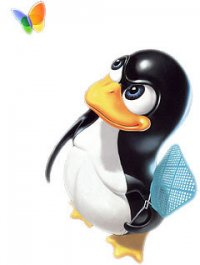
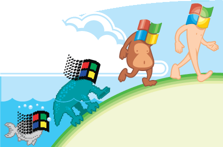
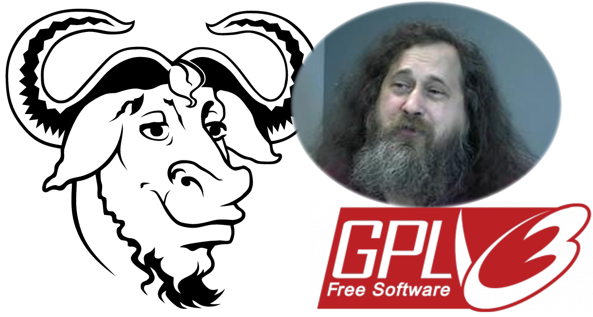
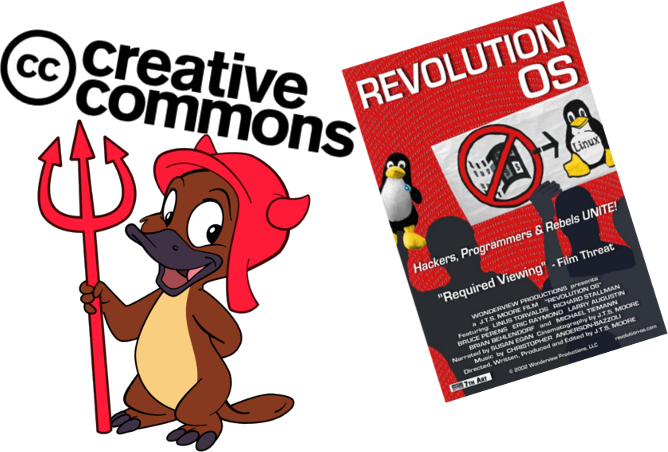
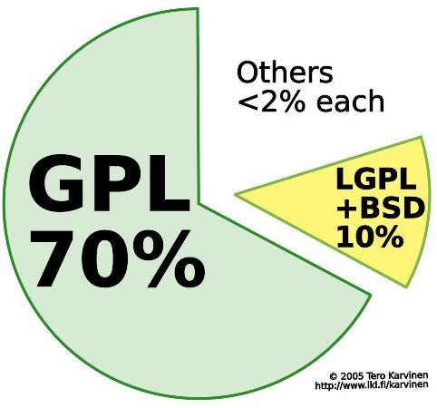
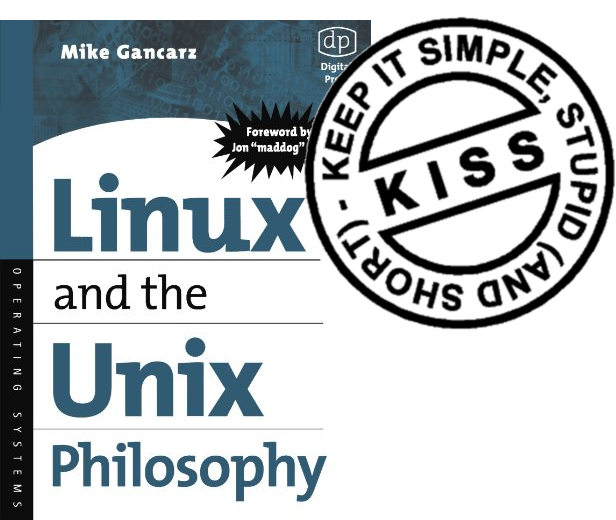
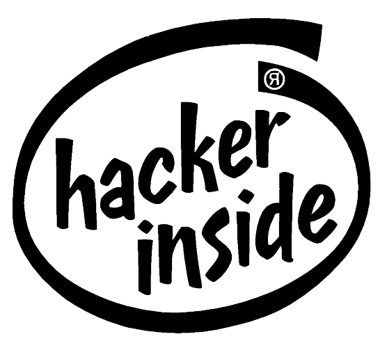
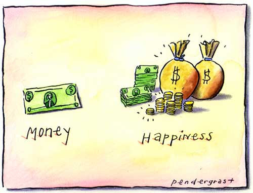
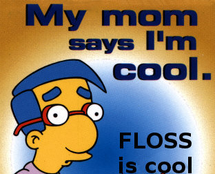
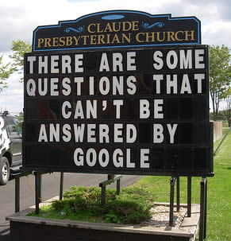

Ingeniería de Software Libre
============================

.. image:: img/port.jpg
   :align: right
   :scale: 80 %

About me...
-----------

**Juan B Cabral.**

    * La UTN dice que soy ingeniero en sistemas.
    * Edito la revista PET (http://revista.python.org.ar/)
    * **Mi alineación es:** Legal Malvado
    * Fumo Pipa (No fumo cigarrillos)
    * Me gusta el buen whisky.
    * Soy algo asi como un pre-doctorando (UPM).
    * Como llegué a esto del FLOSS?

Round 1... Fight!
-----------------

    - Quiero meterlos objetivamente en la discusión del FLOSS vs Software 
      Propietario.
    - Esto no deja de tener mucho subjetivo mio.
    - Aun así son libres de hacerme caso en todo.
    - Esta charla la di en el CNEISI 2011.

    

Historia: Software Propietario
------------------------------

    - No existió siempre.
    - Micro$oft es en gran medida responsable del estado deplorable de las cosas.
    - Bill Gates **an open letter to hobbyists** (http://bit.ly/P1Jmw)
    

Historia: Software Libre
------------------------

- Richard Stallman - GNU -GPL
- Las 4 libertades del software:
    0. La libertad de usar el programa, con cualquier propósito.
    1. La libertad de estudiar cómo funciona el programa y modificarlo, 
       adaptándolo a tus necesidades.
    2. La libertad de distribuir copias del programa, con lo cual puedes 
       ayudar a tu prójimo.
    3. La libertad de mejorar el programa y hacer públicas esas mejoras a los 
       demás, de modo que toda la comunidad se beneficie.

- **INFO:** http://www.fsf.org/

Historia: OSI
-------------

- Bruce Perens y Eric S. Raymond.
- The Cathedral and the Bazaar (lo vieron ayer y voy a profundisar mas adelante)
- Netscape/Mozilla
- Trata de eliminar la visión moralista y agresiva de la FSF y desarrollar una idea
  pragmática orientada al negocio que fomento a Netscape.
- Hay 10 principios que definen al software OS 
- En su pagina oficial hay una lindo grupo de licencias aprobadas.
- **INFO:** http://www.opensource.org/

.. image:: img/osi.png
   :align: center
   :scale: 30 %

Historia: Y que tanto se parece FS y el OS?
-------------------------------------------

.. image::  img/category.png
   :align: center
   :scale: 200%

Mas filosofías además de las principales: 
http://www.gnu.org/philosophy/categories.html

Historia: Cerrando
------------------

Hay mucho mas para ver:
    - Creative Commons (http://creativecommons.org/).
    - Algunas elecciones que se hicieron como Mac OSX y Android.
    - Aplicaciones irreemplazables FLOSS hay unas cuantas.

Para mas ver:
    - Revolution OS (http://www.imdb.com/title/tt0308808/)

Ahora si: A los bifes
---------------------

- Y de ahora en mas digo indistintamente FLOSS/OS/FS
- El software libre disminuye mucho de la sobre ingeniería.
- Se basa mucho en que uno se rasca por que le pica.
- Los que sigue:

        #. Lo técnico.
        #. Lo legal.
        #. El diseño del software.
        #. La gestión de Proyectos.
        #. La parte económica.

   
   
Lo técnico
----------

- Modelo de la catedral vs el modelo del bazar.
- Liberar rápido.
- Si no te gusta... arréglalo (Carajo!).
- Muchas alternativas y sin estar atado a un solo (y mediocre) proveedor.
- Valor de los forks.

.. image:: img/tech.jpg
   :align: right
   :scale: 30 %
   

Lo legal
--------

- Copyleft
- GPL (primer licencia que cuida la comunidad y no a individuos)
- Licencias BSD
- DRM y la GPL 3
- El derecho a leer.

Lo legal: mi licencia favorita
------------------------------

::

  "THE WISKEY-WARE LICENSE":
  <jbc.develop@gmail.com> wrote this file. As long as you retain this notice you
  can do whatever you want with this stuff. If we meet some day, and you think
  this stuff is worth it, you can buy me a WISKEY in return Juan BC

Y ahora algo mas Divertido: Diseño
----------------------------------

- KISS
- Filosofía Unix: (http://en.wikipedia.org/wiki/Unix_philosophy)
    - Small is beautiful.
    - Make each program do one thing well.
    - Build a prototype as soon as possible.
    - Choose portability over efficiency.
    - Store data in flat text files.
    - Use software leverage to your advantage.
    - Use shell scripts to increase leverage and portability.
    - Avoid captive user interfaces.
    - Make every program a filter.

Y ahora algo mas Divertido: Diseño (cont.)
------------------------------------------

- Refactoring.
- La comunidad como parámetro de buen diseño.
- Y como no... modelo bazar sobre modelo catedral.

Lo humano: La gestión de proyectos
----------------------------------

- Administración de contribuciones y parches (forks).
- Benevolent Dictator for life
- Y como mantengo mis versiones?
- Meritocracia Hacker.
  (http://www.sindominio.net/ayuda/preguntas-inteligentes.html)
- Y como hacemos llegar nuestros proyectos a la gente?

Y un poco mas aburrido pero cerrando: Lo económico
--------------------------------------------------

- El principio de escasez.

- Casos interesantes
    - Netscape (safó)
    - Google (mix)
    - Mac OSX (su SO es CASI OS)
    - Sun (se fundió)
    - Canonical (es mix en pequeña escala)
    - MySQL, PHP...

- El como ganar plata no difiere mucho del soft privativo.

Conclusiones
------------

En general:
    - El FLOSS va mas allá de lo técnico.
    - El FLOSS es una forma de ver el software.
    - El FLOSS contradice mucho de la ingeniería de software tradicional.
    - No tiene mas que ventajas en lo académico.

En lo personal:
    - Descreo mucho de gente que se la pasa mas con powerpoint y excel antes 
      que con un editor de texto
    - Valoro lo técnico, lo económico me importa muy poco (asunto de los 
      administradores)
    - FLOSS golpeo mi ego.
    
    

    
    
CONSEJASO
---------

**Muchas de sus tesis van a morir en el olvido... 
**libérenlas, pueden ayudar a alguien**

.. image:: img/bart.gif
    :align: right
    :scale: 300 %
    
    
Algunos Datos de Interes
------------------------

- Fundación Via Libre: http://www.vialibre.org.ar/
- GrULiC: http://www.grulic.org.ar/
- SLUC: http://sluc.org.ar/
- GNUtn: http://www.gnutn.org.ar/
- Solar: http://www.solar.org.ar/
- USLA: http://drupal.usla.org.ar/
- CADESoL: http://www.cadesol.org.ar/

- Mi programa de soft libre: 
    - Source: https://bitbucket.org/leliel12/papers (floss_program)
    - PDF: http://www.slideshare.net/JuanCabral/floss-programa-de-open-source

¿Preguntas?
-----------

    - Charlas:
        - http://bitbucket.org/leliel12/talks
    - Contacto:
        - Juan B Cabral
            - Mail: `jbc.develop@gmail.com <mailto:jbc.develop@gmail.com>`_
            - Twitter: `@JuanBCabral <http://twitter.com/JuanBCabral/>`_
            - Blog: http://jbcabral.com/

.. footer::
    Unicode - Córdoba 13/09/2012

.. header::
    Ingeniería de Software Libre

