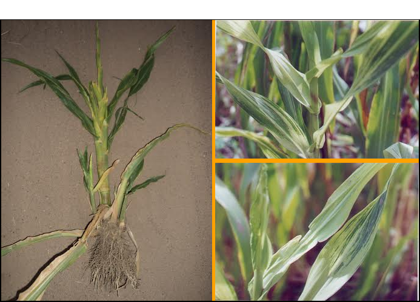
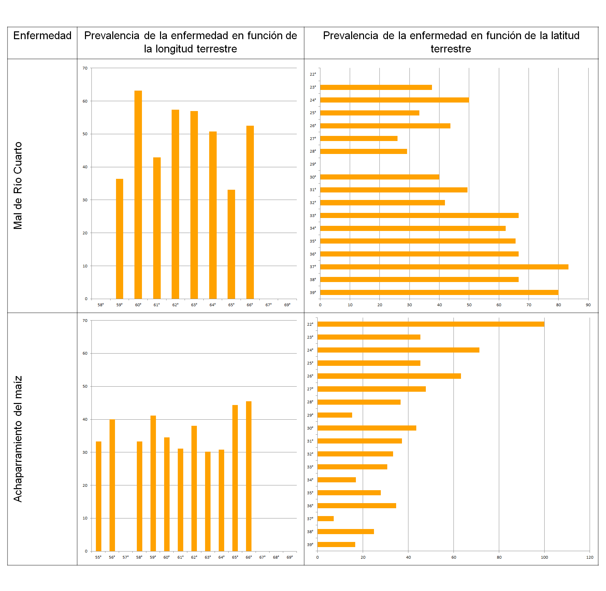
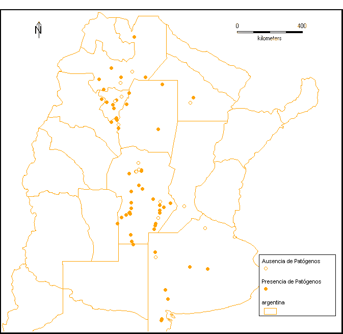
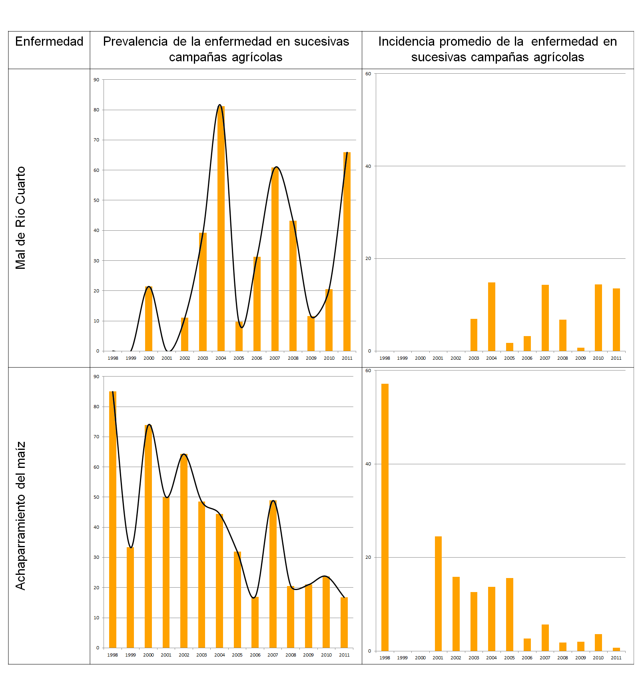

.. =============================================================================
.. HEADER
.. =============================================================================

.. header::

    .. image:: img/head.png
        :align: center
        :scale: 90 %

    Giménez Pecci, M.P. :sup:`1`,
    A. García :sup:`2`,
    M. Druetta :sup:`1 3`,
    J.B. Cabral :sup:`1 2`,
    F. Maurino :sup:`1 4`,
    I.G. Laguna :sup:`1 4`,
    E. H. Ramírez :sup:`2`

    :sup:`1` IPAVE CIAP-INTA, Córdoba;
    :sup:`2` FRC - Univ. Tecnológica Nacional;
    :sup:`3` EEA ESE INTA Quimilí;
    :sup:`4` CONICET

.. =============================================================================
.. CONTENT
.. =============================================================================

Introducción
------------

Mal de Río Cuarto virus (MRCV) y *Spiroplasma kunkelii* (CSS) son dos patógenos
transmitidos por chicharritas auquenorrincos que afectan al maíz, cultivo base
de la sustentabilidad del sistema agropecuario actual de Argentina. La región
agrícola presenta características diferentes en cada zona y ambiente, desde
diferentes climas y base genética del cultivo hasta diferentes tipos de
labranza y prácticas culturales. Hacia el final de la década del 2000 se
estableció una continuidad geográfica de los cultivos entre la zona norte
subtropical y la zona sur templada. En MRCV en décadas anteriores entre una
epifitia y el siguiente ataque con importancia económica se habían registrado
distancias de 5 y 7 años (1977-1982, 1997-2004). En CSS, se observó que el
avance hacia nuevas regiones ocurría en saltos de 10 años (epidemia en Florida
en los 80, detección en Brasil en los 70 y rápida expansión en los 90,
detección en Argentina en los 90 y dispersión en la zona subtropical hasta el
2.000.

    Maiz con MRCV (izquierda) y con CSS (derecha)

Objetivos
---------

Los objetivos del trabajo fueron reconocer la distribución geográfica y
establecer en cada región del país el nivel de inóculo que podría relacionarse
con el desencadenamiento de la enfermedad en la campaña agrícola siguiente, así
como comparar el comportamiento entre las dos enfermedades.

Materiales y métodos
--------------------

Datos serológicos de muestras colectadas en 564 lotes durante 12 campañas
agrícolas (1999/2000 a 2010/2011) en toda la zona agrícola (22° a 39°LS y 58°
a 69°LO), se compararon en cuanto a presencia de la enfermedad evaluada como
prevalencia (número de lotes con al menos una planta enferma) e incidencia
(porcentaje de plantas enfermas en un lote elegido al azar, en al menos 20
plantas colectadas al azar).

Resultados y discusión
----------------------

Los resultados indicaron que la prevalencia de MRCV se incrementa hacia el
sur, no superando valores de 40% hasta el paralelo 30°LS, elevándose sobre el
40% a latitudes mayores, hasta registrarse 83% en el paralelo 37°LS. En el
caso del CSS la tendencia es contraria, incrementándose el porcentaje de lotes
enfermos hacia el norte de la región analizada. En cuanto a la longitud, no se
detectaron grandes diferencias de prevalencia. Respecto a la recurrencia de
estas enfermedades, en MRCV se registraron ciclos de 3 - 4 años con picos
superiores al 60% de lotes enfermos (2004, 2007, 2011), y en CSS los máximos
se registraron en 2000, 2007 y 2010, con valores decrecientes de prevalencia
del 70, 50 y 25%. Los registros de incidencia del espiroplasma presentaron un
cambio notable a mitad de la década: entre 2001 y 2005 el promedio superó el
10% de plantas enfermas en el lote, mientras que entre 2006 y 2011 el promedio
no superó 5%.
Esto podría ser el resultado del empleo de semilla tratada profesionalmente en
origen con insecticidas, práctica empleada masivamente desde la campaña
2005/06.

    Presencia/ausencia de MRCV y CSS en cultivos maíz

Conclusiones
------------

Se concluye que MRCV manifestó ciclos periódicos de 3-4 años, de forma
sinusoidal bien definida, mientras que CSS disminuyó notablemente su incidencia
y prevalencia en la segunda mitad de la década analizada.

.. =============================================================================
.. FOOTER
.. =============================================================================

.. footer::

    .. class:: footer

        **Contacto:** `gimenez.mariadelapaz@inta.gob.ar <mailto:gimenez.mariadelapaz@inta.gob.ar>`_

        **Financiamiento:** INTA PNPV 1135022, UTN 1685.

