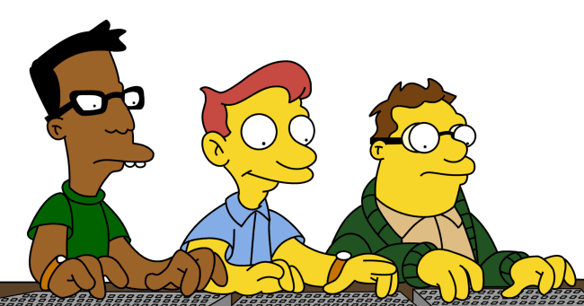
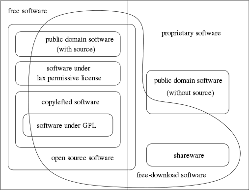

Software Libre Metido en La Ingenieria en Sistemas
==================================================

Quien cuerno soy?
-----------------

**Juan B Cabral.**

    * La UTN dice que soy ingeniero.
    * Edito la revista PET (http://revista.python.org.ar/)
    * Soy becario investigador en bioinformatica.
    * Me interesa la medición de la información desde un punto de vista científico.
    * **Mi alineación es:** Legal Malvado
    * Fumo Pipa (No fumo cigarrillos)
    * Me gusta el buen whisky.

.. image:: img/pipwis.jpg
       :align: right
       :scale: 400 %

Round 1... Fight!
-----------------

    - Quiero meterlos objetivamente en la discucion del FLOSS vs Software Propietario.
    - Esto no deja de tener mucho subjetivo mio.
    - Aun asi son libres de hacerme caso en todo.

Historia: Software Propietario
------------------------------

    - No existio siempre.
    - Micro$oft es en gran medida responsable del estado deplorable de las cosas.
    - Bill Gates **an open letter to hobbyists**

Historia: Software Libre
------------------------

- Richard Stallman.
- Manifesto GNU.
- GPL/LGPL/AGLP
- Las 4 libertades del software:
    0. La libertad de usar el programa, con cualquier propósito.
    1. La libertad de estudiar cómo funciona el programa y modificarlo, adaptándolo a tus necesidades.
    2. La libertad de distribuir copias del programa, con lo cual puedes ayudar a tu prójimo.
    3. La libertad de mejorar el programa y hacer públicas esas mejoras a los demás, de modo que toda la comunidad se beneficie.

- Las libertades 1 y 3 requieren acceso al código fuente porque estudiar y modificar software sin su código fuente es muy poco viable.

Historia: OSI
-------------

- Bruce Perens y Eric S. Raymond.
- The Cathedral and the Bazaar (lo vieron ayer y voy a profundisar mas adelante)
- Netscape/Mozilla
- Trata de eliminar la vision moralista y agresiva de la FSF y desarrollar una idea
  pragmatica orientada al negocio que fomento a netscape.
- Hay 10 principios que definen al software OS

Historia: Y que tanto se parece FS y el OS?
-------------------------------------------

Mas filosofias ademas de las principales: http://www.gnu.org/philosophy/categories.html

Historia: Cerrando
------------------

Hay mucho mas para ver:
    - Creative Common
    - Algunas elecciones que se hicieron como Mac OSX y Android.
    - Aplicaciones irremplazables.

Para mas ver:
    - Revolution OS (http://www.imdb.com/title/tt0308808/)

Y de ahora en mas digo indistintamente FLOSS/OS/FS

Ahora si: A los bifes
---------------------

- El software libre disminuye mucho de la sobre ingeniria que nos venden en la facu.
- Voy a dividir el "proceso" de ing de softwate (libre) en las siguientes partes:

        #. Lo técnico.
        #. Lo legal.
        #. El diseño del software.
        #. La gestión de Proyectos.
        #. La parte ecónomica.

Lo técnico
----------

    - Modelo de la catedral vs el modelo del bazar.
    - Liberar rapido.
    - Si no te gusta... arreglalo.
    - Muchas alternativas y sin estar atado a un solo y mediocre proveedor.

Lo legal
--------

    - Copyleft
    - GPL (primer licensia que cuida la comunidad y no a individuos)
    - Licencias BSD
    - DRM y la GPL v. 3.0
    - El derecho a leer.

Y ahora algo mas Divertido: Diseño
----------------------------------

    - KISS
    - Filosofía Unix:
        - Small is beautiful.
        - Make each program do one thing well.
        - Build a prototype as soon as possible.
        - Choose portability over efficiency.
        - Store data in flat text files.
        - Use software leverage to your advantage.
        - Use shell scripts to increase leverage and portability.
        - Avoid captive user interfaces.
        - Make every program a filter.

Y ahora algo mas Divertido: Diseño (cont.)
------------------------------------------

    - Refactoring.
    - Patrones: mitos y realidades.
    - La comunidad como parámetro de buen diseño.
    - Y como no... modelo bazar sobre modelo catedral.

Lo humano: La gestion de proyectos
----------------------------------

    - Administración de contribuciones y parches (forks).
    - Benevolent Dictator for life
    - Y como mantengo mis versiones?
    - Meritocracia Hacker.
    - Y como hacemos llegar nuestros proyectos a la gente?

Y un poco mas aburrido pero cerrando: Lo economico
--------------------------------------------------

    - Casos interesantes
        - Netscape (safo)
        - Google (es hibrida)
        - Mac OSX (su so es CASI os)
        - Sun (se fundio)
        - Canonical (es hibrido en pequeña escala)
        - MySQL, PHP...

    - El como ganar plata no difiere mucho del soft privativo.

Conclusiones
------------

En general:
    - El FLOSS va mas alla de lo tecnico.
    - El FLOSS es una forma de ver el software.
    - El FLOSS contradice mucho de la ingenieria de software tradicional.

En lo personal:
    - Prefiero el FLOSS ante que laburar para productos mediocres
    - Soy ingeniero y valoro lo tecnico, lo economico me importa muy poco (asunto de los administradores)

¿Preguntas?
-----------

    - Charlas:
        - http://bitbucket.org/leliel12/talks
    - Contacto:
        - Juan B Cabral
            - Mail: `jbc.develop@gmail.com <mailto:jbc.develop@gmail.com>`_
            - Twitter: `@JuanBCabral <http://twitter.com/JuanBCabral/>`_
            - Blog: http://jbcabral.wordpress.com/

.. footer::
    CNEISI - Embalse, Córdoba 30/09/2011

.. header::
    SL Metido en La Ingenieria en Sistemas

