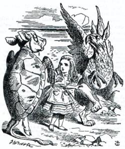

PyQt
----

- Es un binding a una librería grafica hecha en C++ (en realidad es más que eso).
- Posee un editor visual de formularios (QtDesigner)
- Homepage: http://www.riverbankcomputing.co.uk/software/pyqt/intro

----

PyQt (Ejemplo)
--------------

.. code-block:: python

    import os
    from PyQt4 import QtCore, QtGui
    import pycante

    PATH = os.path.abspath(os.path.dirname(__file__))
    UI_DIR = pycante.EDir(PATH)

    class Dialog(UI_DIR("Dialog.ui")):

        def on_pushButton_clicked(self):
            text = self.lineEdit.text()
            self.label.setText("Hola " + unicode(text) + "!")

    app = QtGui.QApplication([])
    d = Dialog()
    d.show()
    app.exec_()

----

Pilas
-----

- Un motor de videojuegos 100% en español (en proceso de traducción a otros lenguajes)
- Multiplataforma y ridiculamente-fácil de aprender.
- Desarrollado por un miembro de PyAr (Hugo Ruscitti)
- Embebible en widgets PyQt
- Homepage: http://www.pilas-engine.com.ar/

----

Pilas (Ejemplo)
---------------

.. code-block:: python

    import pilas
    import time

    pilas.iniciar()

    mono = pilas.actores.Mono()
    mono.x, mono.y = 100, 100
    mono.aprender(pilas.habilidades.Arrastrable)

    bananas = pilas.actores.Banana() * 10
    bombas = pilas.actores.Bomba() * 5

    def mono_come_banana(mono, banana):
        mono.sonreir()
        banana.eliminar()

    def bomba_mata_mono(mono, bomba):
        bomba.explotar()
        mono.gritar()
        mono.eliminar()

    pilas.escena_actual().colisiones.agregar(mono, bananas, mono_come_banana)
    pilas.escena_actual().colisiones.agregar(mono, bombas, bomba_mata_mono)

    pilas.ejecutar()

----

Beautiful Soup
--------------

- Es un parser HTML/XML laxo (¡funciona bien con código HTML/XML mal formado!).
- Permite buscar de una manera **muy**, realmente **muy** flexible en código
  XML-like.
- Es raro.
- Hace cosas raras.
- Homepage: http://www.crummy.com/software/BeautifulSoup/

----

Beautiful Soup (Ejemplo, HTML)
------------------------

.. code-block:: python

    html = """
    <!DOCTYPE html PUBLIC "-//W3C//DTD XHTML 1.0 Strict//EN"
        "http://www.w3.org/TR/xhtml1/DTD/xhtml1-strict.dtd">
    <html xmlns="http://www.w3.org/1999/xhtml" xml:lang="en" lang="en">
    <head>
        <title>titulo</title>
    </head>
    <body>
        
este es un codigo feo<b>
        <a href="http://google.com">to google</a>
        <a href="http://www.google.com" id="unico">to google</a>
        <a href="http://yahoo.com">to yahoo</a>
        <ul class="elgroso">
            <li>something</li>
        </ul>
        <ul class="elgroso">
            <li>something</li>
        </ul>
        <ul class="elflaco">
            <li>something</li>
        </ul>
    </body>
    </html>
    """

----

Beautiful Soup (Ejemplo, Python)
--------------------------------

.. code-block:: python
    
    import re
    import bs4

    soup = bs4.BeautifulSoup(html)
    print soup.find_all("a")
    print soup.find("a", href="http://yahoo.com")
    print soup.find_all("a", href=re.compile(".*google[.]com"))
    print soup.find("a", href=re.compile(".*google[.]com"), id="unico")
    print soup.find("ul", class_="elgroso").find_all("li")
