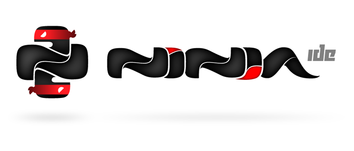

Ninja-IDE
---------

- Project Managment
- Amazing Code Locator
- Errors and PEP8 Finder
- Run Project and Files
- Highly extensible with Pluging

----

Ninja-IDE: screenshots
----------------------

----

Ninja-IDE: screenshots
----------------------

----

Quepy
-----

- (El logo de Quepy está en camino!)
- Proyecto open-source desorrallado por Machinalis con el grupo de investigación de PNL de FaMAF
- Quepy es un framework para transformar preguntas en lenguaje natural a consultas en un lenguaje de base de datos
- Idea: con poco codigo podrías construir tu propio acceso a tu base de datos mediante lenguaje natural.
- Quepy provee soporte para el lenguaje de consultas sparql, pero puede ser extendido a otros lenguajes de consulta.

----

Quepy: Links!
-------------

- https://github.com/machinalis/quepy
- http://quepy.readthedocs.org/
- http://pypi.python.org/pypi/quepy/

----

Quepy
-----

- Tenemos en funcionamiento una instancia de Quepy que consulta a DBpedia en: http://quepy.machinalis.com/

.. image:: img/ScreenShot-Quepy-1.png
    :align: center
    :width: 766px
    :height: 448px
    
----

Quepy: pregunta
---------------

    
----

Quepy: respuesta!
-----------------

