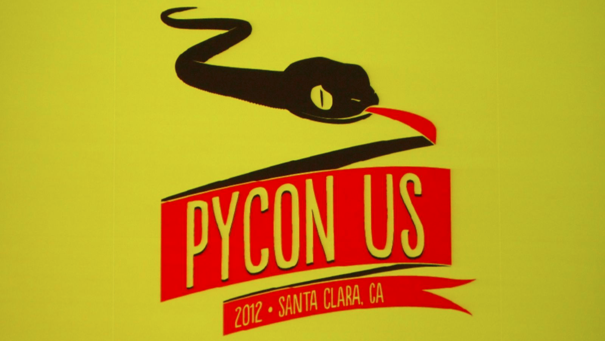

Comunidad
---------

En los siguientes slides se verá:

- La comunidad internacional de Python
- Grandes eventos internacionales
- Comunidad Local
- Eventos locales

----

Comunidad Internacional
-----------------------

- Dada la expresividad del lenguaje, muchos hackers y científicos son miembros
  activos de esta comunidad
- Se nuclea a través de la Python Software Foundation (hay dos miembros de PyAr)
- Se organizan cerca de 200 conferencias anuales de Python en todo el mundo.

----

- Mayor conferencia de python a nivel mundial.
- 5 mil asistentes.
- 15 días (03/2013 es la siguiente en Santa Clara)

----

Muchas conferencias
-------------------

::

    - "PyCon" in United States
    - "EuroPython" in Europe
    - "EuroSciPy" in Europe
    - "Kiwi PyCon" in New Zealand
    - "PyCon Asia Pacific" in Singapore
    - "PyCon AR" in Argentina
    - "PyCon AU" in Australia
    - "PythonBrasil" in Brazil
    - "PyCon Canada" in Canada
    - "PyCon China" in China
    - "PyCon DE" in Germany
    - "PyCon ES" in Spain
    - "PyCon Finland" in Finland
    - "PyCon FR" in France
    - "PyCon India"
    - "PyCon Ireland"
    - "PyCon Italia" in Italy
    - "PyCon Japan"
    - "PyCon Philippines" in the Philippines
    - "PyCon PL" in Poland
    - "PyCon Russia" in Russia
    - "PyCon Taiwan" in Taiwan
    - "PyCon UK" in the United Kingdom
    - "PyCon Ukraine" in Ukraine
    - "PyCon Uruguay" in Uruguay
    - "PyCon Venezuela" in Venezuela
    - "PyCon ZA" in South Africa
    - "SciPy" in the United States
    - "SciPy.in" in India

----

.. image:: img/pyar.png
    :align: center
    :width: 678px
    :height: 275px

- Una lista de correo con cerca de 400 personas activas.
- Alto nivel técnico.
- Recientemente fundado Sci-Pyar
- Homepage: http://python.org.ar

----

Eventos 2011
------------

- PyDay Córdoba 2011 (211 asistentes)
- PyDay Gonzales Catán (~70 asistentes)
- PyDay San Luis (~30 asistentes)
- Django Day Córdoba 2011 (~30 asistentes)
- PyConAr Junin 2011 (~270 asistentes)

----

Eventos 2012
------------

- PyDay Junín 2012 (~50 asistentes)
- PyDay Córdoba 2012 (~100 asistentes)
- PyDay Rafaela 2012 (~30 asistentes (se llovio todo))
- Pycon 2012 (403 asistentes)
- Django Day La Plata

----

- 403 asistentes.
- 9 sprints.
- 2 eventos en paralelo.
- 10 tutoriales y workshops.
- 51 charlas programadas.
- 9 invitados internacionales.

----

    
    Foto final PyConAr 2012
