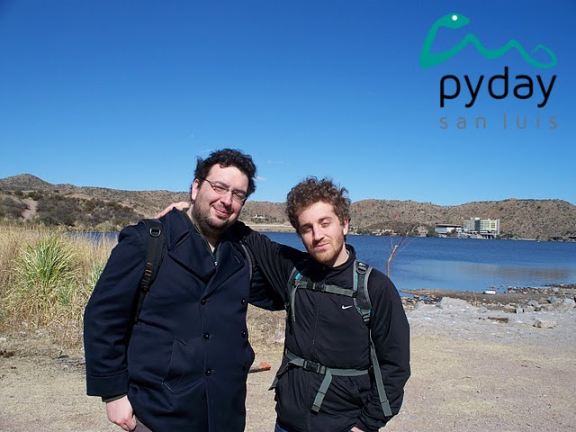

# Python en el mundo real

Juan B. Cabral - Matias Herranz

---

# Los disertantes

Juan B Cabral

- Ing en Sistemas.
- UTN-FRC
- Organizador de la última PyCon Argentina, de un PyDay y un Django Day.
- Trabaja en Liricus.

Matias Herranz

- Lic en Ciencias de la Computación.
- FAMaF - UNC
- Disertante en todo lo que organizo Juan y varias cosas mas.
- Trabaja en Machinalis

---

Los 2:

- Ambos trabajan con Python  en su día a día.
- Ambos hicieron su tesis de grado en Python.
- Ambos son miembros de PyAr.
- Ambos hacen ciencia con Python.
- Ambos se conocieron en PyAr.
- Toman wiskey.
- Son amigos.

---

# ¿De qué va la charla?

- Un ejemplo de su sintaxis en casos didacticos.
- Programas hechos en Python.
- Empresas que apuestan fuerte por Python
- Comunidad de Python.

Y vamos a hablar de plata todo el tiempo!

---

# Y Python...

- Python es un lenguaje de programación interpretado cuya filosofía hace
  hincapié en una sintaxis muy limpia y que favorezca un código legible.
- Lo crea Gido Van Rossum en 1991.
- Multiparadigma.
- Comunidad MUY activa y con... una particularidad en el nivel tecnico.

y... es simple (segun las estadisticas todo es 1/3 de Java y C#)

- 1/3 de tiempos de desarrollo.
- 1/3 de costo de mantenimiento (producto de que sea facil de leer)
- 1/3 de costos.
