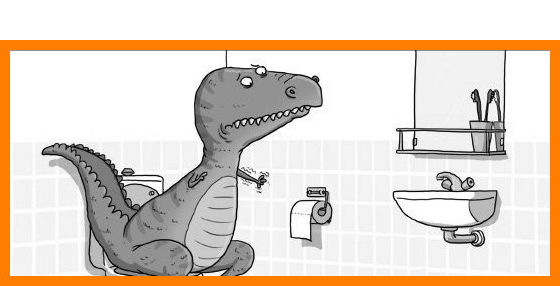

.. image:: img/portada.png
   :align: center
   :scale: 100 %

¿Que es un hacker?
------------------

El jueves 18 de abril del 2013
------------------------------

Los hackers somos emprendedores distintos
-----------------------------------------

Cuando uno consigue un martillo
-------------------------------

- No todo es un problema social.
- No todo es un problema de equipo.
- No todo es un problema de negocio.
- No todo es un problema de emprendedorismo.
- No todo es un problema técnico.

Hace un año en Plaza Mayor de Madrid
------------------------------------

- Diseño de unix.
- Se fomenta que los hackers emprendan.
- Bueno... fomento que los emprendedores vean como se hackea.

¿Preguntas?
-----------

    - Esta Charla:
        - Source: https://bitbucket.org/leliel12/talks/src
    - Contacto:
        - Juan B Cabral <`jbc.develop@gmail.com <mailto:jbc.develop@gmail.com>`_> / @JuanBCabral

.. footer::
    Hackers for Founders - Hackers & Founders 2013-04-26
    -
    Juan B Cabral <`jbc.develop@gmail.com <mailto:jbc.develop@gmail.com>`_>

