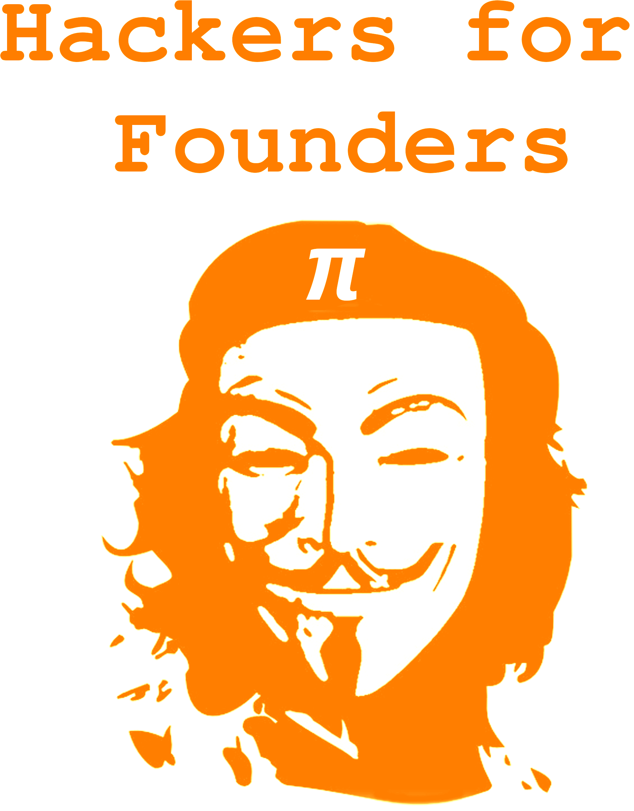
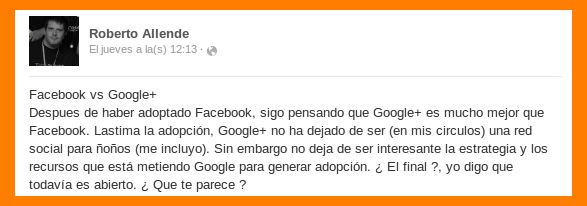

¿Que es un hacker?
------------------

.. image:: img/hacker.png
   :align: center
   :scale: 100 %

Lo que intento decir...
-----------------------

::

    Todo el mundo me dice que tengo que hacer ejercicio, que es bueno para mi
    salud. Pero nunca he escuchado a nadie que le diga a un deportista, tienes
    que leer"

Jose Saramago, escritor

- Se fomenta que los hackers emprendan (en negocios).
- Bueno: Exijo reciprocidad.

El jueves 18 de abril del 2013
------------------------------

- La discucion en general derivo solo a un analisis del producto.
- Se obvio detalles mas alla del modelo de negocio.
- El aspecto tecnico de la solucion de *G+* fue casi ignorado.
- Incluso se obvio el concepto de nicho.

Cuando uno consigue un martillo
-------------------------------

- No todo es un problema social.
- No todo es un problema de equipo.
- No todo es un problema de negocio.
- No todo es un problema de emprendedorismo.
- No todo es un problema técnico. (obviamente)

Red Innova - Madrid 2013
------------------------

.. image:: img/rinova.png
    :align: center
    :scale: 20 %

- KISS
- Filosofía Unix: (http://en.wikipedia.org/wiki/Unix_philosophy)
    - Make each program do one thing well.
    - Build a prototype as soon as possible.
    - Choose portability over efficiency.
    - Make every program a filter.

Por que les recomiendo entender a los hackers?
----------------------------------------------

- Ver cosas como Dropbox. (Traer herramientas de desarrollo a todo el mundo)
- Aprender de grandes que dejan que veas todo (Unix).
- Evitar que el árbol no te deje ver el bosque (Cocos2d).
- En definitiva: Usar el llamado "apalancamiento" del software (filosofia unix)

¿Preguntas?
-----------

    - Esta Charla:
        - Source: https://bitbucket.org/leliel12/talks/src
    - Contacto:
        - Juan B Cabral <`jbc.develop@gmail.com <mailto:jbc.develop@gmail.com>`_> / @JuanBCabral

.. footer::
    Hackers for Founders - Hackers & Founders 2013-04-26
    -
    Juan B Cabral <`jbc.develop@gmail.com <mailto:jbc.develop@gmail.com>`_>

