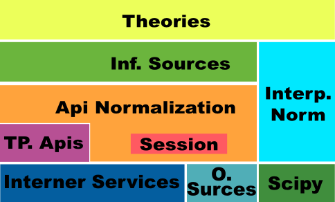

InfoPython - Midiendo el Valor de La información de Mass Media con Python.
==========================================================================

+-------------------------------------------+-------------------------------------------+
| .. image:: img/me.png                     |**Autor:** Juan Bautista Cabral            |
|    :class: right foto                     |                                           |
|                                           |JBC conocio python una solitaria noche del |
|                                           |2007. Desarrollo su proyecto de grado de la|
|                                           |carrera Ing en Sistemas con este lenguaje  |
|                                           |utilizando el frmework Django y trabajo    |
|                                           |1 año desarrollando evaluadores de         |
|                                           |informacion usando nuestro querido reptil. |
|                                           |                                           |
|                                           |**twitter:** @leliel12                     |
|                                           |                                           |
|                                           |**blog:** http://jbcabral.wordpress.com    |
|                                           |                                           |
+-------------------------------------------+-------------------------------------------+

**Infopython** es una librería para la valoración de medios 
de información utilizando teorías formales provenientes de las siencias 
sociales. Inicialmente eran conjunto módulos dispersos que utilizaba en mi 
trabajo; luego de  unos dias de refactoring y paciencia logre unificarlos en una
unica libreria.
    

Trasfondo
---------    
        
Existen diferentes teorías sociologicas para determinar la importancia de
los medios sobre la opinión publica, las mismas analizan la informacion que 
estos emiten desde el punto de vista el emisor, el
receptor o ambos.
     
Por citar un ejemplo, la **Teoría de Información de Shannon** es una
formalización matemática de una de una teoria sociologica conocida como la 
**Aguja hipodérmica**.

En el caso de **Infopython** la teoria que nos ocupa es conocida como
**Agenda-Setting** (en el futuro se planean agregar otras);
la cual postula que los medios de comunicación de masas tienen una gran 
influencia sobre el público al determinar qué historias poseen interés
informativo y cuánto espacio e importancia se les da. El punto central de esta
teoría es asignar una prioridad para obtener mayor **audiencia**, mayor
**impacto** y una determinada **conciencia** sobre la noticia.

Los Medios
----------
        
En **Infopython**, antes de mencionar **como** son los 
procesos de calculo del valor de la informacion es necesario determinar
**qué** es lo que vamos a medir.

Asi definimos informalmente que para nuestro dominio un medio de informacion es:
    
    **Un elemento emisor sobre el cual quiero efectuar una medicion del valor
    de su información. Esta Informacion tiene como caracteristocas: ser homogea,
    dar una "sensacion" de unidad, y ser medible.**
    
Siendo:
    
    * **Homogena:** Toda informacion que emite el medio tiene que tener 
      caracteristicas comunes. Sino dada su extrema variacion interna el medio 
      se nos hace imposible de medir.
      
      Por Ejemplo:
        un canal de television, para
        nuestro caso, no califica como "medio" ya que cada programa y franja
        horaria tiene **muy** diferentes niveles de audiencia y contenido;
        en este caso es mejor tomar como unidad cada programa de television
        como el medio a medir.
        
    * **Sensación de Unidad:** Es mas facil entender este concepto por
      medio de un ejemplo: 
      
          Si yo digo que mi medio de informacion son "Revistas de 
          Deporte" da una sensacion de que este elemento no es "un solo 
          medio" pero sin embargo tomo cambio la definicion, del medio,  a "La 
          revista de deportes Goles y Faroles" esta sensacion si esta presente.
      
    * **Medible:** Si un medio que definimos no podemos extraer datos
      cuantitativos, no tiene sentido para nosotros.

            
          
Formalizando
------------

Llegado el punto en el cual ya tenemos definidos **que es un medio** para 
nuestro dominio, podemos definir "matematicamente" un modelo que se ajuste a
la definicion previa de la "Agenda-Setting"; asi proponemos lo siguiente:

    **El Valor de la informacion de un medio es una funcion de la audiencia
    y el impacto, descartando la conciencia ya que es dificil o imposible
    de medir**
    
    
O lo que es lo mismo:

    **VALOR = F(AUDIENCIA, IMPACTO)**

Siendo:
    * **VALOR:** Es la importancia del medio dada la teoría.
    * **AUDIENCIA:** A cuanta gente le llega la información del medio.
    * **IMPACTO:** Qué tanta importancia le da la audiencia al medio.
    
    
Ahora como ultimo se propone como **F** a:

    **F(AUDIENCIA, IMPACTO) = AUDIENCIA * IMPACTO**

Se elige la funcion **'*'** (Multiplicacion) por los siguientes motivos:

    * **Refleja mejor la variación de los valores:** si un parametro crece o
      decrece mucho, hace variar mucho al valor.
      
      Supongamos el siguiente caso:
        
        Un medio el cual es seguido por un numero bajo de audiencia **10**
        pero tiene genera un alto impacto **1.000**. Esto puede darse 
        si esas pocas personas  pertenecen a un grupo de influencia (asesores
        precidenciales por ejemplo). 
        
        En este caso el valor de la informacion seria **10.000**,
        y dado que valor definimos como "mucho" y y que valor definimos como 
        "poco", este valor es "grande" (mucho).
        Esto, lo podemos considerar como correcto, ya que cualquier
        medio que pueda influir en personas importantes deberia tener un alto
        valor.
        
        Manteniendo los valores, pero cambiando nuestra funcion por 
        **AUDIENCIA + IMPACTO** el valor de la informacion seria **1.010** 
        el cual manteniendo el razonamiento anterior sigue siendo alto.
        
        Ahora, si remplazamos el valor de la audiencia por un numero grande
        **1000**, y mantenemos el del impacto; el valor de la funcion
        original seria **1 millon** y en el segundo caso **2.000**.
        
        Si pensamos que ahora impactamos probablemente sobre 1000 acesores
        presidenciales el valor **2.000** se queda chico, ya que estamos en
        presencia de un medio que probablemente genere un impacto a nivel global.
        Lo cual evidencia que la multiplicacion representa mucho mejor la
        variacion de parametros.
          
    * **El valor se anula ante la ausencia de audiencia o de impacto**:
      Cuando la audiencia o el impacto son **0 (cero)** (Nadie ve o nadie
      presta atencion al medio) el valor de la informacion tambien es **0
      (cero)**.
      
      Esto no es trivial ya que nos suguiere que la informacion no vale nada si
      nadie le interesa verla o nadie le presta atencion.

    
Infopython
----------
    
Dado que existen una amplia variedad de servicios públicos que extraen
estadisticas y datos sobre nuevos medios (web, twitter, etc), como por ejemplo:
    
    * Klout (http://klout.com/)
    * Compete (http://www.compete.com/)
    * Alexa (http://www.alexa.com/)

por citar algunos; **Infopython** se centra en brindar un api sencilla para 
valorar a traves de agenda-setting (en el futuro habran otras teorias
implementadas)a los medios independientemente de su tipo, utilizando los 
servicios antes mencionados

**Arquitectura:**

Analizamos Cada Capa:

    * **Internet Service:** Corresponde a los distintos servicios que existen
      en la web para la extraccion de estadisticas y datos de los nuevos
      medios.
    
    * **Other Sources:** Son otros datos que con los que sa alimenta a
      **Infopython**, como ser Bases de datos, plantillas excel, etc.
    
    * **Scipy:** Es una biblioteca de código abierto de algoritmos y
      herramientas matemáticas.
      
      Esta se encarga del procesamiento numerico necesario.
    
    * **Third Paties Apis:** Son librerias de terceros que se conectan a
      servicios que existen en la red. Por ejemplo:
      
        * tweepy que sirve para manipular datos de twitter.
        * koutpy que se conecta a Klout
      
    * **Session:** Esta subcapa es un modulo que se encarga de centralizar
      todas las configuraciones necesarias para acceder a los servicios de
      internet.
    
    * **Interpolation Normalization:** Esta una capa de abstraccion
      para los diferentes interpoladores que posee Scipy y define algunos nuevos
      todos con la misma API.
    
    * **API Normalization:** Se encarga de convertir todas las respuestas
      de todos los servicios de internet y las API's de terceros a
      estructuras comunes (diccionarios) utilizando de ser necesarios los
      datos que posee la session.
      
    * **Information Sources:** Son las clases que representan nuestras
      fuentes de informacion. Las mismas estas conectadas de manera
      "auto-magica" a las diferentes API's Normalizadas.

    * **Theories:** Esta capa posee modulos que definen el comportamiento y
      los calculos de las teorias implementadas en la **Infopython** (para la 
      version actual solo Agenda-Setting). Cada teoria encapsula los medios de
      de informacion en "nodos" los cuales agregan los datos que brinda
      dicha teoria.
      
          .. image:: img/nodes.png
             :align: center
             :scale: 100 %
    

Ahora definida toda la teoria, y toda la arquitectura podemos mencionar como se
trabaja con la libreria:
    
    1. **Configurar la sesión:** Consiste en brindarle a la capa de session
       todas las api key (mecanismos de autentificacion de servicios de tercero)
       que requiera.
       
       Ejemplo:
       
        .. code-block:: python
        
            from infopython import session
            
            # Listado de todas las llaves OBLIGATORIAS de la libreria
            session.NEEDED_KEYS
            
            # configura la session con las llaves v0, v1, ...
            session.set(v0=1, v1=2...)
            
            # retorna el valor de una llave
            session.get("v0")
            
            # borra la session
            session.clear()
            
       En la version actual todas las NEEDED_KEY son obligatorias y la sesion
       es inmutable.
       
    2. **Crear los medios:** Crear los medios de informacion sobre los cuales
        se desea extraer informacion. En esta version de **Infopython** 
        se brinda clases para **2** medios:
        
            - ``WebPages:`` Representa una página web independientemente si esta
              es un perfil de twitter o un blog o lo que fuera. Se sugiere como
              mecanismo de medicion de audiencia los servicios de Compete
              (http://www.compete.com/) o los de Alexa (http://www.alexa.com/).
              
              Y como mecanismo de medicion de impacto Page Rank
              (http://es.wikipedia.org/wiki/PageRank), ya que si Google dice que
              la importancia de informacion es esta, no vamos a discutir con
              Google.
              
              Ejemplo del Api de ``WebPage``:
              
              .. code-block:: python
    
                  from infopython.isources import webpages
                
                  google = webpages.WebPage("google.com")

                  google.id # devolveria "google.com"
                  google.url # devolveria "http://google.com"
                  google.html # El contenido en HTML de "http://google.com"
                  google.text # El texto del HTML de "http://google.com"

                  google.get_info("compete") # la informacion de compete de
                                             # "google.com" utilizando el
                                             # key de compete suministrado
                                             # en la session
              
            - ``TwitterUser:`` Representa un usuario de Twitter y NO sus tweets
              
              Se sugiere como mecanismo de medicion de audiencia la cantidad de
              followers; y de impacto la informacion suministrada por Klout
              (http://klout.com/)

              Ejemplo del Api de ``TwitterUser``:
              
              .. code-block:: python
    
                  from infopython.isources import twitteruser
                  
                  yo = twitteruser.TwitterUser("leliel12")
                  yo.id # leliel12
                  yo.username # leliel12
                  yo.get_info("tweepy") # la informacion de tweepy del usuario
                                        # "leliel12" utilizando el key de 
                                        # Twitter suministrado en la session
              
              
    3. **Crear Evaluadores:** Consiste en crear **callables** (funciones o 
       metodos) que recivan un medio de informacion como parametro y devuelvan 
       los valores que se asumiran como audiencia o impacto.
       Por ejemplo si  decidimos que nuestra isource ``WebPage`` 
       extraera su **audiencia** de  **Compete** y su  **Impacto** de **Pagerank**, 
       la funciones deberian ser similares a estas:
       
       .. code-block:: python
           
           # extrae los unique visitors de compete de la WebPage que recibe como
           # parametro 
           aud = lambda w: w.get_info("compete")["metrics"]["uv_count"]
           
           # Extrae el valor de page rank de la WebPage que recibe como parametro
           imp = lambda w: w.get_info("pagerank")["pagerank"]
       
       Si a la agenda no le sumistramos alguno de los evaluadores, esta tratara
       de  usar interpoladores suministrados.
       
    4. **Crear los interpoladores:** Los interpoladores se utilizan como segunda
       alternativa a la extraccion de **audiencia** e **impacto**, por lo que
       cada agenda recibe 2 interpoladores: un interpolador de audiencia y uno
       de impacto. 
       
       Asi el interpolador de **impacto** recivira como valor para interpolar 
       **"X"** a la **audiencia** y devolvera un valor **"Y"** 
       correspondiente al **impacto***. 
       
       Ahora si lo que deseamos es interpolar el valor de la **Audiencia**, 
       el interpolador recibira como valor **"X"** el **Impacto** y 
       devolvera un valor **"Y"** correspondiente a la **Audiencia**.
       
       Se demostrara un ejemplo en conjunto mas adelante.
       
    5. **Crear la/s agenda/s:** Al crear las agendas de la deve sumistrar con 
       diferentes datos: 
           - Que tipo de medio de informacion medira.
           - Una lista de medios de informacion (opcional).
           - Un extractor de datos de audiencia (opcional).
           - Un extractor de datos de impacto (opcional).
           - Un interpolador de audiencia (opcional).
           - Un interpolador de impacto (opcional).
        Se demostrara un ejemplo en conjunto mas adelante.
           
    6. **Evaluar los nodos:** La agenda posee metodos para ordenar los
       ``ISources`` segun suvalor para luego, ser iterada y asi generar un
       ranking de  importancia de cada medio.
       
       Al iterar, sobre la ``Agenda`` esta devuelve varios ``ASNode`` los
       cuales son estrcturas de datos que ecapsulan a los medios y agregan
       atributos correspondientes a **Audiencia**, **Impacto** y **Valor**
       asi como tambien fecha y hora de cuando fue creado el  nodo.

Ejemplo Completo
----------------

.. code-block:: python

    from infopython import session
    from infopython import agenda
    from infopython.util import interpolator
    from infopython.isources import webpages

    # Configuramos la session.
    # Todas estas llaves son de fantasia y para una prueba real cualquier
    # Usuario puede registrarlas en la pagina de cada aplicacion.
    session.set(compete_key = "967b8490-e26a-11df-8cbe-0019662306b1", 
                twitter_key = "967b8490-e26a-11df-8cbe-0019662306b1",
                twitter_secret = "967b8490-e26a-11df-8cbe-0019662306b1",
                twitter_user_key = "967b8490-e26a-11df-8cbe-0019662306b1",
                twitter_user_secret = "967b8490-e26a-11df-8cbe-0019662306b1",
                klout_api_key = "967b8490-e26a-11df-8cbe-0019662306b1")

    # Creamos dos webpages       
    google = webpages.WebPage("google.com")
    yahoo = webpages.WebPage("yahoo.com")

    # Saca cosos
    aud = lambda w: w.get_info("compete")["metrics"]["uv_count"] # audiencia
    imp = lambda w: w.get_info("pagerank")["pagerank"] # impacto
    
    # un interpolador
    itp = interpolator.PieceWisePolynomial([0,0,1,1,2,45,64], [1,3,1,1,2,4,64])
    
    # Creamos la agenda
    # Esta agenda tratara de extraer los valores de audiencia e impacto con su
    # 'valuators',  en caso de volver 'None' lo intentara con sus interpoladores.
    # Si estos vuelven a devolver None, se retornara como valor 0.0 y se calculara
    # el valor del medio con ellos.
    ag = agenda.AgendaSetting(itype=webpages.WebPage,
                              inf_sources=[google, yahoo],
                              audience_valuator=aud,
                              impact_valuator=imp,
                              impact_interpolator=itp,
                              audience_interpolator=itp)

    ag.rank() # ordenamos la agenda por el valor de cada medio
    
    # Iteramos sobre cada ASNode e imprimimos los valores de audiencia e impacto.
    for i in ag:
        print i.id, "%s + %s = %s" % (i.audience, i.impact, i.value)

Mas Metodos de la Agenda
------------------------

Suponiendo que tenemos una instancia la misma agenda del ejemplo anterior ``ag``
y el ``WebPage``, ``google``:

    .. code-block:: python
    
        ag.value_of(google) # devuelve el valor de google (audiencia + impacto)
        ag.impact_of(google) # devuelve el el valor del impacto de google
                             # osea dado lo que definimos como evaluador de
                             # impacto haria la llamada:
                             # return google.get_info("pagerank")["pagerank"]
                             
        ag.audience_of(google) # devuelve el el valor de la audiencia de google
                               # osea dado lo que definimos como evaluador de audiencia
                               # haria la llamada:
                               # return google.get_info("compete")["metrics"]["uv_count"] 
        
        ag.wrap(google) # Devolveria un ASNode con los valores de audiencia, 
                        # impacto y valor de la informacion de google

        ag.count(google) # Devuelve cuantas veces aparece este medio en la agenda
        
        ag.remove(google) # elimina la primer ocurrencia google en la agenda
        
        ag.append(google) # agrega google a la agenda

        ag.for_type # Devolveria para que tipo de isource fue creada esta agenda
                    # WebPage para nuestro ejemplo
                    
        ag.audience_valuator # None o la funcion de calculo de audiencia
        
        ag.impact_valuator # None o la funcion de calculo de impacto
        
        ag.audience_interpolator # None o el interpolador de audiencia
        
        ag.impact_interpolator # None o el interpolador de impacto

Comparando 2 Agendas
--------------------

En el modulo ``agenda`` existe una funcion que es muy util para
evaluar varias agendas con diferentes medios de informacion.

Esta funcion retorna una lista de ``ASNode`` ordenada de ambas agendas.

    .. code-block:: python
        
        from infopython import agenda
        from infopython.isources import webpages, twitteruser
        
        # 2 agendas con diferentes tipos de medios.
        ag1 = agenda.AgendaSetting(isource=webpages.WebPage)
        ag2 = agenda.AgendaSetting(isource=twitteruser.TwitterUser)
        
        # itera sobre todos los medios de informacion de ambas agendas
        # ordenados por 'value'.
        for i in agenda.rank_isources(ag1, ag2):
            print i

Nota Final: Test
----------------
    
Al bajar la libreria lo primero que debe hacerse es correr el test con los 
siguientes pasos:

    1. Correr
        ``$ python setup.py test``
        
    2. Configurar ``test.cfg`` con las llaves de las apis correspondientes.
    
    3. Corer ahora si
        ``$ python setup.py test``

Conclusion
----------
    
Como vimos **Infopython** provee una manera uniforme para la valoracion de la 
informacion. En versiones futuras se plantea introducir otros tipos de mass media
ya que por ejemplo, IMDB y GoogleBooks provee informacion via apis de medios 
tradicionales (peliculas y libros); o yendo mas alla, LinkedIn informacion 
bastante confiable de perfiles laborales.

Tambien es posible la integracion con el procesamiento de lenguaje natural con 
NLTK o alguna herramienta de la web semantica.

Enlaces:
    - Infopython: http://bitbucket.org/leliel12/infopython/
    - Teoria de Agenda-Setting: http://en.wikipedia.org/wiki/Agenda-setting_theory

    
