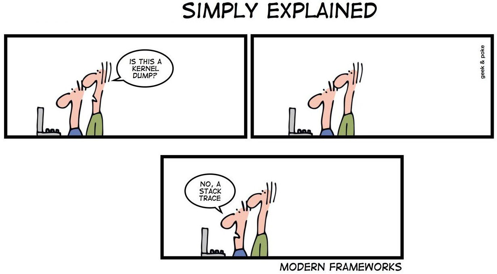

Reflexiones en el diseño de APIs
================================

----

About Me...
-----------

**Juan B Cabral.**

* Argentino
* Soy ingeniero de software.
* Trabajo con python desde el 2007
* Actualmente pertenezco a SciPy.Ar
* Estoy armando mi plan doctoral sobre minería de datos.

----

Introducción
-----------

* Surge como una duda personal de como saber si lo que hago esta bien. (Un
  API malo no deja de funcionar, solo es malo)
* Una buena API no necesariamente es simple a primera vista
  (sqlalchemy, jquery)
* Recomiendo un libro: **Practical API Design**

----

Tipos de API
------------

**API** (Abstract Program Interface)
    - Es la interfaz de un programa con el mundo.
    - El API es la descripción de como un pedazo de código
      nos soluciona un problema.

**SPI** (Service Provider Interface)
    - Es SPI es la forma que un programa nos pide que ingresemos nuestro metodo
      de solución de un problema.
    - API subset.
    - Es la interfaz de un programa con un plugin.

----

API
---

    * Las usamos para resolver problemas comunes (servicios y libs).
    * Sabemos **que** hacen pero no **como** lo hacen.
    * Nos da un suficiente nivel de "desconocimiento" (**clueless**).
    * Abstraen los problemas.
    * Una buena API tiene un **"correcto nivel"** de **"clueless"**.

.. image::  img/libros2.jpg
   :align: right
   :scale: 60%

----

No Clueless
-----------

    Nadie sabe todo lo necesario para volar un avión.

----

Clueless
--------

* La ignorancia es un beneficio.
* Nos ayudan a enfocar en un problema.
* Esta para quedarse.
* No significa "no saber".
* Python es altamente "clueless".

----

Consejos 1
----------

A continuación me extiendo contando algunas reglas que a mi me sirven al
momento de diseño de APIS

----

Consejos 2
----------

- Su problema es la primer regla de diseño, su gusto el segundo y los estándares
  la tercera. (Necesito - Me gusta - PEP 8)
- Las API declarativas suelen ser mas faciles de mantener, extender, y
  generalizar.

  Ejemplos claves:
    - JQuery
    - sqlAlchemy

----

Consejos 3
----------

- Exponer lo estrictamente necesario.
- Mientras menos expongan, mejor.
- No exponer jerarquías profundas: No es lo mismo diseñar para la API que
  para reusar código.
- Cuidado con las clases abstractas (si van a controlar el protocolo, háganlo
  bien)

----

Consejos 4
----------

- Al momento de cooperar con otras APIS

    - Compatibilidad con las pilas.
    - PEP 20
    - (Tratar) Seguir la PEP 8 (No fanatizarse).
    - Muy Mala idea: retornar objetos de otras APIs (disminuye el clueless).
    - Muy Mala idea: redefinir comportamiento de otras APIs.

----

Consejos 5
----------

- De preferencia **NO** exponer objetos propios como resultados de operaciones.
- Los controles de tipos deben hacerse en el nivel de **APIS**
- Los Controles de tipos llevan tiempo.
- Los *assert* son buenas ideas para validar tipos.
- Cuidado con el retorno de valores nulos (None != default)

.. code-block:: python

    def foo(arg):
        assert isinstance(arg, Something), \
               "Bad Type expected {0}".format(Something.__name__)

- Si van a definir objetos:
    - Intentar que sean inmutables (aumenta bastante la
      estabilidad de la librería... bueno no realmente)
    - Darle muchos derechos al constructor (inmutabilidad)

----

Consejo 6: Errores
------------------

- Llamamos errores a algo inmanejable por nuestra librería.
- Los errores se solucionan lo mas tempranamente posible.
- Errors should never pass silently, Unless explicitly silenced.
- Crear excepciones propias puede ser un arma de doble filo.
- Si declaran una Exception y nunca la exponen, es altamente probable que
  esten haciendo algo **MAL**

.. image:: img/bugfeature.jpg
    :align: right
    :scale: 100 %

----

Zen Vs. Zen
-----------

* Las librerias almenos contradicen de alguna manera el "zen" de python:
    - Explicit is better than implicit.
    - Flat is better than nested.
    - Special cases aren't special enough to break the rules.
    - There should be one-- and preferably only one --obvious way to do it.

* Recordar:
    - Although practicality beats purity.
    - Namespaces are one honking great idea -- let's do more of those!

----

Consejo: Diseño
---------------

- Siempre planeen primero la funcionalidad.
- TDD.
- Primero el controller (MVC).
- Plantear inicialmente el nivel de excelencia que se quiere llegar.

----

Consejos: Publicación
---------------------

* No publiquen sin tests.
* TDD se merece una oportunidad.
* Publiquen de manera comunes a los developers python (pypi > ppa).
* No publiquen sin documentación.
* Vean la pagina de Pocoo (http://www.pocoo.org/)

.. image::  img/me-gusta.jpg
   :align: center
   :scale: 60%

----

Consejos: Finales
-----------------

- Las APIs simétricas son buena idea (load, dump).
- Tratar de cumplir en su totalidad el zen de python.
- Un buen diseño de api facilita la retro compatibilidad
- No abusar de los patrones.
- Evitar el monkeypatch.

----

¿Preguntas?
-----------

    - Charlas:
        - http://bitbucket.org/leliel12/talks
    - Contacto:
        - Juan B Cabral
            - Mail: `jbc.develop@gmail.com <mailto:jbc.develop@gmail.com>`_
            - Twitter: `@JuanBCabral <http://twitter.com/JuanBCabral/>`_
            - Blog: http://jbcabral.com/

.. image::  img/wtf.jpg
   :align: right
   :scale: 150%
