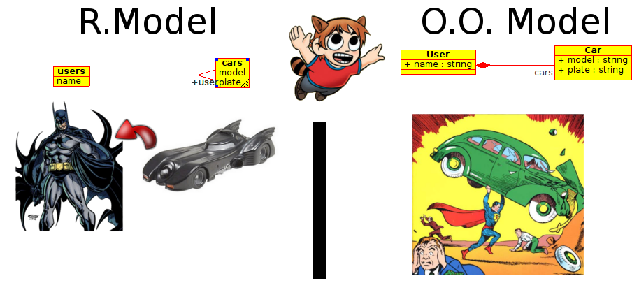


    .. image:: img/logo.png
       :align: center
       :scale: 100 %

¿Quien Soy?
-----------

**Juan B Cabral.**

    * La UTN dice que soy ingeniero en sistemas.
    * **Mi alineación es:** Caotico Bueno

Machete
-------

* Quienes ya saben lo que es un ORM? (exluyendo los de siempre)
* Quienes saben Django? (exluyendo los de siempre)

Al principio
------------

    * Aca deberia haber una enumeración de que son los datos lo que importa
      y no los algoritmos. Pero me aburri antes de ponerme a buscar citas asi
      que escribi esto.
    * **De todas maneras: estamos de acuerdo que los datos son lo importante?.**

    .. image:: img/Scott-Pilgrim1.png
        :scale: 400 %

Python + RDBMS
--------------

.. code-block:: python

    import MySQLdb
    db = MySQLdb.connect(host=’localhost’,user=’root’,
                         passwd=’’,db=’Prueba’)
    cursor = db.cursor()
    sql = ’Select * From usuarios’
    cursor.execute(sql)
    resultado = cursor.fetchall()
    print ‘Datos de Usuarios’
    for registro in resultado:
        print registro[0], ’->’, registro[1]

::

    USU01 -> Young Neil
    USU02 -> Knives Chau

Como estamos?
-------------

- Si te gusta *SQL* tenes sql.
- Pero *SQL* no esta implementado igual en los distintos motores.
- Y nada garantiza que ese motor no cambie con el tiempo (sobre todo en empresas
  grandes donde el que decide poco tiene que ver con el desarrolla)
- Lo que devuelve los conectores son set de datos y no objetos ``User``
  propiamente.
- La diferencias entre el modelo de objetos y relacional.
- Pero esto es rapido.

Que opciones tenemos?
---------------------

- Usar ORM

::

    El mapeo objeto-relacional (más conocido por su nombre en inglés,
    Object-Relational mapping, o sus siglas O/RM, ORM, y O/R mapping) es una
    técnica de programación para convertir datos entre el sistema de tipos
    utilizado en un lenguaje de programación orientado a objetos y el utilizado
    en una base de datos relacional, utilizando un motor de persistencia. En la
    práctica esto crea una base de datos orientada a objetos virtual, sobre la
    base de datos relacional. Esto posibilita el uso de las características
    propias de la orientación a objetos (básicamente herencia y polimorfismo)

`Wikipedia: ORM <http://es.wikipedia.org/wiki/Mapeo_objeto-relacional>`_

- Alternativas en Pyhon: SqlAlchemy, Storm, **Peewee**, Django-ORM
- Nota: Web2py DAL.

Una evidencia de la diferencia de modelos
-----------------------------------------

Vamo con **Peewee**
-------------------

- No es el mejor orm que existe (tiene unas cosillas).
- Es un solo archivo.
- Es Django-like.
- Esta diseñado para trabajar con Flask (flask-peewee).
- Lo estube usando para hacer data mining.
- Hay una version inestable ``2.0`` yo voy a usar la ``1.0``.
- Soporta MySql, Sqlite y Postgres.

Declarando las tablas y las clases
----------------------------------

.. code-block:: python

    from peewee import *

    example_db = SqliteDatabase('example.db')

    class ExampleModel(Model):
        class Meta:
            database = example_db

    class User(ExampleModel):
        name = CharField()

        def __unicode__(self):
            return "<User '{}'>".format(self.name)

.. code-block:: python

    class Car(ExampleModel):
        model = CharField(null=True)
        plate = CharField(unique=True)
        user = ForeignKeyField(User, related_name="cars")

        def __unicode__(self):
            return "<Car '{}-{}'>".format(self.model, self.plate)

    # Creamos las tablas si no existen
    User.create_table(fail_silently=True)
    Car.create_table(fail_silently=True)

¿Preguntas?
-----------

    - Proyecto:
        - http://bitbucket.org/leliel12/infopython/
    - Esta Charla:
        - Source: https://bitbucket.org/leliel12/talks/src
    - Contacto:
        - Juan B Cabral <`jbc.develop@gmail.com <mailto:jbc.develop@gmail.com>`_> / @JuanBCabral

.. footer::
    Peewee ORM - `Pyday Rafaela 2011 <http://www.pyday.com.ar/rafaela2012>`_
    -
    Juan B Cabral <`jbc.develop@gmail.com <mailto:jbc.develop@gmail.com>`_>

