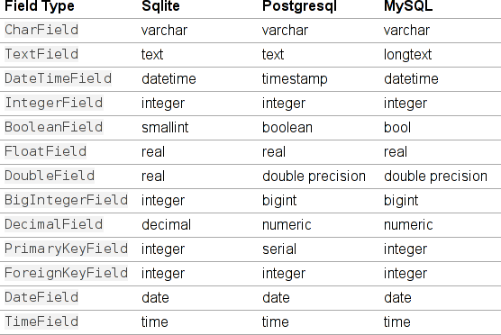

    .. image:: img/logo.png
       :align: center
       :scale: 100 %

¿Quien Soy?
-----------

**Juan B Cabral.**

    * La UTN dice que soy ingeniero en sistemas.
    * **Mi alineación es:** Caotico Bueno

Machete
-------

* Quienes ya saben lo que es un ORM? (exluyendo los de siempre)
* Quienes saben Django? (exluyendo los de siempre)
* Quienen no conocen SQL?

Al principio
------------

    * Aca deberia haber una enumeración de que son los datos lo que importa
      y no los algoritmos. Pero me aburri antes de ponerme a buscar citas asi
      que escribi esto.
    * **De todas maneras: estamos de acuerdo que los datos son lo importante?.**

    .. image:: img/Scott-Pilgrim1.png
        :scale: 100 %

Python + RDBMS
--------------

.. code-block:: python

    import MySQLdb
    db = MySQLdb.connect(host=’localhost’,user=’root’,
                         passwd=’’,db=’Prueba’)
    cursor = db.cursor()
    sql = ’Select * From usuarios’
    cursor.execute(sql)
    resultado = cursor.fetchall()
    print ‘Datos de Usuarios’
    for registro in resultado:
        print registro[0], ’->’, registro[1]

::

    USU01 -> Young Neil
    USU02 -> Knives Chau

Como estamos?
-------------

- Si te gusta *SQL* tenes sql.
- Pero *SQL* no esta implementado igual en los distintos motores.
- Y nada garantiza que ese motor no cambie con el tiempo (sobre todo en empresas
  grandes donde el que decide poco tiene que ver con el desarrolla)
- Lo que devuelve los conectores son set de datos y no objetos ``User``
  propiamente.
- La diferencias entre el modelo de objetos y relacional.
- Pero esto es rapido.

Que opciones tenemos?
---------------------

- Usar ORM

    El mapeo objeto-relacional  es una
    técnica de programación para convertir datos entre el sistema de tipos
    utilizado en un lenguaje de programación OO y el utilizado
    en una base de datos relacional, utilizando un motor de persistencia. En la
    práctica esto crea una base de datos orientada a objetos virtual, sobre la
    base de datos relacional. Esto posibilita el uso de las características
    propias de la orientación a objetos (básicamente herencia y polimorfismo)

`Wikipedia: ORM <http://es.wikipedia.org/wiki/Mapeo_objeto-relacional>`_

- Alternativas en Pyhon: SqlAlchemy, Storm, **Peewee**, Django-ORM

Una evidencia de la diferencia de modelos
-----------------------------------------

Vamo con **Peewee**
-------------------

- No es el mejor orm que existe (tiene unas cosillas).
- Es un solo archivo.
- Es Django-like.
- Esta diseñado para trabajar con Flask (flask-peewee).
- Lo estube usando para hacer data mining.
- Recien salida del horno la version 0.2
- Soporta MySql, Sqlite y Postgres.

Declarando las tablas y las clases
----------------------------------

.. code-block:: python

    from peewee import *
    example_db = SqliteDatabase('example.db')

    class ExampleModel(Model):
        class Meta:
            database = example_db

    class User(ExampleModel):
        name = CharField()
        age = IntegerField()

    class Car(ExampleModel):
        model = CharField(null=True)
        plate = CharField(unique=True)
        user = ForeignKeyField(User, related_name="cars")

    User.create_table(fail_silently=True)
    Car.create_table(fail_silently=True)

Un poco mas de los Fields
-------------------------

    * ``null=False``: boolean indicating whether null values are allowed to be
      stored
    * ``index=False``: boolean indicating whether to create an index on this column
    * ``unique=False``: boolean indicating whether to create a unique index on this
      column
    * ``verbose_name=None``: string representing the "user-friendly" name of this
      field
    * ``help_text=None``: string representing any helpful text for this field
    * ``db_column=None``: string representing the underlying column to use if
      different, useful for legacy databases
    * ``default=None``: any value to use as a default for uninitialized models
    * ``choices=None``: an optional iterable containing 2-tuples of ``value``,
      ``display``
    * ``primary_key=False``: whether this field is the primary key for the table

Mas todavia de los Fields
-------------------------

Creamos registros
-----------------

**Peewee**

.. code-block:: python

    u0 = User()
    u0.name = "Ramona Flowers"
    u0.age = 24
    u0.save()
    u1 = User(name="Stephen Stills", age=24)
    u1.save()
    u2 = User(name="Scott Pilgrim", age=23)
    u2.save()

Queries 1
---------

**Peewee**

.. code-block:: python

    print "Todos los Usuarios"
    for u in User.select():
        print u.id, u.name, u.age

**SQL**

.. code-block:: sql

    SELECT * FROM user

**OUT**

::

    Todos los Usuarios
    1 Ramona Flowers 24
    2 Stephen Stills 24
    3 Scott Pilgrim 23

Queries 2
---------

**Peewee**

.. code-block:: python

    print "Con ID=1"
    print User.get(User.id == 1)

**SQL**

.. code-block:: sql

    SELECT * FROM user WHERE id = 1

**OUT**

::

    Con ID=1
    <User: u'Ramona Flowers'>

Queries 3
---------

**Peewee**

.. code-block:: python

    print "Con nombre 'Stephen Stills'"
    print User.get(User.name == "Stephen Stills")

**SQL**

.. code-block:: sql

    SELECT * FROM user WHERE name = 'Stephen Stills'

**OUT**

::

    Con nombre 'Stephen Stills'
    <User: u'Stephen Stills'>

Queries 4
---------

**Peewee**

.. code-block:: python

    print "Con edad <= 24"
    for u in User.filter(User.age <= 24):
        print u

**SQL**

.. code-block:: sql

    SELECT * FROM user WHERE age <= 24

**OUT**

::

    <User: u'Ramona Flowers'>
    <User: u'Stephen Stills'>
    <User: u'Scott Pilgrim'>

Queries 5
---------

**Peewee**

.. code-block:: python

    print "Con nombre que empieza con 'S'"
    for u in User.filter(fn.Substr(User.name, 1, 1) == "S"):
        print u

**OUT**

::

    Con nombre que empieza con 'S'
    <User: u'Stephen Stills'>
    <User: u'Scott Pilgrim'>

Queries 6 (Entran los autos)
----------------------------

**Peewee**

.. code-block:: python

    # u0 -> Ramona Flowers
    car = Car(model="2012", plate="jbc 2502", user=u0)
    car.save()

    print "Autos de u0"
    for c in Car.filter(Car.user == u0):
        print "{} -> {}".format(c, c.user)

**OUT**

::

    Autos de u0
    <Car: '2012-jbc 2502'> -> <User: u'Ramona Flowers'>

Queries 7
---------

**Peewee**

.. code-block:: python

    print "Cantidad de autos de personas con 24 años"
    print Car.select().join(User).where(User.age == 24).count()

**OUT**

::

    Cantidad de autos de personas con 24 años
    1

Queries 8
---------

**Peewee**

.. code-block:: python

    print "Autos con modelo 2012 de usuarios de 24 años"
    for car in Car.select().join(User).where(User.age == 24, Car.model=="2012"):
        print car

**OUT**

::

    Autos con modelo 2012 de usuarios de 24 años
    <Car: '2012-jbc 2502'>

Update and Delete
-----------------

**UPDATE**

.. code-block:: python

    print "Una actualizacion"
    c = Car.get(plate="jbc 2502")
    c.plate = "AAC 6666"
    c.save()

**DELETE**

.. code-block:: python

    print u0.cars.count()
    car0.delete_instance()
    print u0.cars.count()

**OUT**

::

    1
    0

Cosas en el tintero
-------------------

    - ``.order_by``
    - ``.having``
    - ``.group_by``
    - lookups.

    * Un ejemplito en una app *

¿Preguntas?
-----------

    - Proyecto:
        - https://peewee.readthedocs.org
    - Esta Charla:
        - Source: https://bitbucket.org/leliel12/talks/src
    - Contacto:
        - Juan B Cabral <`jbc.develop@gmail.com <mailto:jbc.develop@gmail.com>`_> / @JuanBCabral

.. footer::
    Peewee ORM - `Pyday Rafaela 2011 <http://www.pyday.com.ar/rafaela2012>`_
    -
    Juan B Cabral <`jbc.develop@gmail.com <mailto:jbc.develop@gmail.com>`_>

