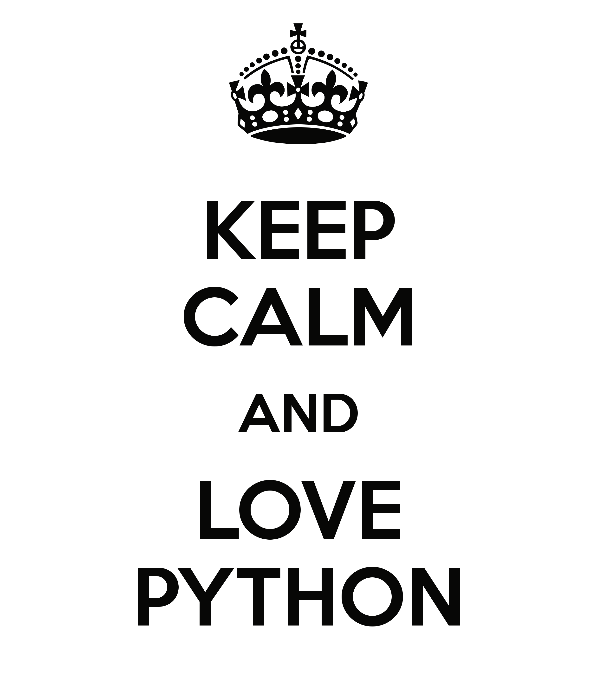

================
¿Por qué Python?
================

----

Sobre yo
--------

**Juan B Cabral**

- Ing. en Sistemas.
- UTN-FRC
- Organizador de la última PyCon Argentina, de un PyDay y un Django Day.
- Se e ocurrio esto del SciPyAr y SciPyConAr (Celia y Nahuel están felices con esto)
- Trabaja en Liricus.
- Trabajo con Python en mi día a día.
- hice su tesis de grado en Python.
- Hago ciencia con Python.
- Tomo whiskey.

----

¿De qué va la charla?
---------------------

- En las PyCons y PyDays siempre se hablo de como hacer ciencia en python.
  Esto es lo mismo pero al revés.
- Ejemplos de algunas librerías que basan su funcionamiento en python.
- Programas hechos en Python.
- Empresas que apuestan fuerte por (¡y ganan fuerte con!) Python
- Comunidad de Python
- Frameworks hechos en Python

.. image:: img/python_logo.png
    :align: center

----

Y Python...
-----------

- Python es un lenguaje de programación interpretado cuya filosofía hace
  hincapié en una sintaxis muy limpia y que favorezca un código legible.
- Lo crea Guido Van Rossum en 1991.
- Multiparadigma.
- Multiplataforma
- Comunidad MUY activa.
- Multiples implementaciones: Jython, IronPython, PyPy, CPython...

y... es simple (según las estadísticas todo es 1/3 de Java y C#)

- 1/3 de tiempos de desarrollo.
- 1/3 de costo de mantenimiento (producto de que sea fácil de leer y entender).
- 1/3 de costos.
- ¡1/3 de time to market!

----

Por cierto...
-------------

- Estos slides estan generados con Landslide (que está hecho con Python)
- Homepage: https://github.com/adamzap/landslide

