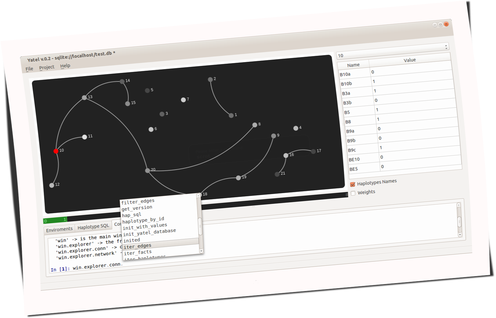
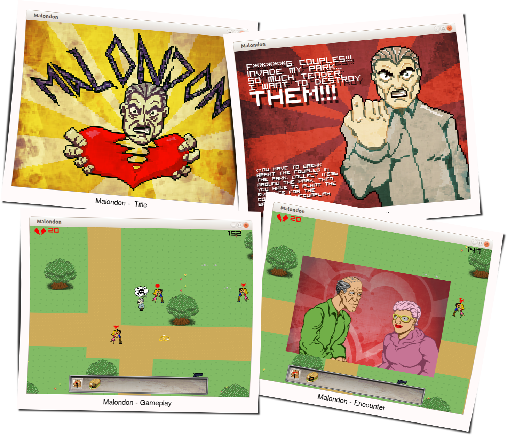

Yatel
-----

.. image:: img/yatel_logo.png
    :align: center

- Es una herramienta de data-mining.
- Se utiliza par análisis de perfiles genéticos en el INTA-IFiVe.
- Utilizable como librería.
- Python + Javascript.
- Utiliza: PyQt, Pygments, Peewee, IPython.

----

Yatel
-----

----

Malondon
--------

- Córdoba Game Jam 2013
- Puro Pilas
- en 48 hs teniamos un prototipo funcional.
- Blues en ruso acompaña tu partida.
- https://github.com/hugoruscitti/gamejam2013

----

Malondon
--------

