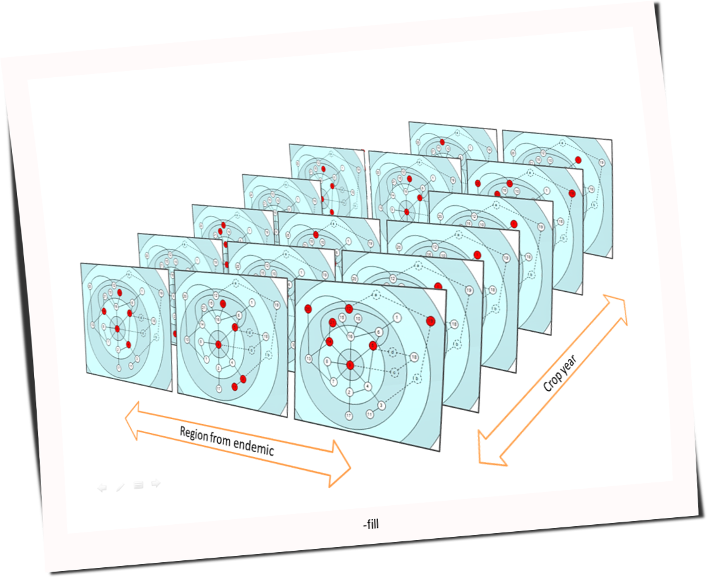

===============================
Motivación, historia y contexto
===============================

El proyecto nace con la necesidad de estudiar la variabilidades genéticas de
los individuos de una especie (en primera instancia el Mal de Río Cuarto virus)
y los factores que influyen sobre ella. Mientas que variabilidad se puede
calcular a partir de las diferencias que hay entre las características propias
de cada individuo o de ciertos grupos; los factores que influyen sobre la
variabilidad son, normalmente, el tiempo, la región geográfica y muchos
elementos más que dependen de la especie que se analiza.

Yatel propone que para encontrar los factores más influyentes se aplique un
enfoque de redes. La red se crea a partir de las diferencias o distancias entre
los perfiles y luego se la explora multidimensionalmente para brindar al
investigador una visión del problema imposible de lograr por otros medios.

    Análisis multidimensional de redes

Cabe que aclarar que:

    - Los nodos de la red conforman los diferentes individuos de la especie
      estudiada (llamados de ahora en más *haplotipos* o *haplotypes* por
      tradición en la herramienta heredada de su origen en la biología).
    - Los arcos los las relaciones entre los *haplotipos*.
    - El peso de los *arcos* es la diferencia entre los dos individuos.
    - Los factores se llaman de ahora en mas *hechos* o *facts* y no están
      presentes en la red. Son como filtros que de *activarse* hace que los
      diferentes nodos se resalten demostrando una dimensión de la exploración.

La forma que utiliza yatel para la exploración de datos es la de **KDD**
**(Knowledge discovery in database)**, muchas veces llamado Minería de Datos a
unque esta sea solo una etapa, es un proceso que intenta encontrar información
útil y novedosa (que pueda influir en la toma de decisiones) y que permanece
oculta en una base de datos (Fayyad 1996).

.. Figure:: img/proceso_kdd.png
    :align: center
    :scale: 100 %

    Proceso de KDD

=============
KDD con Yatel
=============

.. =============================================================================
.. FOOTER
.. =============================================================================

.. footer::

    .. class:: footer

        UTN FRC (Universidad Tecnológica Nacional, Facultad Regional Córdoba)
        Laboratorio de Investigación de Software

        - García, Mario Alejandro <malejandrogarcia@hotmail.com>
        - Cabral, Juan Bautista <jbc.develop@gmail.com>
