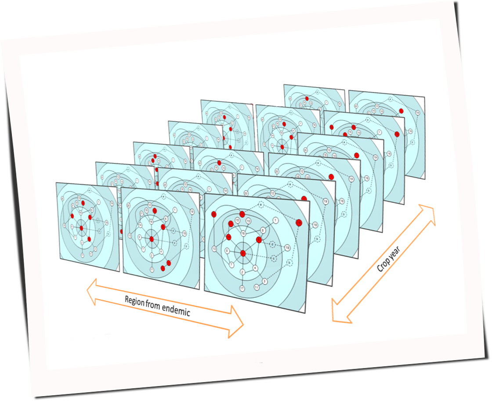
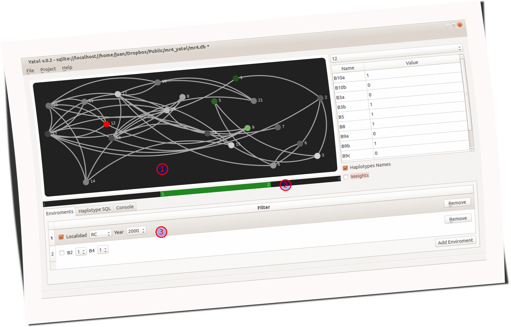
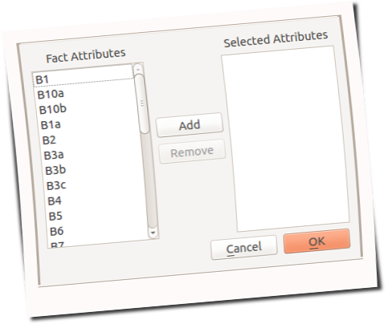
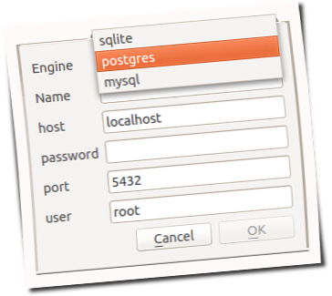
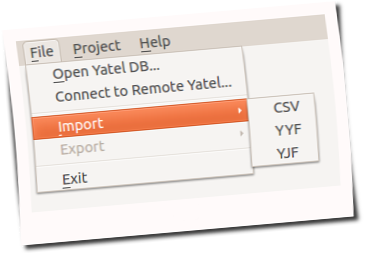
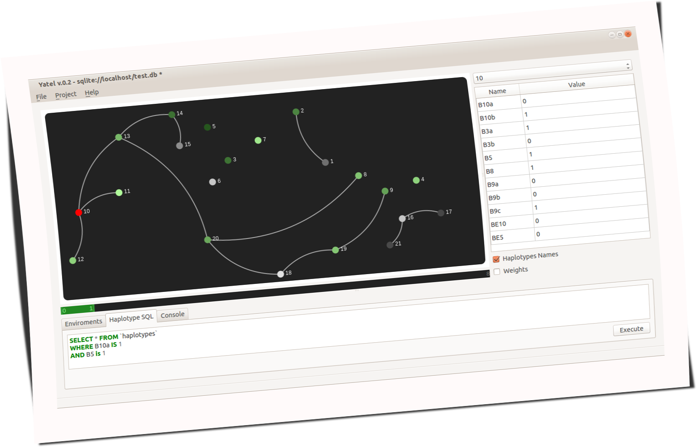
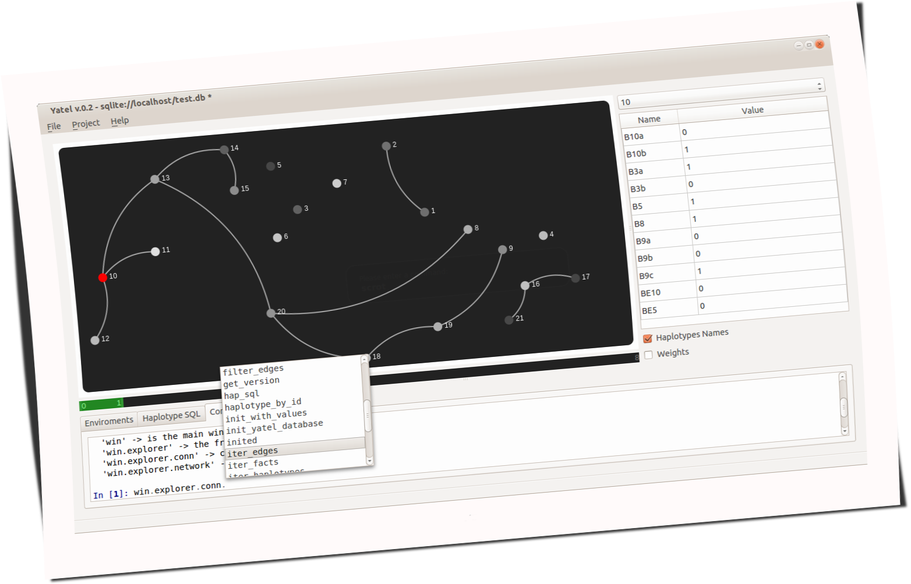
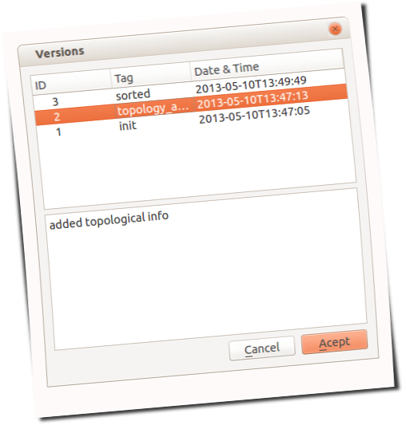
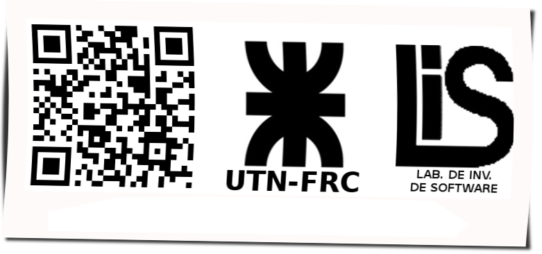

.. =============================================================================
.. HEADER
.. =============================================================================

.. header::

    .. image:: img/head.png
        :align: center
        :scale: 100 %

    **http://yatel.readthedocs.org**

    García, Mario Alejandro <malejandrogarcia@hotmail.com>;
    Cabral, Juan Bautista <jbc.develop@gmail.com>;
    Liberal, Rodrigo <rodrigo.inf.liberal@gmail.com>

.. =============================================================================
.. CONTENT
.. =============================================================================

Motivación, historia y contexto
-------------------------------

El proyecto nace con la necesidad de estudiar la variabilidad genética de
los individuos de una especie (en primera instancia el Mal de Río Cuarto virus)
y los factores que influyen sobre ella. Mientras que variabilidad se puede
calcular a partir de las diferencias que hay entre las características propias
de cada individuo o de ciertos grupos; los factores que influyen sobre la
variabilidad son, normalmente, el tiempo, la región geográfica y muchos
elementos más que dependen de la especie que se analiza.

Yatel propone que para encontrar los factores más influyentes se aplique un
enfoque de redes. La red se crea a partir de las diferencias o distancias entre
los perfiles y luego se la explora multidimensionalmente para brindar al
investigador una visión del problema imposible de lograr por otros medios.

    Análisis multidimensional de redes

Cabe que aclarar que:

    - Los nodos de la red conforman los diferentes individuos de la especie
      estudiada (llamados de ahora en más *haplotipos* o *haplotypes* por
      tradición en la herramienta heredada de su origen en la biología).
    - Los arcos son las relaciones entre los *haplotipos*.
    - El peso de los *arcos* es la diferencia entre los dos individuos.
    - La ocurrencia de eventos se representa mediante *hechos* o *facts*
      presentes en la red. Los mismos son filtros que de *activarse* hace que
      los diferentes nodos se resalten demostrando una dimensión de la
      exploración.

El análisis realizado en Yatel se inspira en el modelo **CRISP-DM** para
*knowledge discovery in database* (KDD).
KDD, muchas veces llamado Minería de Datos aunque  esta sea sólo una etapa,
es un proceso que intenta encontrar información útil y  novedosa (que pueda
influir en la toma de decisiones) y que permanece oculta en una base de datos
(Fayyad 1996).

.. Figure:: img/proceso_kdd.png
    :align: center
    :scale: 70 %

    Proceso de KDD

Features
--------

    Yatel se vé asi

    La red se muestra todos sus Haplotipos (**1**) en tonos de gris y blanco
    cuando están inactivos y se colorean de verde cuando coinciden con algún
    ambiente.

    Se puede limitar los arcos visibles a solo a un rango de *pesos* (**2**).

    Se selecciona que atributos de los hechos constituirán cada ambiente y
    luego se seleccionan los valores con un combo (**3**).

----

    Creador de ambientes para ánalisis multidimensional. Lista todos los
    atributos de todos las situaciones donde se encontraron los haplotipos.

----

    Yatel permite crear sus redes en **SQLite**, **MySQL** y **PostgreSQL**

----

    Además de poder conectarse a su propia base de datos, Yatel permite:

        - Conectarse a instancias remotas de Yatel.
        - Importar desde los formatos ``CSV``, ``yyf`` (basado en *YAML*) y
          ``yjf`` (basado en *JSON*).
        - Exportar a los formatos ``yyf`` y ``yjf``.

----

    Como Yatel construye sus redes sobre **Bases de Datos Relacionales**;
    en exploraciones avanzadas se puede acceder, desde su entorno gráfico,
    con **SQL** a los datos para generar un ambiente dinámico.

----

    En caso de necesidad, Yatel incluye una consola ipython embebida que permite
    interactuar dinámicamente con todo *Python*

----

    Se pueden versionar los estados de exploración directamente en la base de
    datos.

Desde Python
------------

Se puede utilizar Yatel como librería

.. code-block:: python

    # Pensemos en una red exploratoria totalmente rara
    from yatel import dom

    # Super heroes
    haps = [dom.Haplotype("Batman", name="Bruce Wayne", debut=1939),
            dom.Haplotype("Alfred", name="Alfred Pennyworth", debut=1943),
            dom.Haplotype("Superman", name="Clark Joseph Kent", debut=1938),
            dom.Haplotype("Lex Luthor", name="Alexander Joseph Luthor")]

    # Creamos arcos entre amigos = 1 enemigos = 2
    edges = [dom.Edge(1, "Batman", "Superman"),
             dom.Edge(1, "Batman", "Alfred"),
             dom.Edge(2, "Superman", "Lex Luthor")]

    # Agregamos hechos
    facts = [dom.Fact("Batman", job="Billonaire", family="Murdered"),
             dom.Fact("Batman", job="Super Hero", city="Gotham"),
             dom.Fact("Batman", job="Vigilante", created_by="Bob Kane"),
             dom.Fact("Alfred", job="Buttler", created_by="Bob Kane"),
             dom.Fact("Lex Luthor", job="Billonaire"),
             dom.Fact("Lex Luthor", job="Criminal Mastermind"),
             dom.Fact("Superman", job="Super Hero"),
             dom.Fact("Superman", created_by="Jerry Siegel"),
             dom.Fact("Superman", created_by="Joe Shuster"),
             dom.Fact("Superman", job="Reporter"),
             dom.Fact("Lex Luthor", created_by="Jerry Siegel"),
             dom.Fact("Lex Luthor", created_by="Joe Shuster")]

    # Validamos que la red sea consistente
    dom.validate(haps, facts, edges)

    # Persistimos la red en nuestra base de datos
    from yatel import db
    conn = db.YatelConnection("sqlite", "superheroes.db")
    conn.init_with_values(haps, facts, edges)

    # Personajes con trabajo de súper héroes
    list(conn.enviroment(job="Super Hero"))
    #OUT# [<Haplotype 'Batman' at 0x1cb1e90>, <Haplotype 'Superman' at 0x1cb1f90>]

    # Personajes con el trabajo de millonario
    list(conn.enviroment(job="Billonaire"))
    #OUT# [<Haplotype 'Batman' at 0x1caae50>, <Haplotype 'Lex Luthor' at 0x1cb1c90>]

    # Personajes creados por Bob Kane
    list(conn.enviroment(created_by="Bob Kane"))
    #OUT# [<Haplotype 'Batman' at 0x1cb80d0>, <Haplotype 'Alfred' at 0x1cb8150>]

    # Mostramos solos los edges que tienen pesos entre 0 y 1
    list(conn.filter_edges(0,1))
    #OUT# [<Edge '(u'Batman', u'Superman') 1.0' at 0x305ee90>,
    #OUT#  <Edge '(u'Batman', u'Alfred') 1.0' at 0x305ee50>]

    # Podemos exportar nuestra red a json o yaml
    from yatel.conversors import yjf2yatel # yyf2yatel
    with open("bk.yjf", "w") as fp:
    yjf2yatel.dump(conn.iter_haplotypes(), conn.iter_facts(),
                   conn.iter_edges(), conn.iter_versions(),
                   fp) # escribe en el stream fp

    # o importar los elementos de la red para regenerarla
    with open("bk.yjf") as fp:
        haps, facts, edges, versions = yjf2yatel.load(fp)

Futuro
------

- Mejorar la interfaz de la ``yatel.db.YatelConnection`` para poder navegar la
  red via código.
- Implementar el algoritmo de *Dijkstra*.
- Terminar el manual y Tests.
- Mostrar estadísticas de la red.

.. =============================================================================
.. FOOTER
.. =============================================================================

.. footer::

    .. class:: footer

        Universidad Tecnológica Nacional, Facultad Regional Córdoba
        (http://www.frc.utn.edu.ar/)

        Laboratorio de Investigación de Software
        (http://www.investigacion.frc.utn.edu.ar/mslabs/)

        Financiación UTN1685
