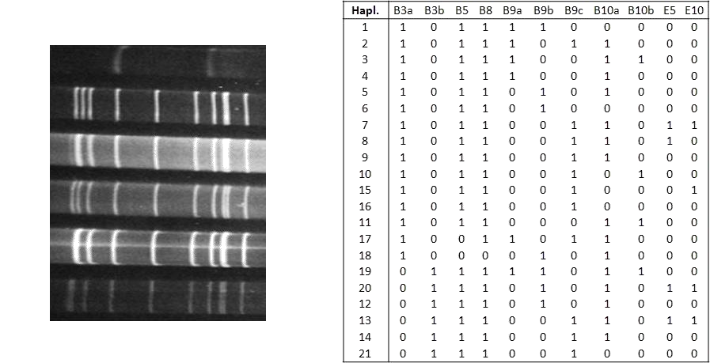
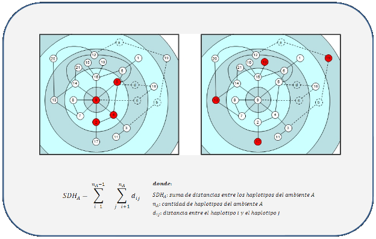

.. =============================================================================
.. ICONS
.. =============================================================================

.. |utnico| image:: img/utnico.png
.. |intaico| image:: img/intaico.png
.. |conicetico| image:: img/conicetico.png

.. =============================================================================
.. CONTENT
.. =============================================================================

Caracterización del Sistema Mal de Río Cuarto del Maíz mediante Minería de Datos y Análisis de Redes
----------------------------------------------------------------------------------------------------

.. image:: img/log.png
    :align: center
    :scale: 100 %

Integrantes
-----------

- |utnico|  - García, Mario Alejandro
- |utnico|  - Cabral, Juan Bautista
- |intaico|  - Gimenez Pecci, María de la Paz
- |utnico|  - Vera, Carlos
- |utnico|  - Liberal Rodrigo
- |conicetico| |intaico|  - Laguna, Irma Graciela
- |intaico|  - Bisonard, Eduardo Matías
- |intaico|  - Maurino, Fernanda
- |intaico|  - Vankeirsbilck, Inés
- |utnico|  - Cucco, Noelia del Valle
- |utnico|  - Nieto Castillo, Adrián L.

Knowledge Discovery in Database (KDD)
-------------------------------------

- Es un proceso no trivial de identificación de información útil y desconocida
  que permanece oculta en una base de datos [Fayyad, 1996]

- Es un proceso centrado en la persona (human-centered) [Brachman, 1996]

Mal de Río Cuarto virus
-----------------------

- Análisis electroforético:

.. image:: img/electroforesis.png
    :align: center
    :scale: 100 %

- Base de datos formada por

        *perfiles electroforéticos +*
        *atributos que definen el ambiente de la planta*

- Resultados de estudios anteriores:

    **Algunos segmentos electroforéticos dependen de otros**

.. image:: img/r4to.png
    :align: right
    :scale: 50 %

Network Science
---------------

- Es el estudio de las redes que representan fenómenos físicos, biológicos y
  sociales conduciendo a modelos predictivos de estos fenómenos.

- Topologías.

- Características comunes.

Networks 1
----------

    Interacción proteína-proteína

Networks 2
----------

.. figure:: img/money.png
    :align: center
    :scale: 50 %

    Redes sociales/económicas

Networks 3
----------

    Red de distribución de energía

Networks 4
----------

.. figure:: img/motor.png
    :align: center
    :scale: 100 %

    Relación entre automotrices

Networks 5
----------

    Red semántica TBBT

Proceso de análisis
-------------------

Identificación y representación de haplotipos
---------------------------------------------

Identificación y representación de haplotipos
---------------------------------------------

Identificación y representación de haplotipos
---------------------------------------------

Definición de medidas de distancia
----------------------------------

Definición de medidas de distancia
----------------------------------

Cálculo de distancias
---------------------

Cálculo de distancias
---------------------

.. image:: img/calc.png
    :align: center
    :scale: 200 %

Creación de la red
------------------

Creación de la red
------------------

Visualización y análisis topológico
-----------------------------------

Visualización y análisis topológico
-----------------------------------

Exploración
-----------

Exploración
-----------

Generación de hipótesis y conclusiones
--------------------------------------

Generación de hipótesis y conclusiones
--------------------------------------

Generación de hipótesis y conclusiones
--------------------------------------

Conclusiones del proyecto
-------------------------

- Según el índice calculado, la variabilidad del Mal de Río Cuarto virus,
  ha disminuido con el tiempo, habiendo una clara división del
  indicador en la campaña posterior a la epidemia de la campaña
  1996/97.
- La utilización de redes en el proceso de KDD resultó muy
  satisfactoria y logró resaltar un comportamiento del objeto de
  estudio que no había sido evidente hasta el momento.
- En un proceso centrado en la persona (human-centered), donde la
  creatividad y experiencia del analista juega un rol fundamental, la
  herramienta propuesta es capaz de ofrecer una perspectiva
  novedosa y complementaria con las demás técnicas del proceso de
  KDD

.. image:: img/sher.png
    :align: right
    :scale: 50 %

Yatel
-----

- Es la implementación en gran parte del proceso mencionado anteriormente.
- Falta trabajo (se aceptan colaboraciones)
- Esta implementado sobre: PyQt, Numpy, Ipython, Peewee, algo de Javascript y
  Pygments.
- Puede usarse como programa o como librería.
- Su version 0.2 es pip-instalable (``pip install yatel``) pero necesitan tener
  previamente numpy y pyqt.

Yatel - la app
--------------

En funcionamiento...

.. image:: img/sshot.png
    :align: center
    :scale: 25 %

Yatel - la lib
--------------

¿Preguntas?
-----------

    - Charlas:
        - http://bitbucket.org/leliel12/talks
    - Contacto:
        - Juan B Cabral
            - Mail: `jbc.develop@gmail.com <mailto:jbc.develop@gmail.com>`_
            - Twitter: `@JuanBCabral <http://twitter.com/JuanBCabral/>`_
            - Blog: http://jbcabral.com/

.. image:: img/questions.png
    :align: right
    :scale: 75 %

