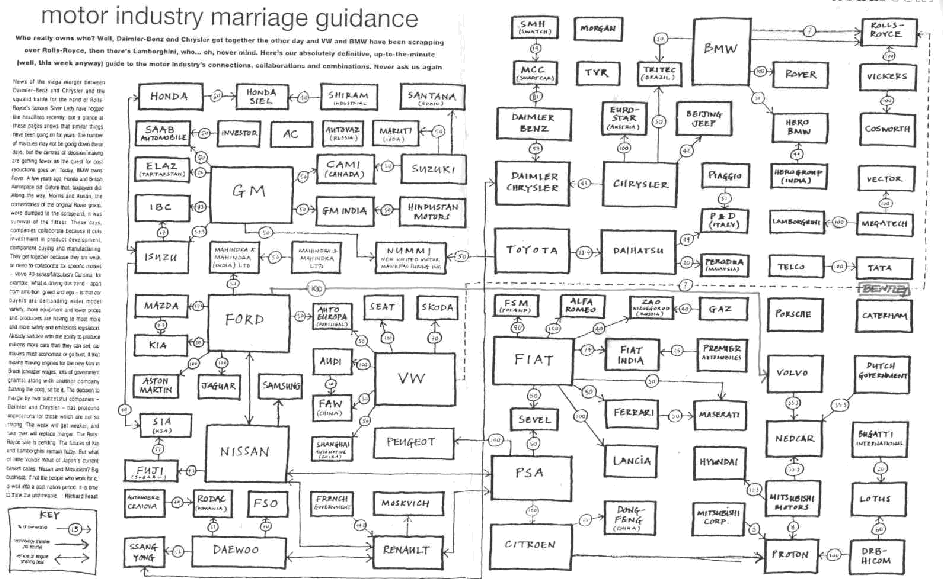

.. =============================================================================
.. ICONS
.. =============================================================================

.. |intaico| image:: img/intaico.png
.. |conicetico| image:: img/conicetico.png

.. =============================================================================
.. CONTENT
.. =============================================================================

Caracterización del Sistema Mal de Río Cuarto del Maíz mediante Minería de Datos y Análisis de Redes
----------------------------------------------------------------------------------------------------

.. image:: img/log.png
    :align: center
    :scale: 100 %

Integrantes
-----------

- |utnico|  - García, Mario Alejandro
- |utnico|  - Cabral, Juan Bautista
- |intaico|  - Gimenez Pecci, María de la Paz
- |utnico|  - Vera, Carlos
- |utnico|  - Liberal Rodrigo
- |conicetico| |intaico|  - Laguna, Irma Graciela
- |intaico|  - Bisonard, Eduardo Matías
- |intaico|  - Maurino, Fernanda
- |intaico|  - Vankeirsbilck, Inés
- |utnico|  - Cucco, Noelia del Valle
- |utnico|  - Nieto Castillo, Adrián L.

Knowledge Discovery in Database (KDD)
-------------------------------------

- Es un proceso no trivial de identificación de información útil y desconocida
  que permanece oculta en una base de datos [Fayyad, 1996]

- Es un proceso centrado en la persona (human-centered) [Brachman, 1996]

Mal de Río Cuarto virus
-----------------------

- Análisis electroforético:

.. image:: img/electroforesis.png
    :align: center
    :scale: 100 %

- Base de datos formada por

        *perfiles electroforéticos +*
        *atributos que definen el ambiente de la planta*

- Resultados de estudios anteriores:

    **Algunos segmentos electroforéticos dependen de otros**

Network Science
---------------

- Es el estudio de las redes que representan fenómenos físicos, biológicos y
  sociales conduciendo a modelos predictivos de estos fenómenos.

- Topologías.

- Características comunes.

Networks 1
----------

.. figure:: img/proteina.png
    :align: center
    :scale: 100 %

    Interacción proteína-proteína

Networks 2
----------

    Redes sociales/económicas

Networks 3
----------

.. figure:: img/energy.png
    :align: center
    :scale: 100 %

    Red de distribución de energía

Networks 4
----------

    Relación entre automotrices

Networks 5
----------

.. figure:: img/bbt.png
    :align: center
    :scale: 35 %

    Red semántica TBBT

Networks 6
----------

bla
