.. =============================================================================
.. ICONS
.. =============================================================================

.. =============================================================================
.. CONTENT
.. =============================================================================

Fundamentos de Business Intelligence
------------------------------------

.. class:: center

    Ing. Cabral, Juan B.

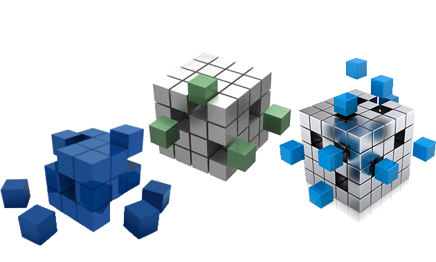

.. class:: center

    Universidad Nacional del Sur

    SciPyCon Argentina 2014

    10/2014 - Bahía Blanca - Argentina

About Me
--------

Juan B Cabral

- Software engineer.
- Data scientist.

Agenda
------

::

    01. Historia y descripción del BI
    02. Bases de datos transaccionales (OLTP) vs Analíticas (OLAP)
    03. Data Marts y Data Warehouse
    04. Facts y Dimensiones
    05. Estructura de datos para análisis multidimensional (OLAP Cubes)
    06. Implementaciones OLAP: ROLAP - MOLAP - HOLAP

    07. Modelado relacional para RDBMS (ROLAP)
    08. Diferentes alternativas de OLAP libres y gratuitas (Mondrian & Cubes)
    09. Aplicaciones BI (Pentaho - Saiku - Cubes Viewer)
    10. Consultas MDX (Multi Dimensional eXpressions)
    11. ETL (Extract, Transform and Load)

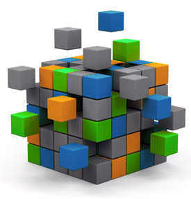

Demo Time
---------

.. image:: imgs/demotime.png
    :align: center
    :scale: 100 %

.. class:: center

    **Veamos a que apuntamos con este tutorial**

Historia y descripción del BI - Definición
------------------------------------------

El término inteligencias empresariales se refiere al uso de datos en una
**empresa** para facilitar la toma de decisiones. Abarca la comprensión del
funcionamiento actual de la **empresa**, bien como la anticipación de
acontecimientos futuros, con el objetivo de ofrecer conocimientos para
respaldar las decisiones **empresariales**. [WIKIPEDIA]_

En 1989, Howard Dresner (más tarde, un analista de Gartner Group) propuso la
"inteligencia de negocios" como un término general para describir
"los conceptos y métodos para mejorar la toma de decisiones **empresariales**
mediante el uso de sistemas basados en hechos de apoyo" [WIKIPEDIA]_

.. class:: center

    **Uno de los pocos casos que Nace en la industria migra a la Ciencia**

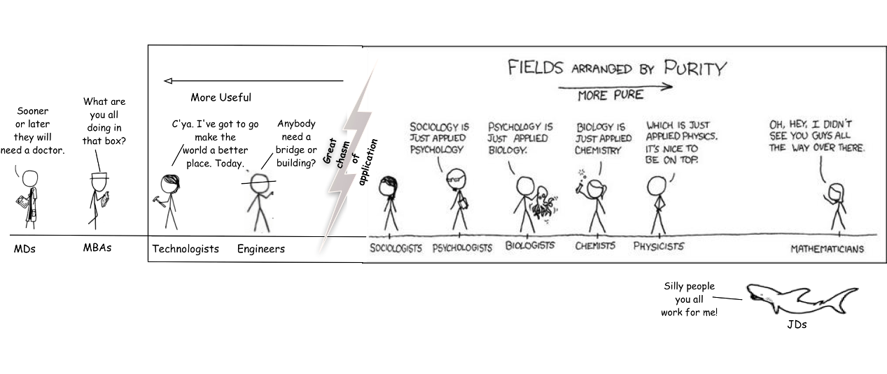

Historia y descripción del BI - Características
-----------------------------------------------

- **Accesibilidad a la información.** El acceso a datos debe ser de forma
  independiente a su procedencia
- **Apoyo en la toma de decisiones.** La herramientas debe permitir la
  selección, análisis  y manipulación selectiva de datos
- **Orientación al usuario final.** Se busca independencia entre los
  conocimientos técnicos de los usuarios y su capacidad para utilizar estas
  herramientas.

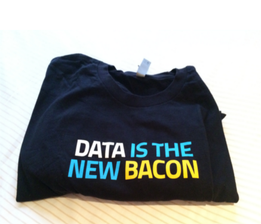

OLTP & OLAP - Versus otras Clasificaciones
------------------------------------------

.. class:: Center

    Existen diferentes formas de clasificar bases de datos

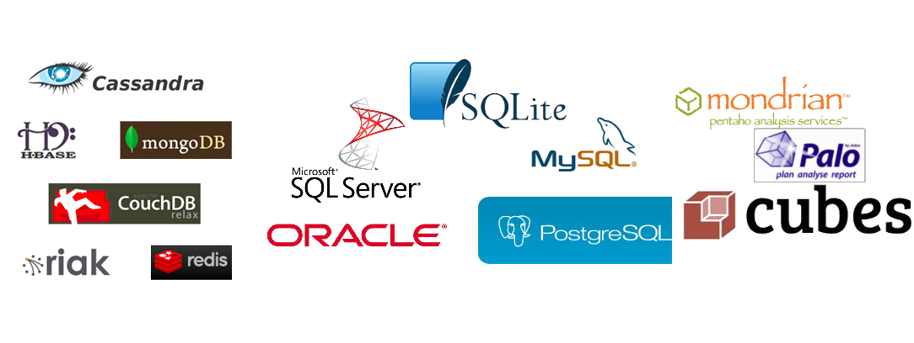

- Segun la estructura que almacentan:
  **OO** (db4o), **Document-Oriented** (mongoDB, CouchDB), **RDBMS** (MySql,
  SQLite, PostgreSQL, Oracle, MicrosoftSQL Server, DB2), **Key-Value**
  (Redis, riak) o **Graph** (Neo4J)
- Segun si implementan o no SQL:
  **SQL** (MySql, SQLite, PostgreSQL, Oracle, MicrosoftSQL Server, DB2) o
  **NO-SQL** (Todas las demas)
- Segun su objetivo:
    **OLAP** (Mondrian, Cubes, Cognos) y **OLTP** (Todas las demas)

OLTP & OLAP - OLAP vs OLTP
--------------------------

.. class:: center

    **OLAP** es el acrónimo en inglés de procesamiento analítico en línea
    (On-Line Analytical Processing). Es una solución utilizada en el campo de
    la llamada Inteligencia empresarial (o Business Intelligence)
    cuyo objetivo es agilizar la consulta de grandes cantidades de datos.
    ... contienen datos resumidos de grandes Bases de datos o Sistemas
    Transaccionales (OLTP). Se usa en informes de negocios de ventas,
    marketing, informes de dirección, minería de datos y áreas similares.

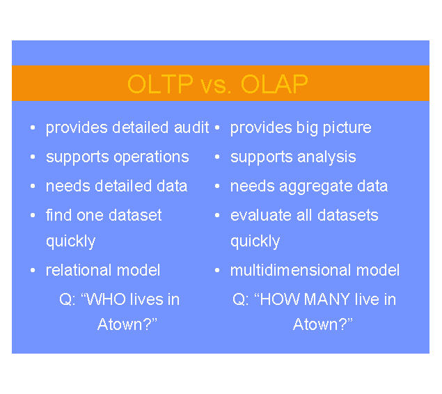

Data Marts
----------

.. class:: center

    Un **Data mart** es una versión especial de almacén de datos.
    Son subconjuntos de datos con el propósito de ayudar a que un área
    específica dentro del negocio pueda tomar mejores decisiones.

Los Data marts son subconjuntos de datos de un almacén de datos  para áreas
específicas.

Entre las características de un data mart destacan:

    - Usuarios limitados.
    - Área específica.
    - Tiene un propósito específico.
    - Tiene una función de apoyo.

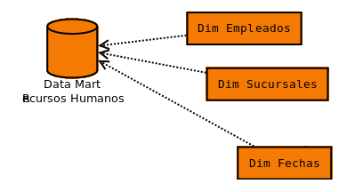

Data Warehouse
--------------

.. class:: center

    Según Ralph Kimball un almacen de datos o **Data Warehouse** es:
    "una copia de las transacciones de datos específicamente estructurada
    para la consulta y el análisis"[cita requerida]. También fue Kimball
    quien determinó que un data warehouse no era más que:
    "la unión de todos los *Data marts* de una entidad". Defiende por tanto
    una metodología ascendente (bottom-up) a la hora de diseñar un almacén de
    datos.

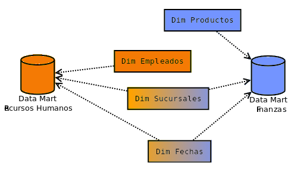

Hechos y Dimensiones - Definición
---------------------------------

Hechos (o *Facts*)
^^^^^^^^^^^^^^^^^^

.. class:: center

    Un hecho es un valor o una medida que representa un hecho (*sic) sobre una
    entidad o un sistema.

    Es algo que efectivamente sucedió o existe y sobre los cuales queremos
    efectuar análisis.

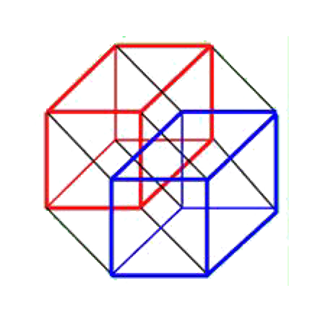

Dimensiones
^^^^^^^^^^^

.. class:: center

    Es una estructura que categoriza a hechos y medidas para permitir responder
    preguntas del negocio.

Dividiendo Dimensiones
----------------------

- Una **dimension** SIEMPRE se divide en una o mas **Jerarquias**.
- Una **Jerarquia** SIEMPRE se divide en uno o mas **Niveles**.
- Un **Nivel** puede tener mas niveles adentro.
- Un **Nivel (sin subniveles)** SIEMPRE se divide en atributos.
- Un **Atributo** tiene **Miembros**
- Los **Miembros son los valores**

.. csv-table:: Ejemplos
    :header-rows: 1

    Dim, Hierarchy, Level, Attribute, Member
    User,User,User,Name,Tito
    User,User,User,LastName, Puente
    Fecha,Año,Mes,Dia,25
    Fecha,Año,Mes,Mes,Feb
    Fecha,Año,Mes,Año,2014

Hechos y Dimensiones - Un ejemplo
---------------------------------

::

    Tito fue a comprar jabón en polvo gasto en total $16 en la sucursal 7
    el 16 de octubre del 2014

- **Hecho:** Sucedió 1 (métrica) venta que se gasto $ 16 (métrica).
- **Dim. Cliente:** tito
- **Dim. Producto:** jabón en polvo.
- **Dim. Sucursal:**  7
- **Dim. Fecha:** 16 de octubre del 2014

.. class:: center

    **Consultas multidimensionales basándonos en el ejemplo:**

#. Promedio de gastos por cliente.
#. Quiero el promedio de de las ventas por producto y sucursal.
#. Quiero la suma de ingresos por producto.
#. Quiero conteo de ventas por día.

Hechos y Dimensiones - Ejemplo Científico
-----------------------------------------

::

    El telescopio X encontró una estrella tipo RR-Lyrae con una magnitud
    aparente Y en la posición Z en la fecha W.

- **Hecho:** Sucedió 1 (métrica) descubrimiento de una estrella de
  magnitud aparente Y (métrica).
- **Dim. Dispositivo:** Telescopio ``X``
- **Dim. Tipo de Fuente:** ``RR-Lyrae``
- **Dim. Zona:** rango ``R`` tal que ``R`` contiene a ``Z``
- **Dim. Fecha:** ``W``

.. class:: center

    **Consultas multidimensionales basándonos en el ejemplo:**

#. Cantidad de descubrimientos por posición.
#. Promedio de magnitud por tipo de fuente.

Dimensiones - Tipos
-------------------

- **Regular:** cliente, articulo, tipo de fuente
- **Conformed:** Conectan mas de un datamart y tienen mismo
  significado semántico en todos los datamarts
- **Role Played:** Cambian de significado según el datamart
- **Junk:** Suelen tener banderas como [S|N] o Sexo
- **Dirty:** Son *role-playing* que no tienen significado en si
  mismos. Por ejemplo: una dimensión numero que en un datamart es un
  identificador de facturas y en otro es un DNI.

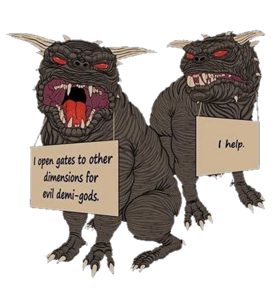

Slowly Change Dimension
-----------------------

- Se supone que una DW no cambia mucho en sus dimensiones.
- Si alguna cambia: **cambia lentamente**

Suponiendo que tengo alguna dimension con un miembro parecido a:

.. code-block:: javascript

    {sk: 1, bk: 001, nombre: "Plutón", cat: "Planeta"}

.. class:: center

    **Ahora Plutón no es mas un planeta...**

Slowly Change Dimension - Enfoques
----------------------------------

0. **SCD Tipo 0:** No hacemos nada. No sempre un cambio en OLTP refleja un cambio en OLAP.

1. **SCD Tipo 1:** No Guardo Historia.

.. code-block:: javascript

    {sk: 1, bk: 001, nombre: "Plutón", cat: "Planeta Enano"}

2. **SCD Tipo 2:** Guardo Historia Versionando.

.. code-block:: javascript

    {sk: 1, bk: 001, nombre: "Plutón", cat: "Planeta", ver: 1}
    {sk: 1, bk: 001, nombre: "Plutón", cat: "Planeta Enano", ver: 2}

3. **SCD Tipo 3:** Guardo Historia Cambiando la Dimensión.

.. code-block:: javascript

    {sk: 1, bk: 001, nombre: "Plutón", cat0: "Planeta", cat1: "Planeta Enano"}

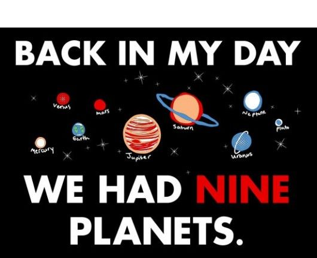

Cubos OLAP
----------

.. class:: center

    Es una base de datos multidimensional, en la cual el almacenamiento físico
    de los datos se realiza en un vector multidimensional.

    Pueden considerar como una ampliación de las dos dimensiones de una hoja
    de cálculo.

    Las respuestas de los cubos olap son cubos de menor dimensión (normalmente
    tablas de doble entrada) y los datos se le llaman celdas.

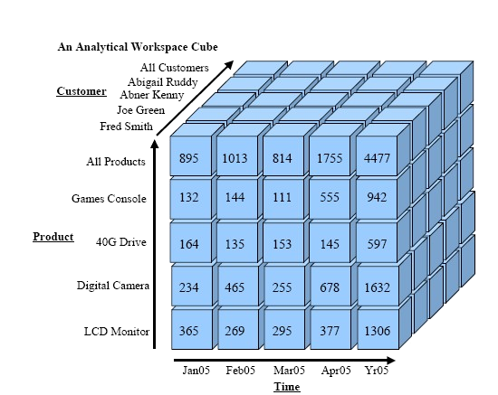

Cubos OLAP - Operaciones
------------------------

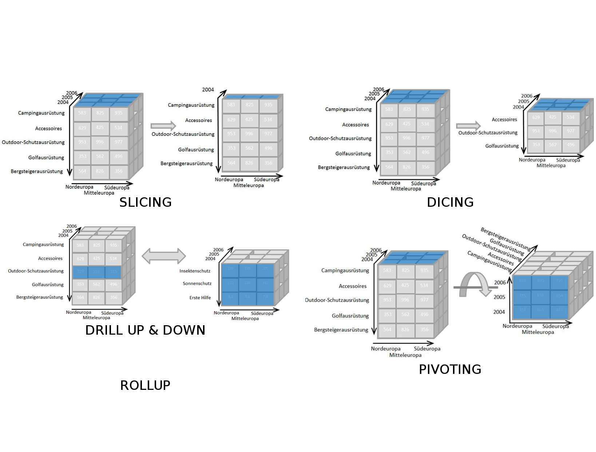

Cubos OLAP - Implementaciones
-----------------------------

- **MOLAP** La base de datos es multidimencional hasta su nivel mas bajo.
  Cada miembro de cada hecho esta almacenado en una celda diferente

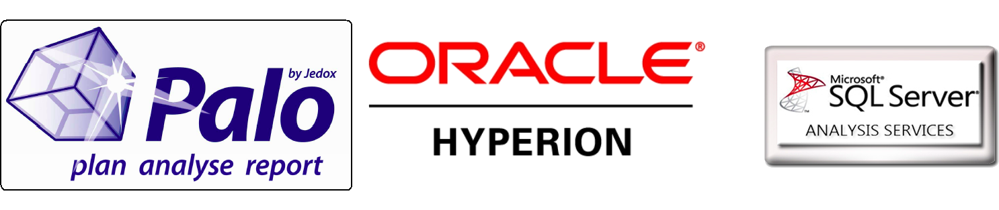

- **ROLAP** La base de datos es una vista lógica sobre una relacional.
  Existen diferentes estrategias para crear la base de datos segun necesidades.

- **HOLAP** Las dimensiones pueden dividir ciertos niveles en MOLAP y ciertos
  niveles en ROLAP

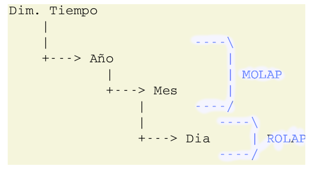

OLAP - Alternativas
-------------------

¿Preguntas?
-----------

    - Charla: http://goo.gl/3rb9QE
    - Contactos:
        - `jbcabral.com <http://jbcabral.com>`_
        - Juan B Cabral <`jbc.develop@gmail.com <mailto:jbc.develop@gmail.com>`_>

.. [WIKIPEDIA] http://es.wikipedia.org/wiki/Inteligencia_empresarial

