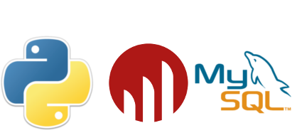

.. =============================================================================
.. ICONS
.. =============================================================================

.. =============================================================================
.. CONTENT
.. =============================================================================

Fundamentos de Business Intelligence
------------------------------------

.. class:: center

    Ing. Cabral, Juan B.

.. image:: imgs/bi.png
    :align: center
    :scale: 60 %

.. class:: center

    Universidad Nacional del Sur

    SciPyCon Argentina 2014

    10/2014 - Bahía Blanca - Argentina

About Me
--------

Juan B Cabral

- Software engineer.
- Data scientist.

.. image:: imgs/eng.png
    :align: center
    :scale: 60 %

Agenda
------

::

    - Historia y descripción del BI.
    - Bases de datos transaccionales (OLTP) vs Analíticas (OLAP).
    - DataMarts y Data Warehouse.
    - Facts y Dimensiones.
    - Estructura de datos para análisis multidimensional (OLAP Cubes).
    - Implementaciones OLAP: ROLAP - MOLAP - HOLAP.
    - Consultas MDX, DMX y XMLA.
    - Modelado relacional para RDBMS (ROLAP).
    - Diferentes alternativas de OLAP libres y gratuitas (Mondrian & Cubes).
    - Aplicaciones BI (Pentaho - Saiku - Cubes Viewer).
    - ETL (Extract, Transform and Load).

    - Un repaso de la creación manual de un cubo (MySQL + Mondrian + Saiku)
    - Conectándose a Mondrian desde Python # a 16 hs aun no lo logre

Demo Time
---------

.. image:: imgs/demotime.png
    :align: center
    :scale: 100 %

.. class:: center

    **Veamos a que apuntamos con este tutorial**

The Kimball Group
-----------------

.. class:: center

    The Kimball Group is a vendor-independent focused team of senior
    consultants specializing in the design of effective data warehouses to
    deliver enhanced business intelligence.

    http://www.kimballgroup.com

Historia y descripción del BI - Definición
------------------------------------------

El término inteligencias empresariales se refiere al uso de datos en una
**empresa** para facilitar la toma de decisiones. Abarca la comprensión del
funcionamiento actual de la **empresa**, bien como la anticipación de
acontecimientos futuros, con el objetivo de ofrecer conocimientos para
respaldar las decisiones **empresariales**.

En 1989, Howard Dresner (más tarde, un analista de Gartner Group) propuso la
"inteligencia de negocios" como un término general para describir
"los conceptos y métodos para mejorar la toma de decisiones **empresariales**
mediante el uso de sistemas basados en hechos de apoyo"

**En resumen** es un nombre comercial alrededor de un conjunto de tecnologías
y paradigmas para el análisis de grandes volúmenes de datos. El nombre se esta
abandonando a favor de **Analytics** (Y antes lo llamabas SSD)

.. image:: imgs/bihist.png
    :align: center
    :scale: 28 %

Historia y descripción del BI - Características
-----------------------------------------------

- **Accesibilidad a la información.** El acceso a datos debe ser de forma
  independiente a su procedencia
- **Apoyo en la toma de decisiones.** La herramientas debe permitir la
  selección, análisis  y manipulación selectiva de datos
- **Orientación al usuario final.** Se busca independencia entre los
  conocimientos técnicos de los usuarios y su capacidad para utilizar estas
  herramientas.

.. image:: imgs/insta.png
    :align: center
    :scale: 40 %

OLTP & OLAP - Versus otras Clasificaciones
------------------------------------------

.. class:: Center

    Existen diferentes formas de clasificar bases de datos

- Según la estructura que almacenan:
  **OO** (db4o), **Document-Oriented** (mongoDB, CouchDB), **RDBMS** (MySql,
  SQLite, PostgreSQL, Oracle, MicrosoftSQL Server, DB2), **Key-Value**
  (Redis, riak) o **Graph** (Neo4J)
- Según si implementan o no SQL:
  **SQL** (MySql, SQLite, PostgreSQL, Oracle, MicrosoftSQL Server, DB2) o
  **NO-SQL** (Todas las demas)
- Según su objetivo:
    **OLAP** (Mondrian, Cubes, Cognos) y **OLTP** (Todas las demas)

OLTP & OLAP - OLAP vs OLTP
--------------------------

.. class:: center

    **OLAP** es el acrónimo en inglés de procesamiento analítico en línea
    (On-Line Analytical Processing). Es una solución utilizada en el campo de
    la llamada Inteligencia empresarial (o Business Intelligence)
    cuyo objetivo es agilizar la consulta de grandes cantidades de datos.
    ... contienen datos resumidos de grandes Bases de datos o Sistemas
    Transaccionales (OLTP). Se usa en informes de negocios de ventas,
    marketing, informes de dirección, minería de datos y áreas similares.

Data Marts
----------

.. class:: center

    Un **Data mart** es una versión especial de almacén de datos.
    Son subconjuntos de datos con el propósito de ayudar a que un área
    específica dentro del negocio pueda tomar mejores decisiones.

Los Data Marts son subconjuntos de datos de un almacén de datos  para áreas
específicas.

Entre las características de un data mart destacan:

    - Usuarios limitados.
    - Área específica.
    - Tiene un propósito específico.
    - Tiene una función de apoyo.

Data Warehouse
--------------

.. class:: center

    Según Ralph Kimball un almacen de datos o **Data Warehouse** es:
    "una copia de las transacciones de datos específicamente estructurada
    para la consulta y el análisis"[cita requerida]. También fue Kimball
    quien determinó que un data warehouse no era más que:
    "la unión de todos los *Data marts* de una entidad". Defiende por tanto
    una metodología ascendente (bottom-up) a la hora de diseñar un almacén de
    datos.

Hechos y Dimensiones - Definición
---------------------------------

Hechos (o *Facts*)
^^^^^^^^^^^^^^^^^^

.. class:: center

    Un hecho es un valor o una medida que representa un hecho (*sic) sobre una
    entidad o un sistema.

    Es algo que efectivamente sucedió o existe y sobre los cuales queremos
    efectuar análisis.

    Los hechos tienen valores que se llaman **Métricas** y definen una
    dimensión en si misma.

Dimensiones
^^^^^^^^^^^

.. class:: center

    Es una estructura que categoriza a hechos y medidas para permitir responder
    preguntas del negocio.

Dividiendo Dimensiones
----------------------

- Una **dimensión** SIEMPRE se divide en una o mas **Jerarquías**.
- Una **Jerarquía** SIEMPRE puede dividirse en **Niveles**.
- Un **Nivel** PUEDE se dividirse en **Niveles**.
- Los **Atributos** pueden estar en las **Jerarquías, Niveles**
- A los registros individuales de una dimensión se los llama **Miembros**

Dividiendo Dimensiones - Ejemplos
---------------------------------

Hechos y Dimensiones - Un ejemplo
---------------------------------

::

    Tito fue a comprar jabón en polvo gasto en total $16 en la sucursal 7
    el 16 de octubre del 2014

- **Hecho:** Sucedió 1 (métrica) venta que se gasto $ 16 (métrica).
- **Dim. Cliente:** tito
- **Dim. Producto:** jabón en polvo.
- **Dim. Sucursal:**  7
- **Dim. Fecha:** 16 de octubre del 2014

.. class:: center

    **Consultas multidimensionales basándonos en el ejemplo:**

#. Promedio de gastos por cliente.
#. Quiero el promedio de de las ventas por producto y sucursal.
#. Quiero la suma de ingresos por producto.
#. Quiero conteo de ventas por día.

Hechos y Dimensiones - Ejemplo Científico
-----------------------------------------

::

    El telescopio X encontró una estrella tipo RR-Lyrae con una magnitud
    aparente Y en la posición Z en la fecha W.

- **Hecho:** Sucedió 1 (métrica) descubrimiento de una estrella de
  magnitud aparente Y (métrica).
- **Dim. Dispositivo:** Telescopio ``X``
- **Dim. Tipo de Fuente:** ``RR-Lyrae``
- **Dim. Zona:** rango ``R`` tal que ``R`` contiene a ``Z``
- **Dim. Fecha:** ``W``

.. class:: center

    **Consultas multidimensionales basándonos en el ejemplo:**

#. Cantidad de descubrimientos por posición.
#. Promedio de magnitud por tipo de fuente.

.. image:: imgs/stars.png
    :align: right
    :scale: 40 %

Dimensiones - Tipos
-------------------

- **Regular:** cliente, articulo, tipo de fuente
- **Conformed:** Conectan mas de un datamart y tienen mismo
  significado semántico en todos los datamarts
- **Role Played:** Cambian de significado según el datamart
- **Junk:** Suelen tener banderas como [S|N] o Sexo
- **Dirty:** Son *role-playing* que no tienen significado en si
  mismos. Por ejemplo: una dimensión numero que en un datamart es un
  identificador de facturas y en otro es un DNI.

Dimensiones - Indentificando Miembros
-------------------------------------

- Cada miembro de una dimensión normalmente se extrae de una entidad de un
  sistema transaccional (una tupla en una RDBMS, una fila de Excel, etc)
- En el sistema transacional es común que esta entidad tenga un identificador
  único (PK en una RDBMS, ID en una base documental, nro de orden en un Excel)
- Las claves del sistema transaccional las llamamos **Business Key** (BK).
- Un miembro tiene una clave calculada a partir del **BK** llamada
  **Surrogated Key** (SK)
- Es obligación del analista mantener esta relación.
- Las SK pueden no ser únicas en una dimensión.

Slowly Change Dimension
-----------------------

- Se supone que una DW no cambia mucho en sus dimensiones.
- Si alguna cambia: **cambia lentamente**

Suponiendo que tengo alguna dimensión con un miembro parecido a:

.. code-block:: javascript

    {sk: 1, bk: 001, nombre: "Plutón", cat: "Planeta"}

.. class:: center

    **Ahora Plutón no es mas un planeta...**

Slowly Change Dimension - Enfoques
----------------------------------

0. **SCD Tipo 0:** No hacemos nada. No siempre un cambio en OLTP refleja un cambio en OLAP.

1. **SCD Tipo 1:** No Guardo Historia.

.. code-block:: javascript

    {sk: 1, bk: 001, nombre: "Plutón", cat: "Planeta Enano"}

2. **SCD Tipo 2:** Guardo Historia Versionando.

.. code-block:: javascript

    {sk: 1, bk: 001, nombre: "Plutón", cat: "Planeta", ver: 1}
    {sk: 1, bk: 001, nombre: "Plutón", cat: "Planeta Enano", ver: 2}

3. **SCD Tipo 3:** Guardo Historia Cambiando la Dimensión.

.. code-block:: javascript

    {sk: 1, bk: 001, nombre: "Plutón", cat0: "Planeta", cat1: "Planeta Enano"}

Cubos OLAP
----------

.. class:: center

    Es una base de datos multidimensional, en la cual el almacenamiento físico
    de los datos se realiza en un vector multidimensional.

    Pueden considerar como una ampliación de las dos dimensiones de una hoja
    de cálculo.

    Las respuestas de los cubos olap son cubos de menor dimensión (normalmente
    tablas de doble entrada) y los datos se le llaman celdas.

.. image:: imgs/cube.png
    :align: center
    :scale: 40 %

Cubos OLAP - Operaciones
------------------------

.. image:: imgs/olap-slicing.png
    :align: center
    :scale: 50 %

Cubos OLAP - Implementaciones
-----------------------------

- **MOLAP** La base de datos es multidimencional hasta su nivel mas bajo.
  Cada miembro de cada hecho esta almacenado en una celda diferente

.. image:: imgs/molapimp.png
    :align: center
    :scale: 20 %

- **ROLAP** La base de datos es una vista lógica (schema) sobre una relacional.
  Existen diferentes estrategias para crear la base de datos según necesidades.
  (es lo que vamos a continuar viendo en este tutorial)

.. image:: imgs/rolapimp.png
    :align: center
    :scale: 30 %

- **HOLAP** Las dimensiones pueden dividir ciertos niveles en MOLAP y ciertos
  niveles en ROLAP

.. image:: imgs/holapex.png
    :align: center
    :scale: 30 %

MDX - Multi Dimensional eXpressions
-----------------------------------

- Es un lenguaje de consulta para bases de datos multidimensionales sobre
  cubos OLAP.
- Es declarativo a diferencia de las operaciones que son imperativas.
- Es muy similar a una consulta SQL, nos devuelve un conjunto de celdas.
- Para manejar jerarquias y niveles MDX tiene funciones como Children
  (hijos en inglés), cousin (primos) y parents (padres).

Una consulta tiene la forma

.. code-block:: sql

    SELECT
        <especificación de eje> ON COLUMNS,
        <especificación de eje> ON ROWS
        FROM <especificación de cubo>
        WHERE <especificación Slicer (rebanador)>

MDX - Multi Dimensional eXpressions - Ejemplo
---------------------------------------------

.. code-block:: sql

    SELECT
    {
        [Measures].[Sales Amount],
        [Measures].[Tax Amount]
    } ON COLUMNS,
    {
        [Date].[Fiscal].[Fiscal Year].&[2002],
        [Date].[Fiscal].[Fiscal Year].&[2003]
    } ON ROWS
    FROM [Adventure Works]
    WHERE ( [Sales Territory].[Southwest] )

- The SELECT clause sets the query axes as the Sales Amount and Tax Amount
  members of the Measures dimension, and the 2002 and 2003 members of the Date
  dimension.
- The FROM clause indicates that the data source is the Adventure Works cube.
- The WHERE clause defines the slicer axis as the Southwest member of the
  Sales Territory dimension.

DMX - Data Mining eXtensions
----------------------------

.. class:: center

    Query language for Data Mining Models supported by Microsoft's SQL Server
    Analysis Services product.
    Whereas SQL statements operate on relational tables, DMX statements operate
    on data mining models

- **DDL** Creates minning model (``CREATE MINING STRUCTURE``, ``CREATE MINING MODEL``)
- **DML** Train mining models: ``INSERT INTO``.
- **DML** Browse data in mining models ``SELECT FROM``.
- **DML** Make predictions using mining model: ``SELECT ... FROM PREDICTION JOIN``.

.. code-block:: sql

    SELECT [Loan Seeker], PredictProbability([Loan Seeker])
    FROM
      [Decision Tree]
    NATURAL PREDICTION JOIN
    (SELECT
       35 AS [Age],
       'Y' AS [House Owner], 'M' AS [Marital Status],
       'F' AS [Gender], 2 AS [Number Cars Owned],
       2 AS [Total Children], 18 AS [Total Years of Education]
    )

XMLA - XML for Anylisis
-----------------------

XMLA consists of only two SOAP methods.[2] It was designed in such a way to preserve simplicity.

- **Execute** method has two parameters:

    :Command: Command to be executed. It can be MDX, MDXML, DMX or SQL.
    :Properties: XML list of command properties such as Timeout, Catalog
                 name, etc.

  The result of Execute command could be Multidimensional Dataset or Tabular Rowset.

- **Discover**

  Discover method was designed to model all the discovery methods possible in
  OLEDB including various schema rowset, properties, keywords, etc. Discover
  method allows users to specify both what needs to be discovered and the
  possible restrictions or properties. The result of Discover method is a
  rowset.

XMLA - XML for Anylisis - Ejemplo
---------------------------------

.. code-block:: xml

    <soap:Envelope>
     <soap:Body>
      <Execute xmlns="urn:schemas-microsoft-com:xml-analysis">
       <Command>
        <Statement>SELECT Measures.MEMBERS ON COLUMNS FROM Sales</Statement>
       </Command>
       <Properties>
        <PropertyList>
         <DataSourceInfo/>
         <Catalog>FoodMart</Catalog>
         <Format>Multidimensional</Format>
         <AxisFormat>TupleFormat</AxisFormat>
        </PropertyList>
       </Properties>
      </Execute>
     </soap:Body>
    </soap:Envelope>

ETL - Extract, Transform and Load
---------------------------------

.. class:: center

    Es el proceso que permite a las organizaciones mover datos desde múltiples
    fuentes, reformatearlos y limpiarlos, y cargarlos en otra base de datos,
    data mart, o data warehouse para analizar, o en otro sistema operacional
    para apoyar un proceso de negocio.

#. Consiste en extraer los datos desde los sistemas de origen. La mayoría de
   los proyectos de almacenamiento de datos fusionan datos provenientes de
   diferentes sistemas de origen.
#. La fase de transformación aplica una serie de reglas de negocio o
   funciones sobre los datos extraídos para convertirlos en datos que serán
   cargados.
#. La fase de carga es el momento en el cual los datos de la fase anterior
   son cargados en el sistema de destino.

Resumen
-------

OLAP - Modelado relacional (ROLAP)
----------------------------------

- Para facilitar en análisis de abandona la 3FN.
- Hay 3 formas de estructurar una RDBMS para ROLAP.
- Aumentan la redundancia de datos.
- Disminuyen los ``Join`` considerablemente.
- **Nota:** Recuerden esto es para facilitar el análisis sacrificando TODO lo
  demás de ser necesario.

OLAP - Modelado relacional (ROLAP) - Star Shema
-----------------------------------------------

OLAP - Modelado relacional (ROLAP) - Snow Shema
-----------------------------------------------

OLAP - Alternativas: Cubes
--------------------------

    http://cubes.databrewery.org/

- Implementado en Python con aproximadamente ~2 años de desarrollo.
- Liviano
- Configurable con JSON (bastante feos los json)
- Usa sqlalchemy como backend de DB
- Tiene implementados dos visores cubes-views y cubes-viewer.
- Como método de análisis utiliza las primitivas de los cubos.
- Para llamadas remotas tiene una interfaz rest llamada slicer.

OLAP - Alternativas: Mondrian
-----------------------------

.. figure:: imgs/mondrian.png
    :align: center
    :scale: 100 %

    http://mondrian.pentaho.com/

- Implementado en Java.
- Liviano como una vaca gorda corriendo con una armadura de bronce.
- Configurable con XML
- Soporta MDX.
- Soporta multiples backends (Casi cualquier cosa conocida anda)
- Soporta cargas de datos muy grandes-
- Tiene cientos de visores implementados (Saiku - Pentaho - OpenI)
- Estándar de facto del mercado.
- Soporta XMLA

BI - End To End
---------------

- Conmunmente se le lama BI a una serie de herramientas integradas para el
  análisis.
- Son muchas:
  Pentaho (Sobre Mondrian), Cubes Viewer (Sobre Cubes), Saiku (Sobre Mondrian),
  Cognos, MS-AS, OpenI (Sobre Mondrian), YellowFin...
- Es lo que vimos como ejemplo al comienzo permite la ejecución y resumen de
  datos de manera *Drag and Drop*

Parte Práctica
--------------

- Vamos a ver un mini problema en un OLTP.
- Vamos a llevar los datos a una forma estrella OLAP en MySQL.
- Vamos a Diseñar el Schema lógico para maper la estrella.
- Vamos a configurar Saiku para que tome el cubo.
- Vamos a tirar unas consultas MDX desde Python (``pip install python-xmla``).

¿Preguntas?
-----------

    - Charla: http://goo.gl/3rb9QE
    - Contactos:
        - `jbcabral.com <http://jbcabral.com>`_
        - Juan B Cabral <`jbc.develop@gmail.com <mailto:jbc.develop@gmail.com>`_>

.. image:: imgs/questions.png
    :align: right
    :scale: 35 %
