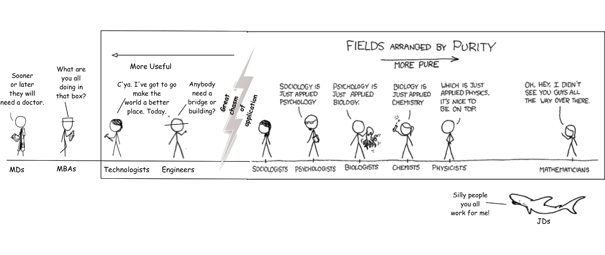

.. =============================================================================
.. ICONS
.. =============================================================================

.. =============================================================================
.. CONTENT
.. =============================================================================

Fundamentos de Bussines Intelligence
------------------------------------

.. class:: center

    Ing. Cabral, Juan B.

.. image:: imgs/bi.png
    :align: center
    :scale: 60 %

.. class:: center

    Universidad Nacional del Sur

    SciPyCon Argentina 2014

    10/2014 - Bahía Blanca - Argentina

About Me
--------

Juan B Cabral

- Software engineer.
- Data scientist.

.. image:: imgs/eng.png
    :align: center
    :scale: 60 %

Agenda
------

::

    - Historia y descripción del BI
    - Bases de datos transaccionales (OLTP) vs Analíticas (OLAP)
    - Data Marts y Data Warehouse
    - Estructura de datos para análisis multidimensional (OLAP Cubes)
    - Implementaciones OLAP: ROLAP - MOLAP - HOLAP
    - Modelado relacional para RDBMS (ROLAP)
    - Diferentes alternativas de OLAP libres y gratuitas (Mondrian & Cubes)
    - Aplicaciones BI (Pentaho - Saiku - Cubes Viewer)
    - Consultas MDX (Multi Dimensional eXpressions)
    - ETL (Extract, Transform and Load)

.. image:: imgs/agenda.png
    :align: center
    :scale: 50 %

Demo Time
---------

.. image:: imgs/demotime.png
    :align: center
    :scale: 100 %

.. class:: center

    **Veamos a que apuntamos con este tutorial**

Historia y descripción del BI - Definición
------------------------------------------

El término inteligencias empresariales se refiere al uso de datos en una
**empresa** para facilitar la toma de decisiones. Abarca la comprensión del
funcionamiento actual de la **empresa**, bien como la anticipación de
acontecimientos futuros, con el objetivo de ofrecer conocimientos para
respaldar las decisiones **empresariales**. [WIKIPEDIA]_

En 1989, Howard Dresner (más tarde, un analista de Gartner Group) propuso la
"inteligencia de negocios" como un término general para describir
"los conceptos y métodos para mejorar la toma de decisiones **empresariales**
mediante el uso de sistemas basados en hechos de apoyo" [WIKIPEDIA]_

.. class:: center

    **Uno de los pocos casos que Nace en la industria migra a la Ciencia**

Historia y descripción del BI - Características
-----------------------------------------------

- **Accesibilidad a la información.** El acceso a datos debe ser de forma
  independiente a su procedencia
- **Apoyo en la toma de decisiones.** La herramientas debe permitir la
  selección, análisis  y manipulación selectiva de datos
- **Orientación al usuario final.** Se busca independencia entre los
  conocimientos técnicos de los usuarios y su capacidad para utilizar estas
  herramientas.

.. image:: imgs/insta.png
    :align: center
    :scale: 40 %

OLTP & OLAP - Versus otras Clasificaciones
------------------------------------------

.. class:: Center

    Existen diferentes formas de clasificar bases de datos

.. image:: imgs/dbtypes.png
    :align: center
    :scale: 50 %

- Segun la estructura que almacentan:
  **OO** (db4o), **Document-Oriented** (mongoDB, CouchDB), **RDBMS** (MySql,
  SQLite, PostgreSQL, Oracle, MicrosoftSQL Server, DB2), **Key-Value**
  (Redis, riak) o **Graph** (Neo4J)
- Segun si implementan o no SQL:
  **SQL** (MySql, SQLite, PostgreSQL, Oracle, MicrosoftSQL Server, DB2) o
  **NO-SQL** (Todas las demas)
- Segun su objetivo:
    **OLAP** (Mondrian, Cubes, Cognos) y **OLTP** (Todas las demas)

OLTP & OLAP - OLAP vs OLTP
--------------------------

.. class:: center

    **OLAP** es el acrónimo en inglés de procesamiento analítico en línea
    (On-Line Analytical Processing). Es una solución utilizada en el campo de
    la llamada Inteligencia empresarial (o Business Intelligence)
    cuyo objetivo es agilizar la consulta de grandes cantidades de datos.
    ... contienen datos resumidos de grandes Bases de datos o Sistemas
    Transaccionales (OLTP). Se usa en informes de negocios de ventas,
    marketing, informes de dirección, minería de datos y áreas similares.

.. image:: imgs/olapvsoltp.png
    :align: center
    :scale: 39 %

Data Marts
----------

.. class:: center

    Un **Data mart** es una versión especial de almacén de datos.
    Son subconjuntos de datos con el propósito de ayudar a que un área
    específica dentro del negocio pueda tomar mejores decisiones.

Los Data marts son subconjuntos de datos de un almacen de datos  para áreas
específicas.

Entre las características de un data mart destacan:

    - Usuarios limitados.
    - Área específica.
    - Tiene un propósito específico.
    - Tiene una función de apoyo.

.. image:: imgs/dmart.png
    :align: right
    :scale: 50 %

Data Warehouse
--------------

.. class:: center

    Según Ralph Kimball un almacen de datos o **Data Warehouse** es:
    "una copia de las transacciones de datos específicamente estructurada
    para la consulta y el análisis"[cita requerida]. También fue Kimball
    quien determinó que un data warehouse no era más que:
    "la unión de todos los *Data marts* de una entidad". Defiende por tanto
    una metodología ascendente (bottom-up) a la hora de diseñar un almacén de
    datos.

.. image:: imgs/dw.png
    :align: center
    :scale: 80 %

¿Preguntas?
-----------

    - Charla:
    - Contactos:
        - `jbcabral.com <http://jbcabral.com>`_
        - Juan B Cabral <`jbc.develop@gmail.com <mailto:jbc.develop@gmail.com>`_>

.. image:: imgs/questions.png
    :align: right
    :scale: 35 %

.. [WIKIPEDIA] http://es.wikipedia.org/wiki/Inteligencia_empresarial

