.. =============================================================================
.. ICONS
.. =============================================================================

.. =============================================================================
.. CONTENT
.. =============================================================================

PhD Proposal with Python
------------------------

o como convencer a ingenieros que hagan ciencia
^^^^^^^^^^^^^^^^^^^^^^^^^^^^^^^^^^^^^^^^^^^^^^^

.. class:: center

    Ing. Cabral, Juan B.

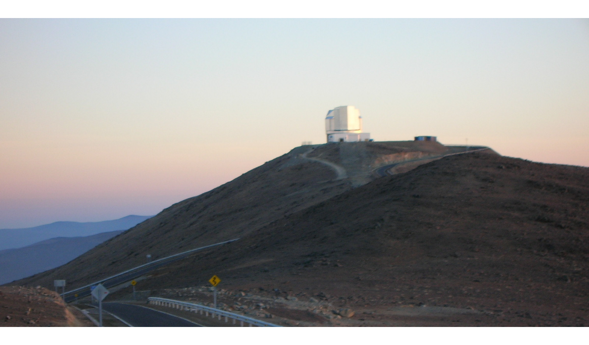

.. class:: center

    Universidad Nacional del Sur

    SciPyCon Argentina 2014

    10/2014 - Bahía Blanca - Argentina

About Me
--------

About Me

- Software engineer.
- Data scientist.

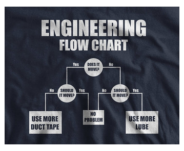

Agenda
------

- **De ingeniero a científico.**
- Encontrando un problema interesante.
- Que herramientas me sirvieron para justificar el plan.
- Conclusiones.

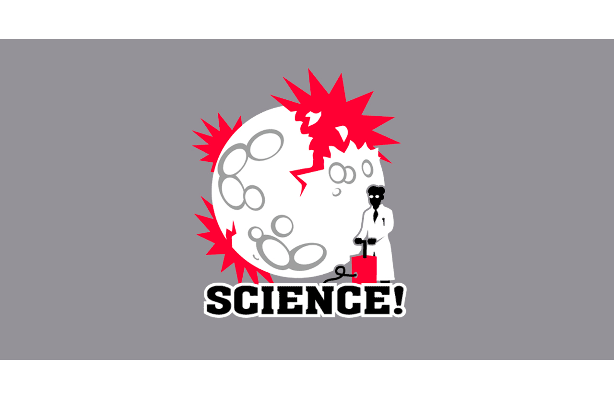

De ingeniero a científico - Ciencia vs Ingeniería
-------------------------------------------------

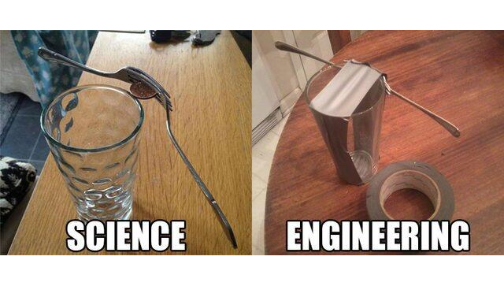

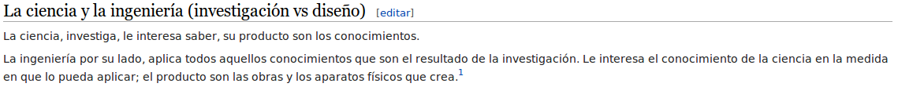

De ingeniero a científico  - Crecimiento de datos
-------------------------------------------------

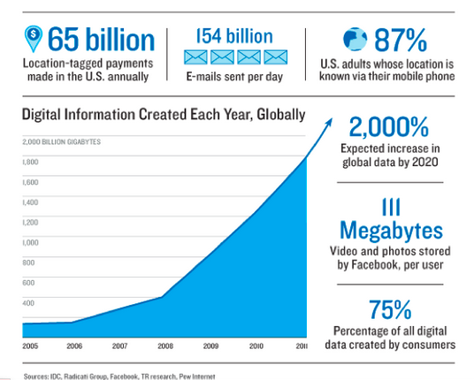

De ingeniero a científico - Las herramientas actuales
-----------------------------------------------------

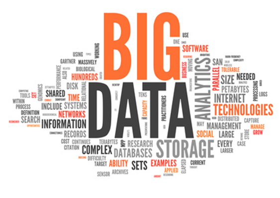

De ingeniero a científico - Algunas conclusiones previas
--------------------------------------------------------

- El crecimiento de datos se lo esta llamando **revolución**
- El manejo de herramientas para grandes volúmenes de datos **NO** es trivial
- El diseño de conocimiento nuevo para el manejo de las técnicas y herramientas
  de análisis se ha transformado en una especialidad en si mismo.
- Los ingenieros estamos para ayudar.

Agenda
------

- De ingeniero a científico.
- **Encontrando un problema interesante.**
- Que herramientas me sirvieron para justificar el plan.
- Conclusiones.

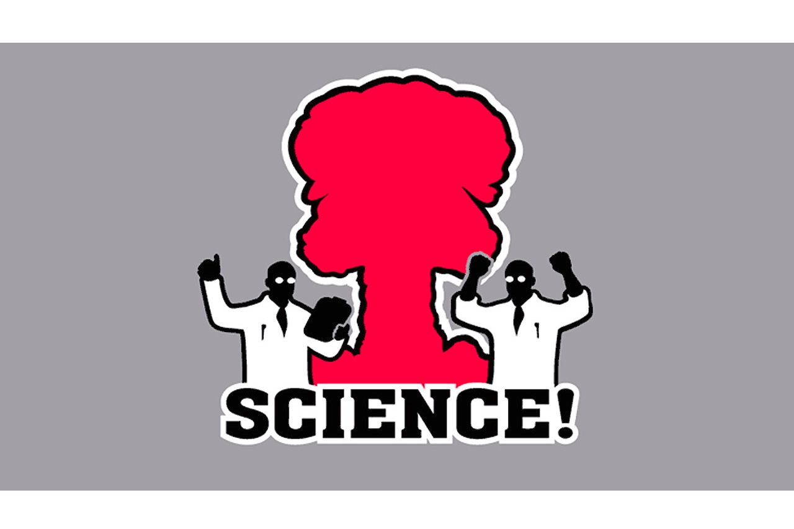

Un problema interesante - Conocimientos Previos
-----------------------------------------------

- Trabajo en un grupo de investigación sobre bioinformática en la UTN.
- Me especialicé en estadística orientada a la investigación.
- Trabaje diseñando modelos (bastante artesanales) para análisis de información
  en una empresa de análisis de medios masivos.
- Trabaje 3 años diseñando soluciones basadas en soporte de
  `Bussines Intelligence <http://en.wikipedia.org/wiki/Business_intelligence>`_

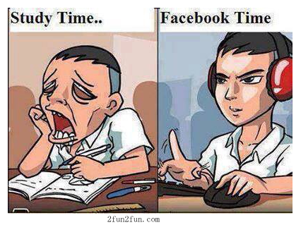

Un problema interesante - Alternativas
--------------------------------------

- Hago un doctorado?
- Lo hago en disciplinas que son de interés a la ingeniería?
- Busco una necesidad de terceros?

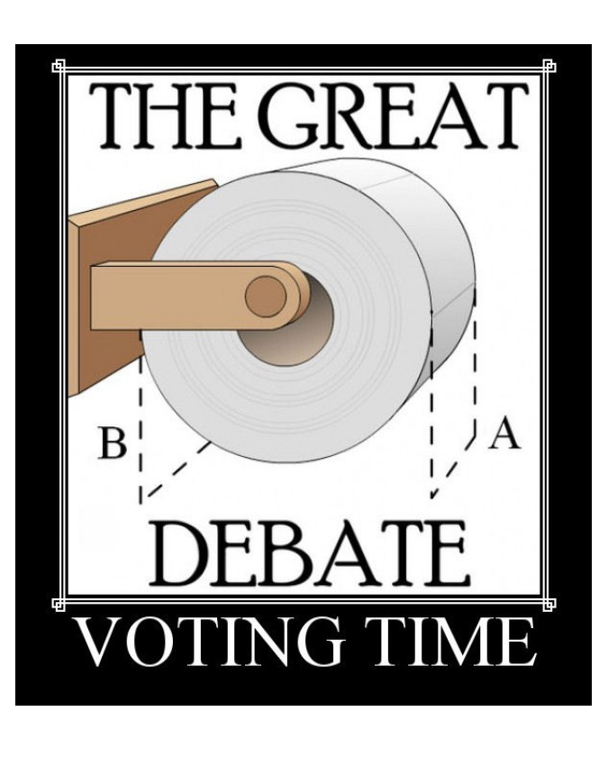

Un problema interesante - Eligiendo el DP
-----------------------------------------

- En la ScipyCon Argentina 2013 Sebastían Gurovich (IATE-OAC) hablo de un
  problemita de datos de un relevamiento llamado el VVV
- Seguimos charlando post conferencia en Córdoba.
- Elegí la universidad donde realizar la titulación.
- Escribimos un plan "draft" y buscamos un codirector.

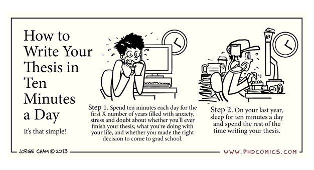

Un problema interesante - El problema
-------------------------------------

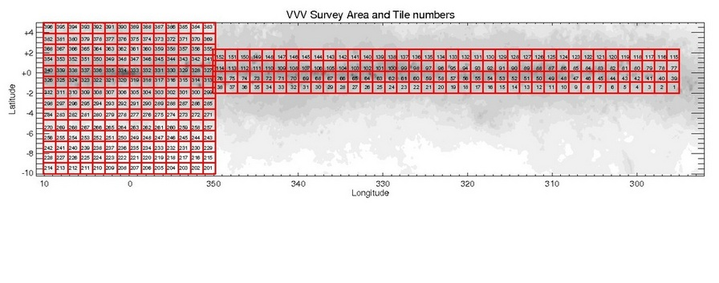

.. class:: center

    **Análisis y diseño de procesos de minería de datos astrofísicos sobre**
    **catálogos fotométricos múltiple época**

    Directores:

    Dr. Pablo Granitto (CIFASIS-CONICET)

    Dr. Sebastian Gurovich (IATE-OAC-UNC)

Agenda
------

- De ingeniero a científico.
- Encontrando un problema interesante.
- **Que herramientas me sirvieron para justificar el plan.**
- Conclusiones.

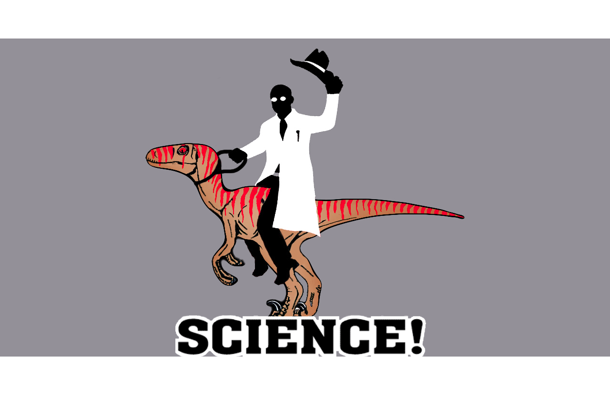

Herramientas
------------

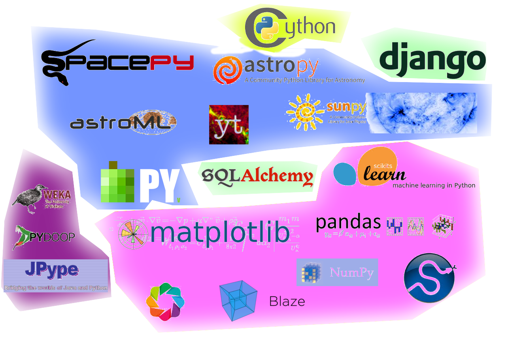

.. class:: center

    http://www.astropython.org/resources

Conclusiones
------------

- El advenimiento de datos ya cambió la forma de hacer ciencia en la ultima
  década.
- No me parece (IMHO) que se este capacitando a ingenieros para asistir a
  tareas científicas (al margen de casi no hay ingenieros)
- El análisis de datos ya esta generando mas roles que antes no existían como
  el astro-estadístico.
- No todas las currículas de ingeniería te dejan preparado para investigar
  (en mi casi fue un esfuerzo personal)

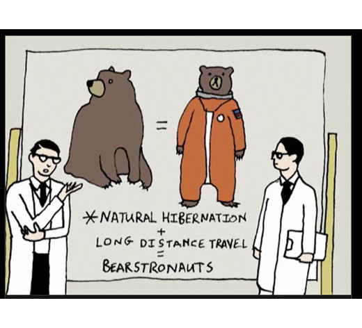

¿Preguntas?
-----------

    - Charla:
    - Contactos:
        - `jbcabral.com <http://jbcabral.com>`_
        - Juan B Cabral <`jbc.develop@gmail.com <mailto:jbc.develop@gmail.com>`_>

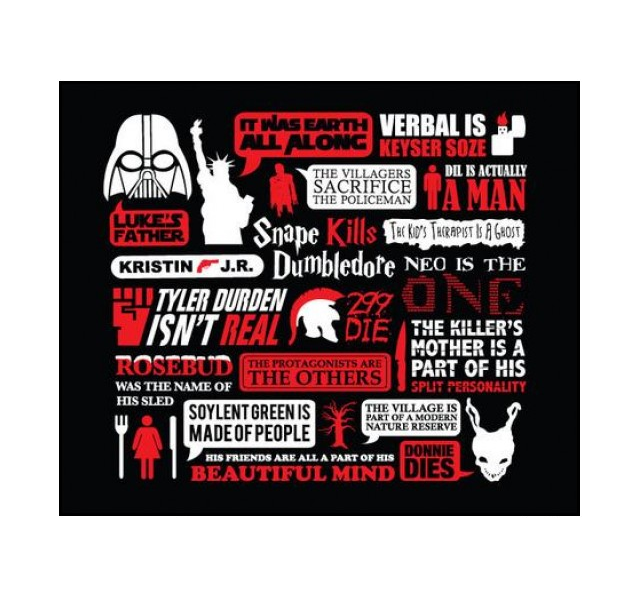

