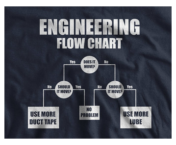
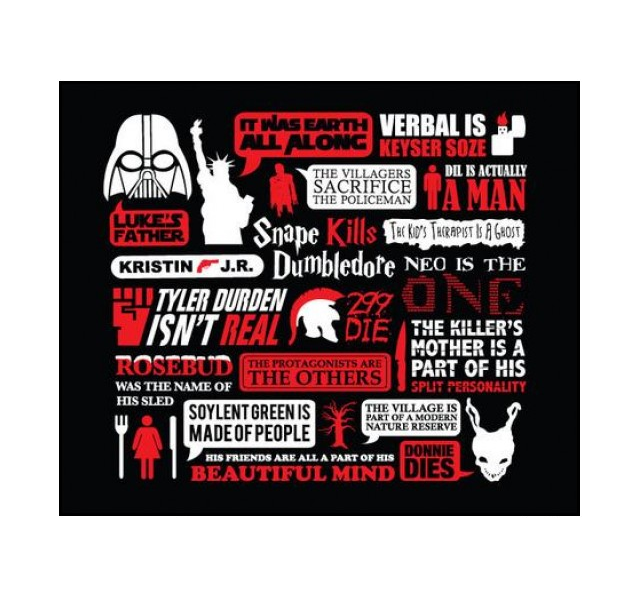

.. =============================================================================
.. ICONS
.. =============================================================================

.. =============================================================================
.. CONTENT
.. =============================================================================

Multicriterio y Escalas Ordinales
---------------------------------

Sus becas fueron asignadas con esto
^^^^^^^^^^^^^^^^^^^^^^^^^^^^^^^^^^^

.. class:: center

    Ing. Cabral, Juan B.

.. class:: center

    Universidad Gastón Dachary

    SciPyLa 2015

    05/2015 - Posadas - Argentina

About Me
--------

About Me

- Software engineer.
- Data scientist.
- Grad Student In Machine Learning for Astrophisics

Agenda
------

- Problemas de analisis a traves de múltiples criterios.
- Escuelas del MCDA
- AHP - WSM - WPM - MOORA - FMC - MPR.
- Comparación de Escalas Ordinales.
- Un ejemplo con Multi-MOORA.
- Futuro.

Decision-Makin Paradox
----------------------

-   Hay muchos metodos MCDA (normativos y descriptivos); y cada uno clama ser
    el mejos. Sin embargo muchos de estos metodos retornan diferentes resultados
    para los mismos problemas con exactamente los mismos datos.
-   Encontrar un el mejor metodo es un problema de MCDA en si mismo.
-   Naturalmente es necesario conocer el mejor metodo a-priori.

Decision-Makin Paradox (cont.)
------------------------------

-   A traves de un estudio [Triantaphyllou1989]_ [Triantaphyllou,2000]_
    Se realizo un experimento de selección de metodos utilizando 4 metodos.
    WSM, WPM y dos variantes de AHP. Cuando se usaba un metodo *X*
    (perteneciente a los anteriores, indicaba que *Y* era el mejor. Cuando se
    utilizaba *Y* el resultado decia que *Z* era mejor.
-   Para enunciar el problema se utilizaron 2 criterios:
    #.  Todo metodo debe ser tan precido en problemas multidimensionales como
        uni-dimensionales (se comparo resultados con WSUM) es lo llamaso
        ranking reversal tipo 5.
    #.  Resultados de Analisis de ranking reversals tipo 2.

Ranking Reversal
----------------

-   Esencialmente son: Test Cases
-   La idea es modificar las alternativas de tal forma que "suponemos" que las
    mejores alternativas no cambian.

Ranking Reversal (cont.)
------------------------

Si tenemos tres Alternativas ``A > B > C``

Tipos:

    -   **Tipo 1:** Agregamos una alternativa D igual o parecida a B o C y
        validamos que la mejor alternativa no cambie.
    -   **Tipo 2:** Reemplazamos B por D siendo D > B. Esperamos que A
        siga siendo la mejor.
    -   **Tipo 3:** Descomponemos el problema es problemas de 2 alternativas
        por ves, y verificamos que ninguno de ellos no se contradiga con el
        problema mayor.
    -   **Tipo 4:** Igual al tipo 3 pero solo comparamos entre ellos ignorando
        el general.
    -   **Tipo 5:** Comparaciones unidimensionales vs multidimensionales.

Ranking Reversal (cont.)
------------------------

-   Puede que una falla en un ranking reversal sea un resultado deseado.
-   Se da en situaciones racionales.
-   Conjetura: Intuyo que pasa en Machine Learning.

Ejemplo:

    - Un comprador M1 que le gusta el lujo, Un comprador M2 que no tiene
      dinero.
    - Un auto A1 lujoso y caro y un auto A2 barato y con poco confort.
    - ``M1 = A1 > A2`` y ``M2 = A2 > A1``

¿Preguntas?
-----------

    - Charla: http://goo.gl/XYHo58
    - Contactos:
        - `jbcabral.com <http://jbcabral.com>`_
        - Juan B Cabral <`jbc.develop@gmail.com <mailto:jbc.develop@gmail.com>`_>

