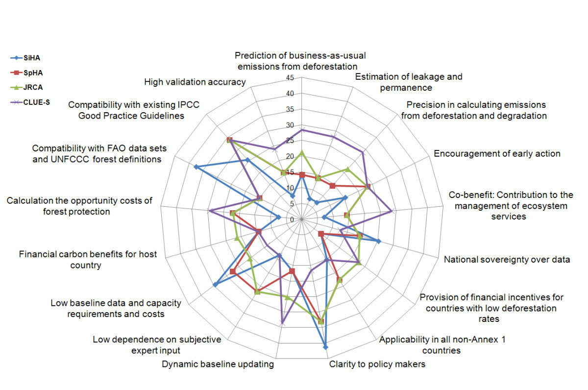

.. =============================================================================
.. ICONS
.. =============================================================================

.. =============================================================================
.. CONTENT
.. =============================================================================

Multicriterio y Escalas Ordinales
---------------------------------

.. class:: center

.. class:: center

    Juan B Cabral

.. class:: center

    Universidad Gastón Dachary

    SciPyLa 2015

    05/2015 - Posadas - Argentina

About Me
--------

.. class:: center

    **Disclaimer:** Wikipedia powered slides!

Decision-making
---------------

.. note::

    Is the study of identifying and choosing alternatives based on the values
    and preferences of the decision maker.

    Rational choice theory encompasses the notion that people try to maximize
    benefits while minimizing costs.

Perspectives:

- Psychological
- Cognitive
- Normative

Decision-making (Cont.)
-----------------------

-   A major part of decision-making involves the analysis of a finite set of
    alternatives described in terms of evaluative criteria.
-   These criteria may be benefit or cost in nature. (*Maximization* an
    *Minimization* problems).
-   The problem might be to rank these alternatives in terms of how attractive
    they are to the decision-maker(s) when all the criteria are considered
    simultaneously.

Multiple-criteria decision analysis
-----------------------------------

-   In our daily lives or in professional settings, there are typically
    multiple conflicting criteria that need to be evaluated in
    making decisions.
-   We usually weigh multiple criteria implicitly and we may be comfortable
    with the consequences of such decisions that are made based on only
    intuition.
-   When stakes are high, it is important to properly structure the problem
    and explicitly evaluate multiple criteria.

Multiple-criteria decision analysis (cont.)
-------------------------------------------

MCDM or MCDA is concerned with structuring and **solving** decision and
planning problems involving multiple criteria.

**"Solving"** can be:

-   Best alternative, small set of best alternatives or grouping
    alternatives.
-   An extreme interpretation could be to find all "efficient" or
    "nondominated" alternatives.

MCDA - Typologies
-----------------

-   **Multiple-criteria evaluation problems:** These problems consist of a
    finite number of alternatives, explicitly known in the beginning of the
    solution process. Each alternative is represented by its performance in
    multiple criteria. The problem may be defined as finding the best
    alternative for a decision maker (DM), or finding a set of good
    alternatives.
-   **Multiple-criteria design problems (multiple objective mathematical**
    **programming problems):** In these problems, the alternatives are not
    explicitly known. An alternative (solution) can be found by solving a
    mathematical model. The number of alternatives is either infinite and
    not countable (when some variables are continuous) or typically very
    large if countable (when all variables are discrete).

MCDA - Typologies (cont.)
-------------------------

-   There are methods that require the DM’s preference information at the start
    of the process, transforming the problem into essentially a single criterion problem.
    (**prior articulation of preferences**).
-   Some methods require preference information from the DM throughout the solution process.
    (**progressive articulation of preferences**).
-   MC design problems typically require the solution of a series of
    mathematical programming models in order to reveal implicitly defined solutions.
    (**posterior articulation of preferences"**).

Representations and definitions
-------------------------------

The MCDM problem can be represented in the criterion space or the decision
space. Alternatively, if different criteria are combined by a weighted linear
function, it is also possible to represent the problem in the weight space.

.. figure:: imgs/space_def.png
    :align: center
    :scale: 70 %

where **q** is the vector of **k** criterion functions
(objective functions) and **Q** is the feasible set, **Q ⊆ R^k**.

If Q is defined explicitly or implicity (by a set of alternatives),
the resulting problem is called a Multiple Criteria Evaluation or Design
problem.

X is the feasible set and x is the decision variable vector of size n.

Te quotation mark indicate the maximization is not well-defined.

Representations and definitions (cont.)
---------------------------------------

.. image:: imgs/space_dem.png
    :align: center
    :scale: 30 %

**Definitions:**

-   **Ideal point:** (in criterion space) represents the best (the maximum for
    maximization problems and the minimum for minimization problems) of each
    objective function, and typically corresponds to an infeasible solution.
-   **Nadir point:** (in criterion space) represents the worst (the minimum
    for maximization problems and the maximum for minimization problems) of
    each objective function among the points in the nondominated set, and is
    typically a dominated point.

Generating nondominated solutions
---------------------------------

.. note::

    .. class:: center

        .. image:: imgs/wsum.png
            :align: center
            :scale: 90 %

        Only one dimension but... works!

Solving MCDM problems - Schools
-------------------------------

-   Multiple objective mathematical programming school
-   Goal programming school
-   Fuzzy-set theorists
-   Multiattribute utility theorists
-   French school
-   Evolutionary multiobjective optimization school (EMO)
-   Analytic hierarchy process (AHP)

.. note::

    .. class:: center

        How many methods?

MCDM methods (1/3)
------------------

-   Aggregated Indices Randomization Method (AIRM)
-   **Analytic hierarchy process (AHP)**
-   Analytic network process (ANP)
-   Best worst method (BWM)[30]
-   Characteristic Objects METhod (COMET)
-   Data envelopment analysis
-   Decision EXpert (DEX)
-   Disaggregation – Aggregation Approaches (UTA*, UTAII, UTADIS)
-   Dominance-based rough set approach (DRSA)
-   ELECTRE (Outranking)
-   Evidential reasoning approach (ER)
-   Goal programming
-   Grey relational analysis (GRA)
-   Inner product of vectors (IPV)

MCDM methods (2/3)
------------------

-   Measuring Attractiveness by a categorical Based Evaluation Technique (MACBETH)
-   Multi-Attribute Global Inference of Quality (MAGIQ)
-   Multi-attribute utility theory (MAUT)
-   Multi-attribute value theory (MAVT)
-   New Approach to Appraisal (NATA)
-   Nonstructural Fuzzy Decision Support System (NSFDSS)
-   Potentially all pairwise rankings of all possible alternatives (PAPRIKA)
-   PROMETHEE (Outranking)
-   Superiority and inferiority ranking method (SIR method)
-   Technique for the Order of Prioritisation by Similarity to Ideal Solution (TOPSIS)
-   Value analysis (VA)
-   Value engineering (VE)

MCDM methods (2/3)
------------------

-   VIKOR method
-   Fuzzy VIKOR method
-   **Weighted product model (WPM)**
-   **Weighted sum model (WSM)**
-   **Multi-Objective Optimization by Ratio Analysis (MOORA)**

Decision-Makin Paradox
----------------------

-   Hay muchos metodos MCDA (normativos y descriptivos); y cada uno clama ser
    el mejos. Sin embargo muchos de estos metodos retornan diferentes resultados
    para los mismos problemas con exactamente los mismos datos.
-   Encontrar un el mejor metodo es un problema de MCDA en si mismo.
-   Naturalmente es necesario conocer el mejor metodo a-priori.

Decision-Makin Paradox (cont.)
------------------------------

-   A traves de un estudio (Triantaphyllou et al, 1989) (Triantaphyllou et al,2000)
    Se realizo un experimento de selección de metodos utilizando 4 metodos.
    WSM, WPM y dos variantes de AHP. Cuando se usaba un metodo *X*
    (perteneciente a los anteriores, indicaba que *Y* era el mejor. Cuando se
    utilizaba *Y* el resultado decia que *Z* era mejor.
-   Para enunciar el problema se criterios de ranking-reversals.

Ranking Reversal
----------------

-   Esencialmente son: Test Cases
-   La idea es modificar las alternativas de tal forma que "suponemos" que las
    mejores alternativas no cambian.

Ranking Reversal (cont.)
------------------------

Si tenemos tres Alternativas ``A > B > C``

Tipos:

    -   **Tipo 1:** Agregamos una alternativa D igual o parecida a B o C y
        validamos que la mejor alternativa no cambie.
    -   **Tipo 2:** Reemplazamos B por D siendo D > B. Esperamos que A
        siga siendo la mejor.
    -   **Tipo 3:** Descomponemos el problema es problemas de 2 alternativas
        por ves, y verificamos que ninguno de ellos no se contradiga con el
        problema mayor.
    -   **Tipo 4:** Igual al tipo 3 pero solo comparamos entre ellos ignorando
        el general.
    -   **Tipo 5:** Comparaciones unidimensionales vs multidimensionales.

Ranking Reversal (cont.)
------------------------

-   Puede que una falla en un ranking reversal sea un resultado deseado.
-   Se da en situaciones racionales.
-   Conjetura: Intuyo que pasa en Machine Learning.
-   Ejemplo:

    - Un comprador M1 que le gusta el lujo, Un comprador M2 que no tiene
      dinero.
    - Un auto A1 lujoso y caro y un auto A2 barato y con poco confort.
    - ``M1 = A1 > A2`` y ``M2 = A2 > A1``

Scikit-Criteria
---------------

Scikit-Criteria - Estado Actual
-------------------------------

- Implementado AHP - MOORA (4 metodos) - WPROD - WSUM.
- Tools sobre ranking (dominancia, igualdad, dominancia de kendall,
  spearman para rankings).
- Varios metodos de normalización.

Scikit-Criteria - Futuro
------------------------

- TOPSIS, VIKOR y ELEKTREE son los metodos prioritarios
- Terminar la documentación y escribir un tutorial.
- Implementar los ranking reversals.
- Integrar todo sobre una interfaz *scikit-learn like*.
- Graficos :D

¿Preguntas?
-----------

    - Charla:
    - Contactos:
        - `jbcabral.org <http://jbcabral.org>`_
        - Juan B Cabral <`jbc.develop@gmail.com <mailto:jbc.develop@gmail.com>`_>

