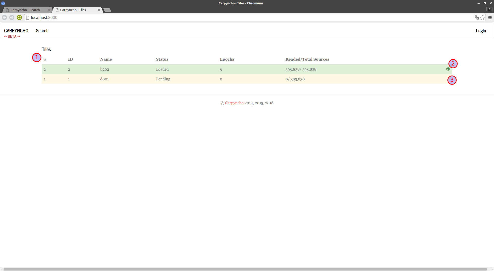
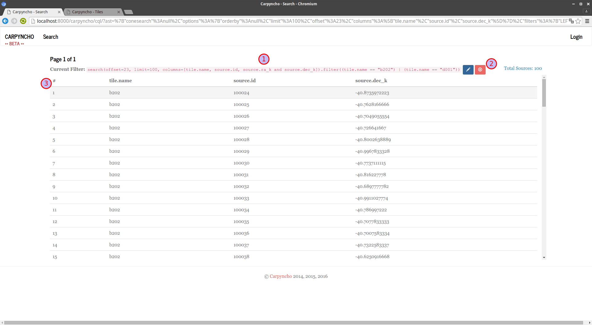
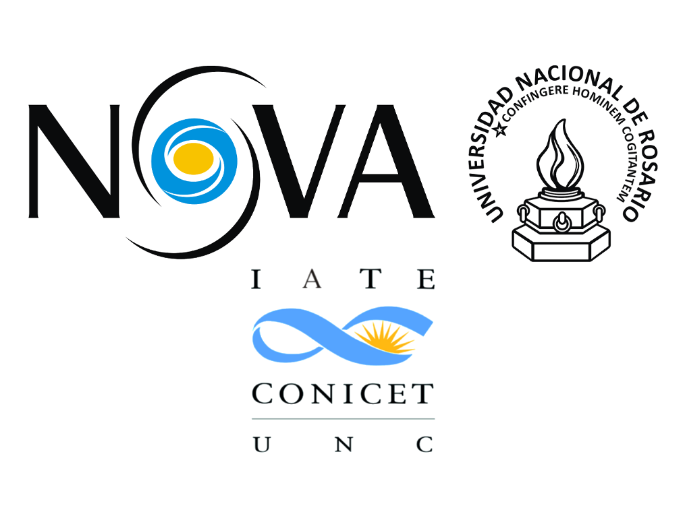

.. =============================================================================
.. HEADER
.. =============================================================================

.. header::

    .. image:: img/head.png
        :align: center
        :scale: 90 %

    Juan Bautista Cabral (IATE-UNR), Sebastian Gurovich (IATE-UNC-CONICET) + VVV Sci.Team

.. =============================================================================
.. CONTENT
.. =============================================================================

Introduction
------------

We present an first version of Carpyncho, a new data mining facility in
development which we hope will be utilized to search and
characterize time variable data of the ~ PiB size VVV survey.

The project are focus to be simple to use by exposing an small language
(~4 functions) to filter data, train machine learning models, execute
experiments in our own server, and download the data and the model to a local
computer.

The Backend
-----------

A data mining facility for the VVV is being developed for the
detection and classification of periodic and transient variables. For
this purpose, the single pawprint data from the VDFS CASU v1.3
catalogues have been crossed matched with the VDFS CASU v1.3 tile
catalogues into a PostgreSql data-base for variability analisis. The
Carpyncho infraestructure http://carpyncho.jbcabral.org/ is being
developed entirely in python on top of a Custom-Framework for data process and
Django web-framework (for the webapp). The
PostgreSql database layer was chosen since its performance is
adequate for large databases ~1 PetaByte and because PostgreSql is
open-source, ensuring support plus evolving versatility.

For calculation purposes Carpyncho is layored on-top of a scientific-
python library stack that includes:

- Numpy & Scipy: for Numerical calculations
- Astropy: for Procesing of Fits tables, astrometric and photometric
  calculations
- PyAstronomy: for GLS, PDM and time conversion algorithms
- AstroML & Scikit-learn: for machine learning algorithms
- SKLL: for machine learning automation.

CQL - Carpyncho Query Language
------------------------------

All the interaction to the backend (including the Web Interface) are made by
a small Domain Specific Language that expose (at the moment of this work) 4
to:

-   Make a Simple Cone Search (http://www.ivoa.net/documents/latest/ConeSearch.html)
    on the K filter.
-   Sort and slice the result
-   Filter the SCS by attributes
-   Train a model with the selected learner (RandomForestClassifier,
    DecisionTreeClassifier, SVC or MultinomialNB)
-   Download the data and the model generated in the server

**Note:** The first 3 and the last functionality is already functional and
available in the demo.

CQL are created above the Python Object Models and compiled to a JSON
format client-side with Brython (http://brython.info/) to avoid
execute untrusted code on our server.

The sintax can be resumed as:

.. code-block:: python

    search(
        <CONE SEARCH PARAM>[, SLICE, COLUMN SELECTOR AND ORDER]
    ).filter(
        <FILTER_0 [, FILTER_1, ...]>
    )

Where:

- ``search()`` are the cone search and the creator of the query
- ``filter()`` are the optional filters by attributes.

For example if you want to make only a SCN around some position you can write:

.. code-block:: python

    search(271.906250005, -40.1668833333, 1)

If you want to make the same query as before but ordering by the
``source.ra_k`` attribute **and** only select the ``first 100`` sources
**starting from** the source number ``23`` and **only get the columns**
``tile.name``, ``source.id``, ``source.ra_k`` and  ``source.dec_k``
the query will be like:

.. code-block:: python

    search(
        271.906250005, -40.1668833333, 1, orderby=source.ra_k,
        offset=23, limit=100,
        columns=[tile.name, source.id, source.ra_k and  source.dec_k])

Also the we can remove all the SCS query and filter all the stars from
the tile ``b201`` or  ``d001``

.. code-block:: python

    search(
        offset=23, limit=100,
        columns=[tile.name, source.id, source.ra_k and  source.dec_k]
    ).filter((tile.name == "b201") | (tile.name == "d001"))

Aside of the the classics boolean operators ``==``, ``<=``, ``>=``, ``<``
and ``>`` CQL support more complex logic operators like ``.belongs``
which returns true when the field value belongs to the specified set

.. code-block:: python

    search().filter(tile.name.belongs(["b201", "d001"]))

``like`` and ``ilike`` that you can use to match strings (ilike ignore if
the letters are upper or lower cases)

.. code-block:: python

    # all the sources from the boulge
    search().filter(tile.name.ilike("B%"))

Disyuction ``|``, conjuction ``&`` and negation ``~``

.. code-block:: python

    # all the sources from the boulge
    search().filter(
        (tile.id >= 23) |
        ~((source.ra_k > 274) & (source.ra_j < 275))
    )

Also the **download** feature is implemented as function with the signature:

.. code-block:: python

    # csv is actually the only supported format
    download(search(...).filter(...), fmt="csv")

CQL - Machine Learning
^^^^^^^^^^^^^^^^^^^^^^

As the current state of Carpyncho can process very fast the data from VVV and
storage all the features we extracted into a relational database that we
explore and export through CQL functions.

We actually aiming to extend CQL to create full platform for data mining
with machine learning over the VVV dataset.

Currently we have implemented a simple function called ``Learn`` with
signature:

.. code-block:: python

    Learn(
        "my_custom_learner", search(..).filter(..), PARAMS)

where ``my_custom_learner`` is a name of your model (a model is only visible
to creator) and ``PARAMS`` is a set of parameter to configure a machine
learning  experiment. Because Learn take time, when the training is ready
an email is sent to the user to inform that they can already use the model
and chaeck all they quality measures like ROC Curves or Spearman.

Webapp
------

Because all the Carpyncho webapp are implemented over CQL we only have 2 main
pages:

-   The **index** that show the current status of the pipeline
    (like pending processing) In addition serves as "welcome" screen
-   and the **CQL** where every result of cql are showed.

    Index Page. 1-The list of tiles in the Carpyncho DB. 2-The Tile *b202*
    are in green (ready to use) if you click over the "eye" in the right
    side of the green rows this execute a CQL to show all the sources of the
    given tile. 3-The tile *d001* still need some more processing
    to be useful.

    CQL Page. 1-The current query. 2-Tools: the blue button with the pencil
    allow the user to edit the current CQL; the pink with the down arrow
    execute a query to download the current results as CSV; and finally, the
    orange with the trash-can clear the query and take you back to the
    Index Page.

You can require access to our demo: http://carpyncho.jbcabral.org/

.. =============================================================================
.. FOOTER
.. =============================================================================

.. footer::

    .. class:: footer

        **Contact:** `jbc.develop@gmail.com <mailto:jbc.develop@gmail.com>`_

