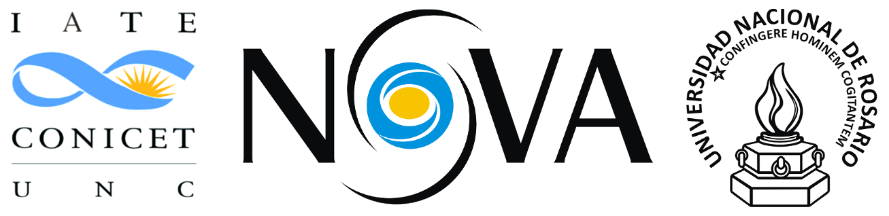

.. =============================================================================
.. HEADER
.. =============================================================================

.. header::

    .. image:: img/head.png
        :align: center
        :scale: 90 %

    Juan Bautista Cabral (IATE, UNR), Sebastian Gurovich (IATE-UNC-CONICET),
    Felipe Gran (PUC-MAS), a Dante Minniti (Andres Bello - Vatican Observatory)
    + VVV Sci.Team

.. =============================================================================
.. CONTENT
.. =============================================================================

Introduction
------------

We present a first version of Carpyncho, a data mining facility in
development which we hope will be utilized to search for and
characterize time variable data of the ~ PiB size VVV survey.

The project is designed to provide a simple to use small language set
(~4 functions) to filter data, train machine learning models, execute
experiments in a VVV server, and provide access to refined data and the model
parameter downloadable to a local computer.

The Backend
-----------

A data mining facility for the VVV is being developed for the
detection and classification of periodic and non-periodic (or transient
variables). For this purpose the stacked pawprint data from the VDFS CASU v1.3
catalogues have been crossed matched with the VDFS CASU v1.3 tile
catalogues into a PostgreSql data-base. The Carpyncho infraestructure http://carpyncho.jbcabral.org/ is being
developed entirely in python on top of a Custom-Framework for data processing and
a Django web-framework (for the webapp). The
PostgreSql database layer was chosen since its performance is
adequate for large databases (~1 PetaByte) and because PostgreSql is
open-source, thua ensuring support with evolving versatility.

For calculation purposes Carpyncho is layored on-top of a scientific-
python library stack that includes:

- Numpy & Scipy: for Numerical calculations
- Astropy: for Procesing of Fits tables, astrometric and photometric
  calculations
- PyAstronomy: for GLS, PDM and time conversion algorithms
- AstroML & Scikit-learn: for machine learning algorithms
- SKLL: for machine learning automation.

CQL - Carpyncho Query Language
------------------------------

All the interaction to the backend (including the Web Interface) are made by
a small Domain Specific Language that provide (at this moment) four functions to:

-   Make a Simple Cone Search (SCS)
    on the Ks-band data.
-   Sort and slice the result
-   Filter the SCS by attributes
-   Train a model with the selected learner (RandomForestClassifier,
    DecisionTreeClassifier, SVC or MultinomialNB)
-   Download the data and model generated in the server

**Note:** The first 3 and last item are already functional and
available in the demo.

CQL is created above the Python Object Model and compiled to a JSON
format client-side with Brython (http://brython.info/) to avoid
the execution of untrusted code on the server side.

The syntax can be sumarized as:

.. code-block:: python

    search(
        <CONE SEARCH PARAM>[, SLICE, COLUMN SELECTOR AND ORDER]
    ).filter(
        <FILTER_0 [, FILTER_1, ...]>
    )

Where:

- ``search()`` are the cone search and the creator of the query
- ``filter()`` are the optional filters by attributes.

For example if you want to make only a SCN around some position you can write:

.. code-block:: python

    search(271.906250005, -40.1668833333, 1)

If you want to make the same query as before but ordering by the
``source.ra_k`` attribute **and** only select the ``first 100`` sources
**starting from** the source number ``23`` and **only get the columns**
``tile.name``, ``source.id``, ``source.ra_k`` and  ``source.dec_k``
the query will be like:

.. code-block:: python

    search(
        271.906250005, -40.1668833333, 1, orderby=source.ra_k,
        offset=23, limit=100,
        columns=[tile.name, source.id, source.ra_k and  source.dec_k])

The query functionality is independent, for example the SCS is not mandatory and filtering for all stars from
a particular tile is obviously posible as in:

.. code-block:: python

    search(
        offset=23, limit=100,
        columns=[tile.name, source.id, source.ra_k and  source.dec_k]
    ).filter((tile.name == "b201") | (tile.name == "d001"))

Aside of the the classics boolean operators ``==``, ``<=``, ``>=``, ``<``
and ``>`` CQL supports more complex logic operators like ``.belongs``
which returns true when the field value belongs to the specified set

.. code-block:: python

    search().filter(tile.name.belongs(["b201", "d001"]))

``like`` and ``ilike`` that you can use to match strings (ilike ignore if
the letters are upper or lower cases)

.. code-block:: python

    # all the sources from the bulge
    search().filter(tile.name.ilike("B%"))

"OR",  ``|``, conjunction ``&`` and negation ``~``

.. code-block:: python

    # all the sources from the boulge
    search().filter(
        (tile.id >= 23) |
        ~((source.ra_k > 274) & (source.ra_j < 275))
    )

Also the **download** feature is implemented as function with the signature:

.. code-block:: python

    # csv is actually the only supported format
    export(search(...).filter(...), fmt="csv")

CQL - Machine Learning
^^^^^^^^^^^^^^^^^^^^^^

The current state of Carpyncho can process the data from VVV and
store all the features into a relational database that we
explore and export through CQL functions.

Our aim is to extend CQL to create a platform for data mining
& machine learning on the VVV dataset.

Currently we have implemented a simple function called ``Learn`` with
signature:

.. code-block:: python

    Learn(
        "my_custom_learner", search(..).filter(..), PARAMS)

where ``my_custom_learner`` is a name of your model (a model is only visible
to the creator) and ``PARAMS`` is a set of parameter to configure a machine
learning  experiment. Because "Learn" takes time, when the training is ready
an email is sent to the user to inform them that the model is ready
for te user to check quality measures for example ROC Curves or Spearman.

Webapp
------

Because all the Carpyncho webapp are implemented over CQL we have 2 main
pages:

-   The **index** that shows the current status of the pipeline
    (like pending processing) that in addition serves as a "welcome" screen
-   and the **CQL** where all results of CQL are showed.

.. figure:: img/index.png
    :align: center
    :scale: 40%

    Index Page. 1-The list of tiles in the Carpyncho DB. 2-The Tile *b202*
    are in green (ready to use) if you click over the "eye" in the right
    side of the green rows this execute a CQL to show all the sources of the
    given tile. 3-The tile *d001* still need some more processing
    to be useful.

    CQL Page. 1-The current query. 2-Tools: the blue button with the pencil
    allow the user to edit the current CQL and the pink one with the down arrow
    execute a query to download the current results as CSV

Results
-------

In the current state of the database and with some external tools as plotting
libraries we already reproduced the RRLyrae analysis for tile b201 and revised the fourier components
the work of Gran, et al 2015 [1]_.

    **Top:** Reproduction of the RRLyrae AB from the work of
    Gran, et al 2015 [1]_. **Bottom:** the simulated light curves with
    the original Fourier Components (blue) and the revised ones (red)

    Stability of the periods calculated from carpyncho data throughout 100,000
    montecarlo simulations

Future Works
------------

In the short term we plan to complete the analysis on the RRL sample as our test-bed.

.. =============================================================================
.. FOOTER
.. =============================================================================

You can require access to our demo: http://carpyncho.jbcabral.org/

.. [1] Gran, F. et al. Bulge RR Lyrae stars in the VVV tile b201. Astronomy & Astrophysics 575, A114 (2015).

.. footer::

    .. class:: footer

        **Contact:** `jbc.develop@gmail.com <mailto:jbc.develop@gmail.com>`_

